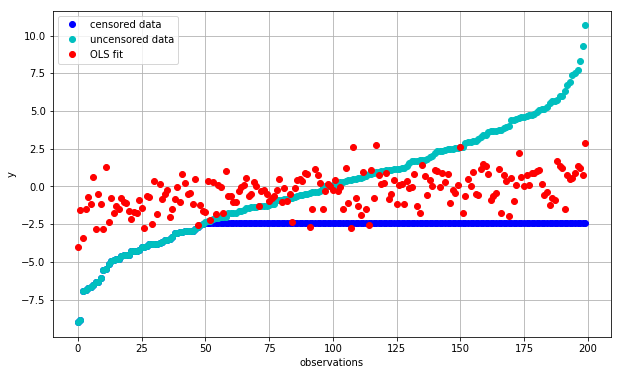
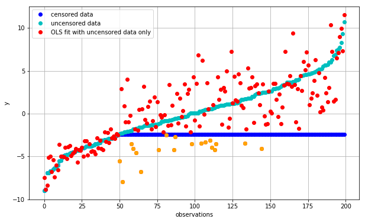
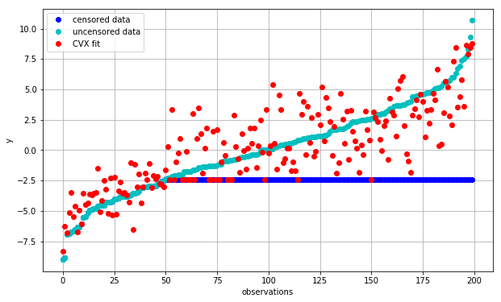

Fitting censored data
=====================

Experimental measurements are sometimes censored such that we only know
partial information about a particular data point. For example, in
measuring the lifespan of mice, a portion of them might live through the
duration of the study, in which case we only know the lower bound.

One of the ways we can deal with this is to use Maximum Likelihood
Estimation (`MLE <http://en.wikipedia.org/wiki/Maximum_likelihood>`__).
However, censoring often make analytical solutions difficult even for
well known distributions.

We can overcome this challenge by converting the MLE into a convex
optimization problem and solving it using
`CVXPY <https://www.cvxpy.org/en/latest/>`__.

This example is adapted from a homework problem from Boyd's `CVX 101:
Convex Optimization
Course <https://class.stanford.edu/courses/Engineering/CVX101/Winter2014/info>`__.

Setup
-----

We will use similar notation here. Suppose we have a linear model:

.. math::  y^{(i)} = c^Tx^{(i)} +\epsilon^{(i)} 

where :math:`y^{(i)} \in \mathbf{R}`, :math:`c \in \mathbf{R}^n`,
:math:`k^{(i)} \in \mathbf{R}^n`, and :math:`\epsilon^{(i)}` is the
error and has a normal distribution :math:`N(0, \sigma^2)` for $ i =
1,,K$.

Then the MLE estimator :math:`c` is the vector that minimizes the sum of
squares of the errors :math:`\epsilon^{(i)}`, namely:

.. math::

   \begin{array}{ll}
     \underset{c}{\mbox{minimize}} & \sum_{i=1}^K (y^{(i)} - c^T x^{(i)})^2
   \end{array}

In the case of right censored data, only :math:`M` observations are
fully observed and all that is known for the remaining observations is
that :math:`y^{(i)} \geq D` for :math:`i=\mbox{M+1},\ldots,K` and some
constant :math:`D`.

Now let's see how this would work in practice.

Data Generation
---------------

.. code:: python

    import numpy as np
    n = 30 # number of variables
    M = 50 # number of censored observations
    K = 200 # total number of observations
    
    np.random.seed(n*M*K)
    X = np.random.randn(K*n).reshape(K, n)
    c_true = np.random.rand(n)
    
    # generating the y variable
    y = X.dot(c_true) + .3*np.sqrt(n)*np.random.randn(K)
    
    # ordering them based on y
    order = np.argsort(y)
    y_ordered = y[order]
    X_ordered = X[order,:]
    
    #finding boundary
    D = (y_ordered[M-1] + y_ordered[M])/2. 
    
    # applying censoring
    y_censored = np.concatenate((y_ordered[:M], np.ones(K-M)*D))
    
    import matplotlib.pyplot as plt
    
    # Show plot inline in ipython.
    %matplotlib inline
    
    def plot_fit(fit, fit_label):
        plt.figure(figsize=(10,6))
        plt.grid()
        plt.plot(y_censored, 'bo', label = 'censored data')
        plt.plot(y_ordered, 'co', label = 'uncensored data')
        plt.plot(fit, 'ro', label=fit_label)
        plt.ylabel('y')
        plt.legend(loc=0)
        plt.xlabel('observations');

Regular OLS
-----------

Let's see what the OLS result looks like. We'll use the
``np.linalg.lstsq`` function to solve for our coefficients.

.. code:: python

    c_ols = np.linalg.lstsq(X_ordered, y_censored, rcond=None)[0]
    fit_ols = X_ordered.dot(c_ols)
    plot_fit(fit_ols, 'OLS fit')

We can see that we are systematically overestimating low values of
:math:`y` and vice versa (red vs. cyan). This is caused by our use of
censored (blue) observations, which are exerting a lot of leverage and
pulling down the trendline to reduce the error between the red and blue
points.

OLS using uncensored data
-------------------------

A simple way to deal with this while maintaining analytical tractability
is to simply ignore all censored observations.

.. math::

   \begin{array}{ll}
     \underset{c}{\mbox{minimize}} & \sum_{i=1}^M (y^{(i)} - c^T x^{(i)})^2
   \end{array}

Give that our :math:`M` is much smaller than :math:`K`, we are throwing
away the majority of the dataset in order to accomplish this, let's see
how this new regression does.

.. code:: python

    c_ols_uncensored = np.linalg.lstsq(X_ordered[:M], y_censored[:M], rcond=None)[0]
    fit_ols_uncensored = X_ordered.dot(c_ols_uncensored)
    plot_fit(fit_ols_uncensored, 'OLS fit with uncensored data only')
    
    bad_predictions = (fit_ols_uncensored<=D) & (np.arange(K)>=M)
    plt.plot(np.arange(K)[bad_predictions], fit_ols_uncensored[bad_predictions], color='orange', marker='o', lw=0);

We can see that the fit for the uncensored portion is now vastly
improved. Even the fit for the censored data is now relatively unbiased
i.e. the fitted values (red points) are now centered around the
uncensored observations (cyan points).

The one glaring issue with this arrangement is that we are now
predicting many observations to be *below* :math:`D` (orange) even
though we are well aware that this is not the case. Let's try to fix
this.

Using constraints to take into account of censored data
-------------------------------------------------------

Instead of throwing away all censored observations, lets leverage these
observations to enforce the additional information that we know, namely
that :math:`y` is bounded from below. We can do this by setting
additional constraints:

.. math::

   \begin{array}{ll}
     \underset{c}{\mbox{minimize}} & \sum_{i=1}^M (y^{(i)} - c^T x^{(i)})^2 \\
     \mbox{subject to} & c^T x^{(i)} \geq D\\
     & \mbox{for } i=\mbox{M+1},\ldots,K
   \end{array}

.. code:: python

    import cvxpy as cp
    X_uncensored = X_ordered[:M, :]
    c = cp.Variable(shape=n)
    objective = cp.Minimize(cp.sum_squares(X_uncensored*c - y_ordered[:M]))
    constraints = [ X_ordered[M:,:]*c >= D]
    prob = cp.Problem(objective, constraints)
    result = prob.solve()
    
    c_cvx = np.array(c.value).flatten()
    fit_cvx = X_ordered.dot(c_cvx)
    plot_fit(fit_cvx, 'CVX fit')

Qualitatively, this already looks better than before as it no longer
predicts inconsistent values with respect to the censored portion of the
data. But does it do a good job of actually finding coefficients
:math:`c` that are close to our original data?

We'll use a simple Euclidean distance :math:`\|c_\mbox{true} - c\|_2` to
compare:

.. code:: python

    print("norm(c_true - c_cvx): {:.2f}".format(np.linalg.norm((c_true - c_cvx))))
    print("norm(c_true - c_ols_uncensored): {:.2f}".format(np.linalg.norm((c_true - c_ols_uncensored))))

.. parsed-literal::

    norm(c_true - c_cvx): 1.49
    norm(c_true - c_ols_uncensored): 2.23

Conclusion
----------

Fitting censored data to a parametric distribution can be challenging as
the MLE solution is often not analytically tractable. However, many MLEs
can be converted into a convex optimization problems as show above. With
the advent of simple-to-use and robust numerical packages, we can now
solve these problems easily while taking into account the entirety of
our information set by enforcing consistency conditions on various
portions of the data.
