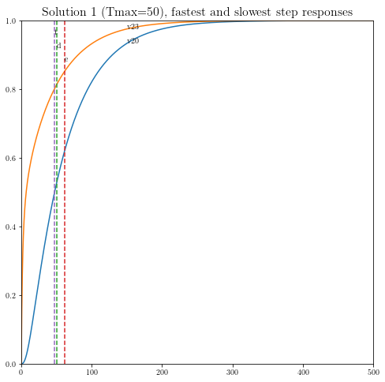
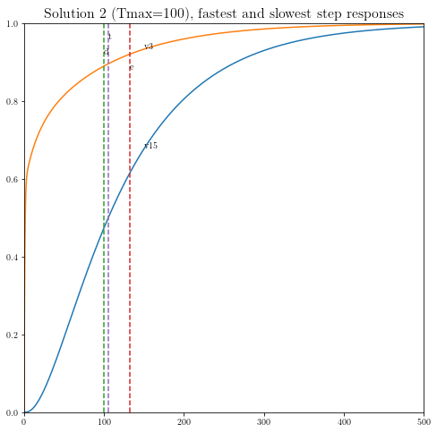
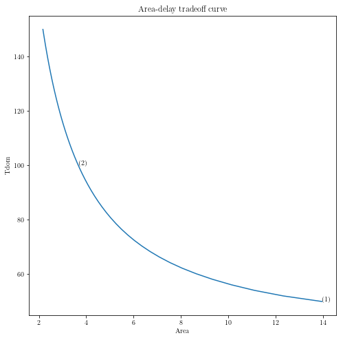

Sizing of clock meshes
======================

Original by Lieven Vanderberghe. Adapted to CVX by Argyris Zymnis,
12/4/2005. Modified by Michael Grant, 3/8/2006. Adapted to CVXPY, with
cosmetic modifications, by Judson Wilson, 5/26/2014.

Topic References:

-  Section 4, L. Vandenberghe, S. Boyd, and A. El Gamal "Optimal Wire
   and Transistor Sizing for Circuits with Non-Tree Topology"

Introduction
------------

We consider the problem of sizing a clock mesh, so as to minimize the
total dissipated power under a constraint on the dominant time constant.
The numbers of nodes in the mesh is :math:`N` per row or column (thus
:math:`n=(N+1)^2` in total). We divide the wire into m segments of width
:math:`x_i`, :math:`i = 1,\dots,m` which is constrained as
:math:`0 \le x_i \le W_{\mbox{max}}`. We use a pi-model of each wire
segment, with capacitance :math:`\beta_i x_i` and conductance
:math:`\alpha_i x_i`. Defining
:math:`C(x) = C_0+x_1 C_1 + x_2 C_ 2 + \cdots + x_m C_m` we have that
the dissipated power is equal to :math:`\mathbf{1}^T C(x) \mathbf{1}`.
Thus to minimize the dissipated power subject to a constraint in the
widths and a constraint in the dominant time constant, we solve the SDP

.. math::

   \begin{array}{ll}
       \mbox{minimize}   & \mathbf{1}^T C(x) \mathbf{1}   \\
       \mbox{subject to} &  T_{\mbox{max}} G(x) - C(x) \succeq 0 \\
                         & 0 \le x_i \le W_{\mbox{max}}.
       \end{array}

Import and setup packages
-------------------------

.. code:: python

    import cvxpy as cp
    import numpy as np
    import scipy as scipy
    import matplotlib.pyplot as plt
    
    # Show plots inline in ipython.
    %matplotlib inline
    
    # Plot properties.
    plt.rc('text', usetex=True)
    plt.rc('font', family='serif')
    font = {'weight' : 'normal',
            'size'   : 16}
    plt.rc('font', **font)

Helper functions
----------------

.. code:: python

    # Computes the step response of a linear system.
    def simple_step(A, B, DT, N):
        n  = A.shape[0]
        Ad = scipy.linalg.expm((A * DT))
        Bd = (Ad - np.eye(n)).dot(B)
        Bd = np.linalg.solve(A, Bd)
        X  = np.zeros((n, N))
        for k in range(1, N):
            X[:, k] = Ad.dot(X[:, k-1]) + Bd;
        return X

Generate problem data
---------------------

.. code:: python

    #
    # Circuit parameters.
    #
    
    dim=4            # Grid is dimxdim (assume dim is even).
    n=(dim+1)**2     # Number of nodes.
    m=2*dim*(dim+1)  # Number of wires.
                     #   0 ... dim(dim+1)-1 are horizontal segments
                     #     (numbered rowwise);
                     #   dim(dim+1) ... 2*dim(dim+1)-1 are vertical
                     #     (numbered columnwise)
    beta = 0.5       # Capacitance per segment is twice beta times xi.
    alpha = 1        # Conductance per segment is alpha times xi.
    G0 = 1           # Source conductance.
    C0 = np.array([ (      10,     2,     7,     5,     3),
                    (       8,     3,     9,     5,     5),
                    (       1,     8,     4,     9,     3),
                    (       7,     3,     6,     8,     2),
                    (       5,     2,     1,     9,    10) ])
    wmax = 1        # Upper bound on x.
    
    #
    # Build capacitance and conductance matrices.
    #
    
    CC = np.zeros((dim+1, dim+1, dim+1, dim+1, m+1))
    GG = np.zeros((dim+1, dim+1, dim+1, dim+1, m+1))
    
    # Constant terms.
    # - Reshape order='F' is fortran order to match original
    #   version in MATLAB code.
    CC[:, :, :, :, 0] = np.diag(C0.flatten(order='F')).reshape(dim+1, dim+1,
                                                               dim+1, dim+1, order='F').copy()
    zo13 = np.zeros((2, 1, 2, 1))
    zo13[:,0,:,0] = np.array([(1, 0), (0, 1)])
    zo24 = np.zeros((1, 2, 1, 2))
    zo24[0,:,0,:] = zo13[:, 0, :, 0]
    pn13 = np.zeros((2, 1, 2, 1))
    pn13[:,0,:,0] = np.array([[1, -1], [-1, 1]])
    pn24 = np.zeros((1, 2, 1, 2))
    pn24[0, :, 0, :] = pn13[:, 0, :, 0]
    
    for i in range(dim+1):
        # Source conductance.
        # First driver in the middle of row 1.
        GG[int(dim/2), i, int(dim/2), i, 0] = G0
        for j in range(dim):
            # Horizontal segments.
            node = 1 + j + i * dim
            CC[j:j+2, i, j:j+2, i, node] = beta * zo13[:, 0, :, 0]
            GG[j:j+2, i, j:j+2, i, node] = alpha * pn13[:, 0, :, 0]
            # Vertical segments.
            node = node + dim * ( dim + 1 )
            CC[i, j:j+2, i, j:j+2, node] = beta * zo24[0, :, 0, :]
            GG[i, j:j+2, i, j:j+2, node] = alpha * pn24[0, :, 0, :]
    
    # Reshape for ease of use.
    CC = CC.reshape((n*n, m+1), order='F').copy()
    GG = GG.reshape((n*n, m+1), order='F').copy()
    
    #
    # Compute points the tradeoff curve, and the three sample points.
    #
    
    npts    = 50
    delays  = np.linspace(50, 150, npts)
    xdelays = [50, 100]
    xnpts   = len(xdelays)
    areas   = np.zeros(npts)
    xareas  = dict()

Solve problem and display results
---------------------------------

.. code:: python

    # Iterate over all points, and revisit specific points
    for i in range(npts + xnpts):
        # First pass, only gather minimal data from all cases.
        if i < npts:
            delay = delays[i]
            print( ('Point {} of {} on the tradeoff curve ' \
                  + '(Tmax = {})').format(i+1, npts, delay))
        # Second pass, gather more data for specific cases,
        # and make plots (later).
        else:
            xi = i - npts
            delay = xdelays[xi]
            print( ('Particular solution {} of {} ' \
                  + '(Tmax = {})').format(xi+1, xnpts, delay))
    
        #
        # Construct and solve the convex model.
        #
    
        # Variables.
        xt = cp.Variable(shape=(m+1)) # Element 1 of xt == 1 below.
        G = cp.Variable((n,n), symmetric=True)  # Symmetric constraint below.
        C = cp.Variable((n,n), symmetric=True)  # Symmetric constraint below.
        
        # Objective.
        obj = cp.Minimize(cp.sum(C))
    
        # Constraints.
        constraints = [ xt[0] == 1,
                        G == G.T,
                        C == C.T,
                        G == cp.reshape(GG*xt, (n,n)),
                        C == cp.reshape(CC*xt, (n,n)),
                        delay * G - C == cp.Variable(shape=(n,n), PSD=True),
                        0 <= xt[1:],
                        xt[1:] <= wmax,
                      ]
    
        # Solve problem (use CVXOPT instead of SCS to match original results;
        # cvxopt produces lower objective values as well, but is much slower)
        prob = cp.Problem(obj, constraints)
        try:
            prob.solve(solver=cp.CVXOPT)
        except cp.SolverError:
            print("CVXOPT failed, trying robust KKT")
            prob.solve(solver=cp.CVXOPT, kktsolver='robust')
                
        if prob.status not in [cp.OPTIMAL, cp.OPTIMAL_INACCURATE]:
            raise Exception('CVXPY Error')
        
        # Chop off the first element of x, which is 
        # constrainted to be 1
        x = xt.value[1:] 
    
        # First pass, only gather minimal data from all cases.
        if i < npts:
            areas[i] = sum(x)
        # Second pass, gather more data for specific cases,
        # and make plots.
        else:
            xareas[xi] = sum(x)
    
            #
            # Print display sizes.
            #
    
            print('Solution {}:'.format(xi+1))
            print('Vertical segments:')
            print(x[0:dim*(dim+1)].reshape(dim, dim+1, order='F').copy())
            print('Horizontal segments:')
            print(x[dim*(dim+1):].reshape(dim, dim+1, order='F').copy())
    
            #
            # Determine and plot the step responses.
            #
    
            A = -np.linalg.inv(C.value).dot(G.value)
            B = -A.dot(np.ones(n))
            T = np.linspace(0, 500, 2000)
            Y = simple_step(A, B, T[1], len(T))
            indmax = -1
            indmin = np.inf
            for j in range(Y.shape[0]):
                inds = np.amin(np.nonzero(Y[j, :] >= 0.5)[0])
                if ( inds > indmax ):
                    indmax = inds
                    jmax = j
                if ( inds < indmin ):
                    indmin = inds
                    jmin = j
    
            tthres = T[indmax]
            GinvC  = np.linalg.solve(G.value, C.value)
            tdom   = max(np.linalg.eig(GinvC)[0])
            elmore = np.amax(np.sum(GinvC.T, 0))
            plt.figure(figsize=(8, 8))
            plt.plot( T, np.asarray(Y[jmax,:]).flatten(), '-',
                      T, np.asarray(Y[jmin,:]).flatten() )
            plt.plot( tdom   * np.array([1, 1]), [0, 1], '--',
                      elmore * np.array([1, 1]), [0, 1], '--',
                      tthres * np.array([1, 1]), [0, 1], '--' )
            plt.xlim([0, 500])
            plt.ylim([0, 1])
            plt.text(tdom, 0.92, 'd')
            plt.text(elmore, 0.88, 'e')
            plt.text(tthres, 0.96, 't')
            plt.text( T[600], Y[jmax, 600], 'v{}'.format(jmax+1))
            plt.text( T[600], Y[jmin, 600], 'v{}'.format(jmin+1))
            plt.title(('Solution {} (Tmax={}), fastest ' \
                        + 'and slowest step responses').format(xi+1, delay), fontsize=16)
            plt.show()
    
    #
    # Plot the tradeoff curve.
    #
    
    plt.figure(figsize=(8, 8))
    ind = np.isfinite(areas)
    plt.plot(areas[ind], delays[ind])
    plt.xlabel('Area')
    plt.ylabel('Tdom')
    plt.title('Area-delay tradeoff curve')
    # Label the specific cases.
    for k in range(xnpts):
        plt.text(xareas[k], xdelays[k], '({})'.format(k+1))
    plt.show()

.. parsed-literal::

    Point 1 of 50 on the tradeoff curve (Tmax = 50.0)
    CVXOPT failed, trying robust KKT
    Point 2 of 50 on the tradeoff curve (Tmax = 52.04081632653061)
    Point 3 of 50 on the tradeoff curve (Tmax = 54.08163265306123)
    Point 4 of 50 on the tradeoff curve (Tmax = 56.12244897959184)
    Point 5 of 50 on the tradeoff curve (Tmax = 58.16326530612245)
    Point 6 of 50 on the tradeoff curve (Tmax = 60.20408163265306)
    Point 7 of 50 on the tradeoff curve (Tmax = 62.244897959183675)
    Point 8 of 50 on the tradeoff curve (Tmax = 64.28571428571429)
    Point 9 of 50 on the tradeoff curve (Tmax = 66.3265306122449)
    Point 10 of 50 on the tradeoff curve (Tmax = 68.36734693877551)
    Point 11 of 50 on the tradeoff curve (Tmax = 70.40816326530611)
    Point 12 of 50 on the tradeoff curve (Tmax = 72.44897959183673)
    Point 13 of 50 on the tradeoff curve (Tmax = 74.48979591836735)
    Point 14 of 50 on the tradeoff curve (Tmax = 76.53061224489795)
    Point 15 of 50 on the tradeoff curve (Tmax = 78.57142857142857)
    Point 16 of 50 on the tradeoff curve (Tmax = 80.61224489795919)
    Point 17 of 50 on the tradeoff curve (Tmax = 82.65306122448979)
    Point 18 of 50 on the tradeoff curve (Tmax = 84.6938775510204)
    Point 19 of 50 on the tradeoff curve (Tmax = 86.73469387755102)
    Point 20 of 50 on the tradeoff curve (Tmax = 88.77551020408163)
    Point 21 of 50 on the tradeoff curve (Tmax = 90.81632653061224)
    Point 22 of 50 on the tradeoff curve (Tmax = 92.85714285714286)
    Point 23 of 50 on the tradeoff curve (Tmax = 94.89795918367346)
    Point 24 of 50 on the tradeoff curve (Tmax = 96.93877551020408)
    Point 25 of 50 on the tradeoff curve (Tmax = 98.9795918367347)
    Point 26 of 50 on the tradeoff curve (Tmax = 101.0204081632653)
    Point 27 of 50 on the tradeoff curve (Tmax = 103.06122448979592)
    Point 28 of 50 on the tradeoff curve (Tmax = 105.10204081632654)
    Point 29 of 50 on the tradeoff curve (Tmax = 107.14285714285714)
    Point 30 of 50 on the tradeoff curve (Tmax = 109.18367346938776)
    Point 31 of 50 on the tradeoff curve (Tmax = 111.22448979591837)
    Point 32 of 50 on the tradeoff curve (Tmax = 113.26530612244898)
    Point 33 of 50 on the tradeoff curve (Tmax = 115.3061224489796)
    Point 34 of 50 on the tradeoff curve (Tmax = 117.34693877551021)
    Point 35 of 50 on the tradeoff curve (Tmax = 119.38775510204081)
    Point 36 of 50 on the tradeoff curve (Tmax = 121.42857142857143)
    Point 37 of 50 on the tradeoff curve (Tmax = 123.46938775510205)
    Point 38 of 50 on the tradeoff curve (Tmax = 125.51020408163265)
    Point 39 of 50 on the tradeoff curve (Tmax = 127.55102040816327)
    Point 40 of 50 on the tradeoff curve (Tmax = 129.59183673469389)
    Point 41 of 50 on the tradeoff curve (Tmax = 131.6326530612245)
    Point 42 of 50 on the tradeoff curve (Tmax = 133.67346938775512)
    Point 43 of 50 on the tradeoff curve (Tmax = 135.71428571428572)
    Point 44 of 50 on the tradeoff curve (Tmax = 137.75510204081633)
    Point 45 of 50 on the tradeoff curve (Tmax = 139.79591836734693)
    Point 46 of 50 on the tradeoff curve (Tmax = 141.83673469387756)
    Point 47 of 50 on the tradeoff curve (Tmax = 143.87755102040816)
    Point 48 of 50 on the tradeoff curve (Tmax = 145.9183673469388)
    Point 49 of 50 on the tradeoff curve (Tmax = 147.9591836734694)
    Point 50 of 50 on the tradeoff curve (Tmax = 150.0)
    Particular solution 1 of 2 (Tmax = 50)
    CVXOPT failed, trying robust KKT
    Solution 1:
    Vertical segments:
    [[0.65284441 0.4391586  0.52378143 0.47092764 0.2363529 ]
     [0.99999993 0.85353862 0.99999992 0.93601078 0.56994586]
     [0.92325575 0.29557654 0.80041338 0.99999998 0.99999997]
     [0.41300012 0.13553757 0.26699524 0.67049218 0.88916807]]
    Horizontal segments:
    [[1.96487539e-01 1.40591789e-01 9.70591442e-08 7.79376843e-08
      5.27429285e-08]
     [7.07446433e-02 6.38430105e-02 1.02136471e-07 8.59913722e-08
      6.28906472e-08]
     [6.05807467e-09 1.16285450e-08 3.91561390e-08 9.48052913e-02
      1.58096913e-01]
     [3.82528741e-07 4.85708568e-07 5.75578696e-07 8.39862772e-02
      5.38639181e-02]]

.. parsed-literal::

    Particular solution 2 of 2 (Tmax = 100)
    Solution 2:
    Vertical segments:
    [[0.2687881  0.04368684 0.17122095 0.133796   0.07360396]
     [0.41346231 0.08016135 0.30642705 0.2224136  0.1484946 ]
     [0.25755998 0.08016077 0.11200259 0.38352317 0.28159768]
     [0.13439419 0.04368697 0.02445701 0.24083502 0.24534599]]
    Horizontal segments:
    [[ 1.53896782e-09 -5.18600578e-10 -9.75218556e-10 -5.19196383e-10
       1.57176577e-09]
     [ 9.30752726e-10 -9.56673760e-10 -1.35065528e-09 -9.96797753e-10
       1.03852376e-09]
     [ 9.35404466e-10 -9.12219313e-10 -2.22938358e-10 -7.91865186e-10
       1.51304362e-09]
     [ 1.31975762e-09 -8.50790152e-10 -1.39421076e-09 -8.33247519e-10
       1.27680128e-09]]

