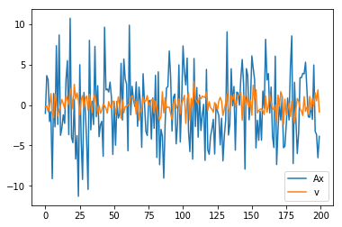
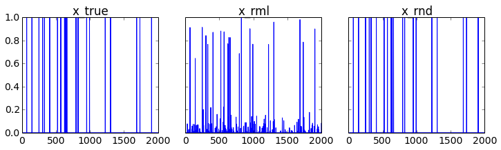

Fault detection
===============

We'll consider a problem of identifying faults that have occurred in a
system based on sensor measurements of system performance.

Topic references
================

-  `Samar, Sikandar, Dimitry Gorinevsky, and Stephen Boyd. "Likelihood
   Bounds for Constrained Estimation with Uncertainty." Decision and
   Control, 2005 and 2005 European Control Conference. CDC-ECC'05. 44th
   IEEE Conference on. IEEE,
   2005. <https://web.stanford.edu/~boyd/papers/pdf/map_bounds.pdf>`__

Problem statement
=================

Each of :math:`n` possible faults occurs independently with probability
:math:`p`. The vector :math:`x \in \lbrace 0,1 \rbrace^{n}` encodes the
fault occurrences, with :math:`x_i = 1` indicating that fault :math:`i`
has occurred. System performance is measured by :math:`m` sensors. The
sensor output is

.. math::

   \begin{equation}
   y = Ax + v = \sum_{i=1}^n a_i x_i + v,
   \end{equation}

where :math:`A \in \mathbf{R}^{m \times n}` is the sensing matrix with
column :math:`a_i` being the **fault signature** of fault :math:`i`, and
:math:`v \in \mathbf{R}^m` is a noise vector where :math:`v_j` is
Gaussian with mean 0 and variance :math:`\sigma^2`.

The objective is to guess :math:`x` (which faults have occurred) given
:math:`y` (sensor measurements).

We are interested in the setting where :math:`n > m`, that is, when we
have more possible faults than measurements. In this setting, we can
expect a good recovery when the vector :math:`x` is sparse. This is the
subject of compressed sensing.

Solution approach
=================

To identify the faults, one reasonable approach is to choose
:math:`x \in \lbrace 0,1 \rbrace^{n}` to minimize the negative
log-likelihood function

.. math::

   \begin{equation}
   \ell(x) = \frac{1}{2 \sigma^2} \|Ax-y\|_2^2 +  \log(1/p-1)\mathbf{1}^T x + c.
   \end{equation}

However, this problem is nonconvex and NP-hard, due to the constraint
that :math:`x` must be Boolean.

To make this problem tractable, we can relax the Boolean constraints and
instead constrain :math:`x_i \in [0,1]`.

The optimization problem

.. math::

   \begin{array}{ll}
   \mbox{minimize} &  \|Ax-y\|_2^2 + 2 \sigma^2 \log(1/p-1)\mathbf{1}^T x\\
   \mbox{subject to} &  0 \leq x_i \leq 1, \quad i=1, \ldots n
   \end{array}

is convex. We'll refer to the solution of the convex problem as the
**relaxed ML** estimate.

By taking the relaxed ML estimate of :math:`x` and rounding the entries
to the nearest of 0 or 1, we recover a Boolean estimate of the fault
occurrences.

Example
=======

We'll generate an example with :math:`n = 2000` possible faults,
:math:`m = 200` measurements, and fault probability :math:`p = 0.01`.
We'll choose :math:`\sigma^2` so that the signal-to-noise ratio is 5.
That is,

.. math::

   \begin{equation}
   \sqrt{\frac{\mathbf{E}\|Ax \|^2_2}{\mathbf{E} \|v\|_2^2}} = 5.
   \end{equation}

.. code:: python

    import numpy as np
    import matplotlib.pyplot as plt
    
    np.random.seed(1)
    
    n = 2000
    m = 200
    p = 0.01
    snr = 5
    
    sigma = np.sqrt(p*n/(snr**2))
    A = np.random.randn(m,n)
    
    x_true = (np.random.rand(n) <= p).astype(np.int)
    v = sigma*np.random.randn(m)
    
    y = A.dot(x_true) + v

Below, we show :math:`x`, :math:`Ax` and the noise :math:`v`.

.. code:: python

    plt.plot(range(n),x_true)

.. parsed-literal::

    [<matplotlib.lines.Line2D at 0x11ae42518>]

.. image:: fault_detection_files/fault_detection_3_1.png

.. code:: python

    plt.plot(range(m), A.dot(x_true),range(m),v)
    plt.legend(('Ax','v'))

.. parsed-literal::

    <matplotlib.legend.Legend at 0x11aee9630>

Recovery
========

We solve the relaxed maximum likelihood problem with CVXPY and then
round the result to get a Boolean solution.

.. code:: python

    %%time
    import cvxpy as cp
    x = cp.Variable(shape=n)
    tau = 2*cp.log(1/p - 1)*sigma**2
    obj = cp.Minimize(cp.sum_squares(A*x - y) + tau*cp.sum(x))
    const = [0 <= x, x <= 1]
    cp.Problem(obj,const).solve(verbose=True)
    print("final objective value: {}".format(obj.value))
    
    # relaxed ML estimate
    x_rml = np.array(x.value).flatten()
    
    # rounded solution
    x_rnd = (x_rml >= .5).astype(int)

.. parsed-literal::

    
    ECOS 2.0.4 - (C) embotech GmbH, Zurich Switzerland, 2012-15. Web: www.embotech.com/ECOS
    
    It     pcost       dcost      gap   pres   dres    k/t    mu     step   sigma     IR    |   BT
     0  +7.343e+03  -3.862e+03  +5e+04  5e-01  5e-04  1e+00  1e+01    ---    ---    1  1  - |  -  - 
     1  +4.814e+02  -9.580e+02  +8e+03  1e-01  6e-05  2e-01  2e+00  0.8500  1e-02   1  2  2 |  0  0
     2  -2.079e+02  -1.428e+03  +6e+03  1e-01  4e-05  8e-01  2e+00  0.7544  7e-01   2  2  2 |  0  0
     3  -1.321e+02  -1.030e+03  +5e+03  8e-02  3e-05  7e-01  1e+00  0.3122  2e-01   2  2  2 |  0  0
     4  -2.074e+02  -8.580e+02  +4e+03  6e-02  2e-05  6e-01  9e-01  0.7839  7e-01   2  2  2 |  0  0
     5  -1.121e+02  -6.072e+02  +3e+03  5e-02  1e-05  5e-01  7e-01  0.3859  4e-01   2  3  3 |  0  0
     6  -4.898e+01  -4.060e+02  +2e+03  3e-02  8e-06  3e-01  5e-01  0.5780  5e-01   2  2  2 |  0  0
     7  +7.778e+01  -5.711e+01  +8e+02  1e-02  3e-06  1e-01  2e-01  0.9890  4e-01   2  3  2 |  0  0
     8  +1.307e+02  +6.143e+01  +4e+02  6e-03  1e-06  6e-02  1e-01  0.5528  1e-01   3  3  3 |  0  0
     9  +1.607e+02  +1.286e+02  +2e+02  3e-03  4e-07  3e-02  5e-02  0.8303  3e-01   3  3  3 |  0  0
    10  +1.741e+02  +1.557e+02  +1e+02  2e-03  2e-07  2e-02  3e-02  0.6242  3e-01   3  3  3 |  0  0
    11  +1.834e+02  +1.749e+02  +5e+01  8e-04  9e-08  8e-03  1e-02  0.8043  3e-01   3  3  3 |  0  0
    12  +1.888e+02  +1.861e+02  +2e+01  3e-04  3e-08  2e-03  4e-03  0.9175  3e-01   3  3  2 |  0  0
    13  +1.909e+02  +1.902e+02  +4e+00  7e-05  7e-09  6e-04  1e-03  0.8198  1e-01   3  3  3 |  0  0
    14  +1.914e+02  +1.912e+02  +1e+00  2e-05  2e-09  2e-04  3e-04  0.8581  2e-01   3  2  3 |  0  0
    15  +1.916e+02  +1.916e+02  +1e-01  2e-06  3e-10  2e-05  4e-05  0.9004  3e-02   3  3  3 |  0  0
    16  +1.916e+02  +1.916e+02  +4e-02  7e-07  8e-11  7e-06  1e-05  0.8174  1e-01   3  3  3 |  0  0
    17  +1.916e+02  +1.916e+02  +8e-03  1e-07  1e-11  1e-06  2e-06  0.8917  9e-02   3  2  2 |  0  0
    18  +1.916e+02  +1.916e+02  +2e-03  4e-08  4e-12  4e-07  5e-07  0.8588  2e-01   3  3  3 |  0  0
    19  +1.916e+02  +1.916e+02  +2e-04  3e-09  3e-13  3e-08  5e-08  0.9309  2e-02   3  2  2 |  0  0
    20  +1.916e+02  +1.916e+02  +2e-05  4e-10  4e-14  4e-09  6e-09  0.8768  1e-02   4  2  2 |  0  0
    21  +1.916e+02  +1.916e+02  +4e-06  6e-11  6e-15  6e-10  9e-10  0.9089  6e-02   4  2  2 |  0  0
    22  +1.916e+02  +1.916e+02  +1e-06  2e-11  2e-15  2e-10  2e-10  0.8362  1e-01   2  1  1 |  0  0
    
    OPTIMAL (within feastol=1.8e-11, reltol=5.1e-09, abstol=9.8e-07).
    Runtime: 6.538894 seconds.
    
    final objective value: 191.6347201927456
    CPU times: user 6.51 s, sys: 291 ms, total: 6.8 s
    Wall time: 7.5 s

Evaluation
==========

We define a function for computing the estimation errors, and a function
for plotting :math:`x`, the relaxed ML estimate, and the rounded
solutions.

.. code:: python

    import matplotlib
    
    def errors(x_true, x, threshold=.5):
        '''Return estimation errors.
        
        Return the true number of faults, the number of false positives, and the number of false negatives.
        '''
        n = len(x_true)
        k = sum(x_true)
        false_pos = sum(np.logical_and(x_true < threshold, x >= threshold))
        false_neg = sum(np.logical_and(x_true >= threshold, x < threshold))
        return (k, false_pos, false_neg)
    
    def plotXs(x_true, x_rml, x_rnd, filename=None):
        '''Plot true, relaxed ML, and rounded solutions.'''
        matplotlib.rcParams.update({'font.size': 14})
        xs = [x_true, x_rml, x_rnd]
        titles = ['x_true', 'x_rml', 'x_rnd']
    
        n = len(x_true)
        k = sum(x_true)
    
        fig, ax = plt.subplots(1, 3, sharex=True, sharey=True, figsize=(12, 3))
    
        for i,x in enumerate(xs):
                ax[i].plot(range(n), x)
                ax[i].set_title(titles[i])
                ax[i].set_ylim([0,1])
                
        if filename:
            fig.savefig(filename, bbox_inches='tight')
            
        return errors(x_true, x_rml,.5)

We see that out of 20 actual faults, the rounded solution gives perfect
recovery with 0 false negatives and 0 false positives.

.. code:: python

    plotXs(x_true, x_rml, x_rnd, 'fault.pdf')

.. parsed-literal::

    (20, 0, 0)

