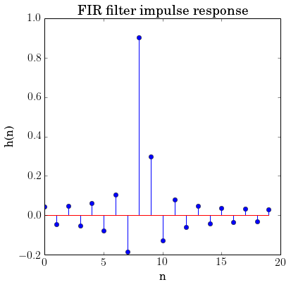
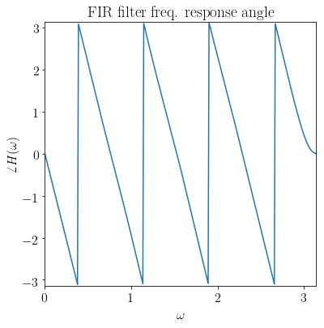

Chebychev design of an FIR filter given a desired :math:`H(\omega)`
===================================================================

A derivative work by Judson Wilson, 5/27/2014. Adapted from the CVX
example of the same name, by Almir Mutapcic, 2/2/2006.

Topic References:

-  "Filter design" lecture notes (EE364) by S. Boyd

Introduction
------------

This program designs an FIR filter, given a desired frequency response
:math:`H_\mbox{des}(\omega)`. The design is judged by the maximum
absolute error (Chebychev norm). This is a convex problem (after
sampling it can be formulated as an SOCP), which may be written in the
form:

.. raw:: latex

   \begin{array}{ll}
       \mbox{minimize}   &  \max |H(\omega) - H_\mbox{des}(\omega)| 
                                \quad \mbox{ for }  0 \le \omega \le \pi,
       \end{array}

where the variable :math:`H` is the frequency response function,
corresponding to an impulse response :math:`h`.

Initialize problem data
-----------------------

.. code:: 

    import numpy as np
    import cvxpy as cvx
    
    #********************************************************************
    # Problem specs.
    #********************************************************************
    # Number of FIR coefficients (including the zeroth one).
    n = 20
    
    # Rule-of-thumb frequency discretization (Cheney's Approx. Theory book).
    m = 15*n
    w = np.mat(np.linspace(0,np.pi,m)).T
    
    #********************************************************************
    # Construct the desired filter.
    #********************************************************************
    # Fractional delay.
    D = 8.25                # Delay value.
    Hdes = np.exp(-1j*D*w)  # Desired frequency response.
    
    # Gaussian filter with linear phase. (Uncomment lines below for this design.)
    #var = 0.05
    #Hdes = 1/(np.sqrt(2*np.pi*var)) * np.exp(-np.square(w-np.pi/2)/(2*var))
    #Hdes = np.multiply(Hdes, np.exp(-1j*n/2*w))

Solve the minimax (Chebychev) design problem
--------------------------------------------

.. code:: 

    # A is the matrix used to compute the frequency response
    # from a vector of filter coefficients:
    #     A[w,:] = [1 exp(-j*w) exp(-j*2*w) ... exp(-j*n*w)]
    A = np.exp( -1j * np.kron(np.mat(w), np.mat(np.arange(n))) )
    
    # Presently CVXPY does not do complex-valued math, so the
    # problem must be formatted into a real-valued representation.
    
    # Split Hdes into a real part, and an imaginary part.
    Hdes_r = np.real(Hdes)
    Hdes_i = np.imag(Hdes)
    
    # Split A into a real part, and an imaginary part.
    A_R = np.real(A)
    A_I = np.imag(A)
    
    #
    # Optimal Chebyshev filter formulation.
    #
    
    # h is the (real) FIR coefficient vector, which we are solving for.
    h = cvx.Variable(shape=(n,1))
    # The objective is:
    #     minimize max(|A*h-Hdes|)
    # but modified into an equivelent form:
    #     minimize max( real(A*h-Hdes)^2 + imag(A*h-Hdes)^2 )
    # such that all computation is done in real quantities only.
    obj = cvx.Minimize(
            cvx.max( 
               cvx.square(A_R * h - Hdes_r)     # Real part.
             + cvx.square(A_I * h - Hdes_i) ) ) # Imaginary part.
    
    # Solve problem.
    prob = cvx.Problem(obj)
    prob.solve()
    
    # Check if problem was successfully solved.
    print 'Problem status:', prob.status
    if prob.status != cvx.OPTIMAL:
        raise Exception('CVXPY Error')

.. parsed-literal::

    Problem status: optimal

Result plots
------------

.. code:: 

    import matplotlib.pyplot as plt
    
    # Show plot inline in ipython.
    %matplotlib inline
    
    # Plot properties.
    plt.rc('text', usetex=True)
    plt.rc('font', family='serif')
    font = {'family' : 'normal',
            'weight' : 'normal',
            'size'   : 16}
    plt.rc('font', **font)
    
    # Plot the FIR impulse reponse.
    plt.figure(figsize=(6, 6))
    plt.stem(range(n),h.value)
    plt.xlabel('n')
    plt.ylabel('h(n)')
    plt.title('FIR filter impulse response')
    
    # Plot the frequency response.
    H = np.exp(-1j * np.kron(w, np.mat(np.arange(n)))) * h.value
    plt.figure(figsize=(6, 6))
    # Magnitude
    plt.plot(np.array(w), 20 * np.log10(np.array(np.abs(H))),
             label='optimized')
    plt.plot(np.array(w), 20 * np.log10(np.array(np.abs(Hdes))),'--',
             label='desired')
    plt.xlabel(r'$\omega$')
    plt.ylabel(r'$|H(\omega)|$ in dB')
    plt.title('FIR filter freq. response magnitude')
    plt.xlim(0, np.pi)
    plt.ylim(-30, 10)
    plt.legend(loc='lower right')
    # Phase
    plt.figure(figsize=(6, 6))
    plt.plot(np.array(w), np.angle(np.array(H)))
    plt.xlim(0, np.pi)
    plt.ylim(-np.pi, np.pi)
    plt.xlabel(r'$\omega$')
    plt.ylabel(r'$\angle H(\omega)$')
    plt.title('FIR filter freq. response angle')

.. parsed-literal::

    <matplotlib.text.Text at 0x11125d410>

.. image:: fir_chebychev_design_files/fir_chebychev_design_5_2.png

