TODO
====

-  time-varying graphs
-  table of results
-  show combinatorics. why not NP hard. enumerate paths.
-  remove :math:`\mathcal{P}`. just describe a path with :math:`x` from
   the start?

Topic references
================

-  `Convex Optimization book <http://web.stanford.edu/~boyd/cvxbook/>`__
-  `Additional Exercise 15.4: Allocation of interdiction
   effort <http://web.stanford.edu/~boyd/cvxbook/bv_cvxbook_extra_exercises.pdf>`__
-  `Shortest path problem in graph
   theory <http://en.wikipedia.org/wiki/Shortest_path_problem>`__
-  `Dijkstra's\_algorithm <http://en.wikipedia.org/wiki/Dijkstra%27s_algorithm>`__
-  `Iterated weighted :math:`\ell_1`
   heuristic <http://stanford.edu/class/ee364b/lectures/l1_ext_slides.pdf>`__

Allocating interdiction effort to catch a smuggler
==================================================

We'll explore a game between a smuggler moving through a graph and a
security team trying to catch him.

The smuggler moves along a directed graph (cycles are allowed) with
:math:`n` nodes and :math:`m` edges from node :math:`0` (the source) to
node :math:`n-1` (the destination). Edge :math:`j` has evasion
probability :math:`p_j`, which is the probability that the smuggler
moves along that edge undetected. The detection events on the edges are
independent, so the probability that the smuggler makes it to the
destination undetected is :math:`\prod_{j \in \mathcal{P}} p_j`, where
:math:`\mathcal{P} \subset \lbrace 0,\ldots, m-1\rbrace` is the set of
edges on the smuggler's path. We assume that the smuggler knows the
evasion probabilities and will take a path that maximizes the
probability of making it to the destination node undetected.

The security team is trying to catch the smuggler as he moves through
the graph. They can control the evasion probabilities on the graph edges
through, say, allocation of resources to the edges, assigning guards,
etc. We'll keep this abstract for now, and just consider that security
can modify the evasion probabilities subject to some constraints. Their
goal is to choose evasion probabilities to minimize the chance that the
smuggler gets through undetected.

Transformations and mathematical formulation
============================================

We'll take the logarithm of all probabilities to make the problem
amenable to convex optimization and simplify the remaining discussion.
This transforms products of variables (generally not convex) into sums
of variables (convex!).

Let :math:`c_j = \log(p_j)`. As this is a one-to-one correspondence, we
may refer to the 'edge detection probabilities' when we really mean to
refer to their logarithm, :math:`c`. This should be clear from context
and hopefully won't cause any confusion.

Given :math:`c` and a path :math:`\mathcal{P}`, let
:math:`P(c, \mathcal{P})` be the logarithm of the evasion probability of
that path. That is,

.. math::

   P(c, \mathcal{P}) = \log \left( \prod_{j \in \mathcal{P}} p_j \right) = \sum_{j \in \mathcal{P}} \log(p_j) = \sum_{j \in \mathcal{P}} c_j.

Define :math:`P(c, \mathcal{P}) = -\infty` if :math:`\mathcal{P}` is not
a valid path from source to sink. We do this to implicitly encode the
constraint that the smuggler's path must be valid.

Min/max game
============

We can now interpret this problem as a min/max game. The smuggler is
trying to maximize his chance of getting through undetected by choosing
:math:`\mathcal{P}`, and security is trying to minimize the smuggler's
chance by choosing :math:`c`. That is, the smuggler is trying to
maximize :math:`P(c, \mathcal{P})` while the security team is trying to
minimize it.

We end up with a game with two 'moves'. Security 'moves' first by
choosing the edge evasion probabilities via :math:`c`. The smuggler
'moves' second (after :math:`c` is fixed) by choosing his path
:math:`\mathcal{P}`.

For security to make an optimal choice of edge evasion probabilities,
they'll need to model what the smuggler will do when faced with any set
of evasion probabilities. Thus, we'll let :math:`P^\mathrm{opt}(c)` be
the optimal value of the problem

\\[ ]

:math:`P^\mathrm{opt}(c)` is the (logarithm of the) evasion probability
of the smuggler if he picks an optimal path, knowing the values of
:math:`c`.

The security team's goal is then to minimize this quantity, subject to
some constraints on :math:`c`, which we'll denote by the set
:math:`\mathcal{C}`. Let :math:`P^{\star}` be the optimal value of

\\[ ]

In the remainder, we'll first consider the smuggler's objective so as to
obtain a convex formulation of :math:`P^\mathrm{opt}(c)`, which we can
then use to analyze and optimize the security team's objective.

Helper functions
================

The next cell contains some helper functions for generating the examples
and plotting the results. This is the majority of the code. The actual
CVXPY optimization code is only a few lines. We'll go over the
optimization code later in the notebook.

.. code:: python

    #%config InlineBackend.figure_format = 'pdf'
    #%config InlineBackend.figure_format = 'svg'
    %config InlineBackend.figure_format = 'retina'
    
    import matplotlib.pyplot as plt
    import numpy as np
    import networkx as nx
    import cvxpy as cp
    
    from matplotlib import rcParams
    rcParams.update({'font.size': 16})
    
    def formGraph(N,mu,eta,buildings=None,seed=None,dummyNodes=False):
        ''' Form N by N grid of nodes, perturb by mu and connect nodes within eta.
            mu and eta are relative to 1/(N-1)
            
            buildings is a list of tuples (x,y,w,h)
        '''
        if seed is not None:
            np.random.seed(seed)
        
        mu = mu/(N-1)
        eta = eta/(N-1)
        
        # generate perterbed grid positions for the nodes
        pos = [(i + mu*np.random.randn(), j + mu*np.random.randn())\
           for i in np.linspace(0,1,N) for j in np.linspace(1,0,N)]
        
        #select out nodes that end up inside buildings
        if buildings is not None and buildings != []:
            pos2 = []
            for p in pos:
                inside = False
                for x,y,w,h in buildings:
                    if x <= p[0] and p[0] <= x + w and y <= p[1] and p[1] <= y + h:
                        inside = True
                        break
                if not inside:
                    pos2.append(p)
            pos = pos2
            
        # add dummy nodes for multiple entry/exit example
        if dummyNodes:
            pos = [(-.5,.5)] + pos + [(1.5,.5)]
        
        pos = dict(enumerate(pos))
        n = len(pos)
        
        # connect nodes with edges
        G = nx.random_geometric_graph(n,eta,pos=pos)
        
        # remove edges that cross buildings
        if buildings is not None and buildings != []:
            for e in list(G.edges()):
                blocked = False
                for x,y,w,h in buildings:
                    if intersect(pos[e[0]],pos[e[1]],x,x+w,y,y+h):
                        blocked = True
                if blocked:
                    G.remove_edge(*e)
        
        G = nx.DiGraph(G)
        
        # add edges connecting dummy nodes to nodes on left and right edges of grid
        if dummyNodes:
            for i in range(N):
                G.add_edge(0,i+1)
                G.add_edge(n-i-2,n-1)
        
        return G, pos
    
    def showPaths(G,pos,edgeProbs=1.0,path=None,visibleNodes=None,Gnodes=None,Rnodes=None,guards=None):
        ''' Takes directed graph G, node positions pos, and edge probabilities.
            Optionally uses path (a list of edge indices) to plot the smuggler's path.
            
            edgeProbd gives the probabilities for all the edges, including hidden ones.
            
            path includes all the edges, including the hidden ones
            
            Gnodes and Rnodes denote the source and destination nodes, to be plotted green
            and red respectively.
            
            guards is a list of node indices for denoting guards with a black dot on the plot
        '''
        fig = plt.figure(figsize=(8,6))
        ax = fig.add_subplot(111, aspect='equal')
        
        n = G.number_of_nodes()
        if visibleNodes is None:
            visibleNodes = G.nodes()
            
        # draw the regular interior nodes in the graph
        nx.draw_networkx_nodes(G,pos,nodelist=visibleNodes, edgecolors='k',
                               node_color='w',node_size=100,ax=ax)
    
        # draw the origin and destination nodes
        for nodes, color in zip([Gnodes,Rnodes],['g','r']):
            for color2, alpha in zip(['w',color],[1,.2]):
                nx.draw_networkx_nodes(G,pos,
                               nodelist=nodes,
                               node_color=color2,
                               edgecolors='k',
                               node_size=200,
                               ax=ax,alpha=alpha)
    
        # draw guard nodes
        if guards is not None:
            nx.draw_networkx_nodes(G,pos,nodelist=guards,node_color='k',
                                   node_size=100,ax=ax)
          
            
        if path is None:
            alpha = 1
        else:
            alpha = .15
            
        # start messing with edges
        edge2ind = {e:i for i,e in enumerate(G.edges())}
        ind2edge = {i:e for i,e in enumerate(G.edges())}
        
        # only display edges between non-dummy nodes
        visibleEdges = [i for i in range(len(edge2ind)) if ind2edge[i][0] in visibleNodes and ind2edge[i][1] in visibleNodes]
        
        edgelist = [ind2edge[i] for i in visibleEdges]
        
        if isinstance(edgeProbs,float):
            edgeProbs = [edgeProbs]*G.number_of_edges()
            
        p = [edgeProbs[i] for i in visibleEdges]
    
        # draw edges of graph, make transparent if we're drawing a path over them
        edges = nx.draw_networkx_edges(G,pos,edge_color=p,width=4,
                                       edge_cmap=plt.cm.RdYlGn,arrows=False,edgelist=edgelist,edge_vmin=0.0,
                                       edge_vmax=1.0,ax=ax,alpha=alpha)
    
        # draw the path, only between visible nodes
        if path is not None:
            visiblePath = [i for i in path if ind2edge[i][0] in visibleNodes and ind2edge[i][1] in visibleNodes]
            path_pairs = [ind2edge[i] for i in visiblePath]
            path_colors = [edgeProbs[i] for i in visiblePath]
            edges = nx.draw_networkx_edges(G,pos,edge_color=path_colors,width=8,
                                           edge_cmap=plt.cm.RdYlGn,edgelist=path_pairs,arrows=False,edge_vmin=0.0,
                                       edge_vmax=1.0)
        
        fig.colorbar(edges,label='Evasion probability')
    
        ax.axis([-0.05,1.05,-0.05,1.05])
        #ax.axis('tight')
        #ax.axis('equal')
        ax.axis('off')
        
        return fig, ax
        
    def optPath(G,p):
        ''' Find the optimal smuggler's path in directed graph G
            with edge evasion probabilities p and dictionary
            edge2ind bringing node pairs to edge indices
        '''
        edge2ind = {e:i for i,e in enumerate(G.edges())}
        H = G.copy()
        p = np.minimum(p,1)
        w = -np.log(p)
        n = H.number_of_nodes()
        
        for i in H:
            for j in H[i]:
                H[i][j]['w'] = w[edge2ind[(i,j)]]
                
        path = nx.shortest_path(H,0,n-1,'w')
        #path = nx.astar_path(H,0,n-1,weight='w')
                
        foo = [edge2ind[(i,j)] for i,j in zip(path[:-1],path[1:])]
        x = np.zeros_like(p)
        x[foo] = 1
        return x
    
    def intersect(p1,p2,xmin,xmax,ymin,ymax):
        '''determine if a rectangle given by xy limits blocks the line of sight between p1 and p2'''
    
        block = False
        
        # if either point inside block
        for p in [p1,p1]:
            if xmin <= p[0] and p[0] <= xmax and ymin <= p[1] and p[1] <= ymax:
                return True
        
        # if the two points are equal at this stage, then they are outside the block
        if p1[0] == p2[0] and p1[1] == p2[1]:
            return False
        
        
        if p2[0] != p1[0]:
            for x in [xmin,xmax]:
                alpha = (x-p1[0])/(p2[0] - p1[0])
                y = p1[1] + alpha*(p2[1] - p1[1])
    
                if 0 <= alpha and alpha <= 1 and ymin <= y and y <= ymax:
                    return True
                
        if p2[1] != p1[1]:
            for y in [ymin,ymax]:
                alpha = (y-p1[1])/(p2[1] - p1[1])
                x = p1[0] + alpha*(p2[0] - p1[0])
    
                if 0 <= alpha and alpha <= 1 and xmin <= x and x <= xmax:
                    return True
            
        return False
    
    def getGuardEffects(G,pos,guardIdxs,buildings=None,dummyNodes=None):
        ''' for n guards and m edges, return an m by n matrix giving the
            effect of each guard on the evasion probabilities of each edge
            in the graph.
            
            Ignore dummy nodes, if any. Guards cannot see through buildings.
            
            guardIdxs is a list of the node indices where we would consider placing
            guards
            
            Return the log of the detection probabilities for each guard.
        
        '''
        def evadeProb(x,radius=.2):
            r = np.linalg.norm(x)/radius
            return min(r+.1,1)
        
        m = G.number_of_edges()
        if buildings is None:
            buildings = []
        if dummyNodes is None:
            dummyNodes = []
        
        
        ind2edge = {i:e for i,e in enumerate(G.edges())}
        edgeCenters = []
        for e in G.edges():
            edgeCenters.append((np.array(pos[e[0]]) + np.array(pos[e[1]]))/2)
            
        edgeCenters = np.array(edgeCenters)
        numGuards = len(guardIdxs)
        edgeVals = np.zeros((m,numGuards))
        
        for i,gid in enumerate(guardIdxs):
            for j in range(m):
                blocked = False
                for x,y,w,h in buildings:
                    if intersect(edgeCenters[j,:],pos[gid],x,x+w,y,y+h):
                        blocked = True
                        break
                e = ind2edge[j]
                if e[0] in dummyNodes or e[1] in dummyNodes:
                    blocked = True
                if not blocked:
                    edgeVals[j,i] += np.log(evadeProb(pos[gid]-edgeCenters[j,:],.3))
        return edgeVals
    
    def get_a(G,seed=None):
        '''
        Generate a random value in [0,1] for each edge in the graph.
        For directed graphs, directed edges between the same nodes should have the same value
        '''
        if seed is not None:
            np.random.seed(seed)
        m = G.number_of_edges()
        a = np.zeros((m))
        edge2ind = {e:i for i,e in enumerate(G.edges())}
        for e in G.edges():
            a[edge2ind[e]] = np.random.rand()
            e2 = (e[1],e[0])
            if e2 in edge2ind:
                a[edge2ind[e2]] = a[edge2ind[e]]
        return a

Smuggler's objective
====================

The smuggler chooses a path :math:`\mathcal{P}` only after :math:`c` is
fixed. His goal is to find a valid path in the graph which maximizes
:math:`\sum_{j \in \mathcal{P}} c_j`. Note that this problem can be cast
and solved exactly as a `shortest path problem in graph
theory <http://en.wikipedia.org/wiki/Shortest_path_problem>`__. We
formulate it here as a convex problem so that the security team can use
the model to thwart the smuggler.

We'll denote possible paths with a Boolean decision variable
:math:`x \in \lbrace 0,1 \rbrace^m`, where :math:`x_j = 1` denotes
:math:`j \in \mathcal{P}`. Note that this allows us to write the
smuggler's objective as

.. math::

   \sum_{j \in \mathcal{P}} c_j = \sum_{j=0}^{n-1} c_j x_j = c^T x.

The :math:`x` variable needs to satisfy certain constraints to represent
a valid path. Firstly, the number of times the path exits the source
node must be exactly one more than the number of times it enters the
source node. Similarly, the number of times the path enters the
destination node must be exactly one more than the number of times it
exits destination node. For all other nodes in the graph, the number of
times the path enters and exits the node must be equal. These
constraints can be represented as :math:`Ax = b`, where

\\[ b\_i = ]

\\[ A\_{ij} = ]

The smuggler's problem can then be written so that
:math:`P^\mathrm{opt}(c)` is the optimum value of the problem

\\[ ]

This is a linear problem with Boolean variables, which is not convex,
but we can transform it into a convex problem by relaxing the Boolean
constraints to get the linear program

\\[ ] with optimum value :math:`P^{\mathrm{opt}}_\mathrm{R}(c)`.

It turns out that this relaxed convex problem solves the original
Boolean problem *exactly*. That is,
:math:`P^{\mathrm{opt}}(c) = P^{\mathrm{opt}}_\mathrm{R}(c)`, so we will
only write :math:`P^{\mathrm{opt}}` in the remainder. In addition, the
solution to the LP, :math:`x^\star`, will be Boolean when there is a
unique optimal path. In the presence of multiple optimal paths, the
:math:`x^\star` may have fractional entries, but an optimal path can
still be recovered.

For the purposes of the security team, we'll only need that the Boolean
and LP optimal values are equal. Before continuing on to security's
perspective, we'll look at an example of the smuggler choosing an
optimal path in a given graph.

Smuggler's path example
=======================

We'll solve the smuggler's problem on an example network to see an
example of an optimal path.

We'll create an :math:`N \times N` grid of points with small
perturbations to make the graph irregular, connecting two nodes with two
directed edges (one going each way) if the nodes are within distance
:math:`\eta` of each other. Pairs of edges :math:`(i,j)` and
:math:`(j,i)` will have identical evasion probabilities, i.e., the
evasion probability is the same in either direction between two
connected nodes. The evasion probability will be distributed like
:math:`p_j = e^{-a_j}`, where :math:`a_j` is a uniform random variable
over the interval :math:`\left[0,1\right]`.

The smuggler will find an optimal path from node :math:`0` in the
upper-left corner of the graph plot to node :math:`n-1` in the
lower-right corner of the graph plot.

We show the graph with the edge evasion probabilities below.

.. code:: python

    N = 10
    G, pos = formGraph(N,.12,1.2,seed=5)
    n = G.number_of_nodes()
    
    a = get_a(G,seed=2)
    p = np.exp(-a)    
    
    fig, ax = showPaths(G,pos,p,Gnodes=[0],Rnodes=[n-1])

.. parsed-literal::

    /anaconda3/envs/cvxpy/lib/python3.6/site-packages/networkx/drawing/nx_pylab.py:611: MatplotlibDeprecationWarning: isinstance(..., numbers.Number)
      if cb.is_numlike(alpha):

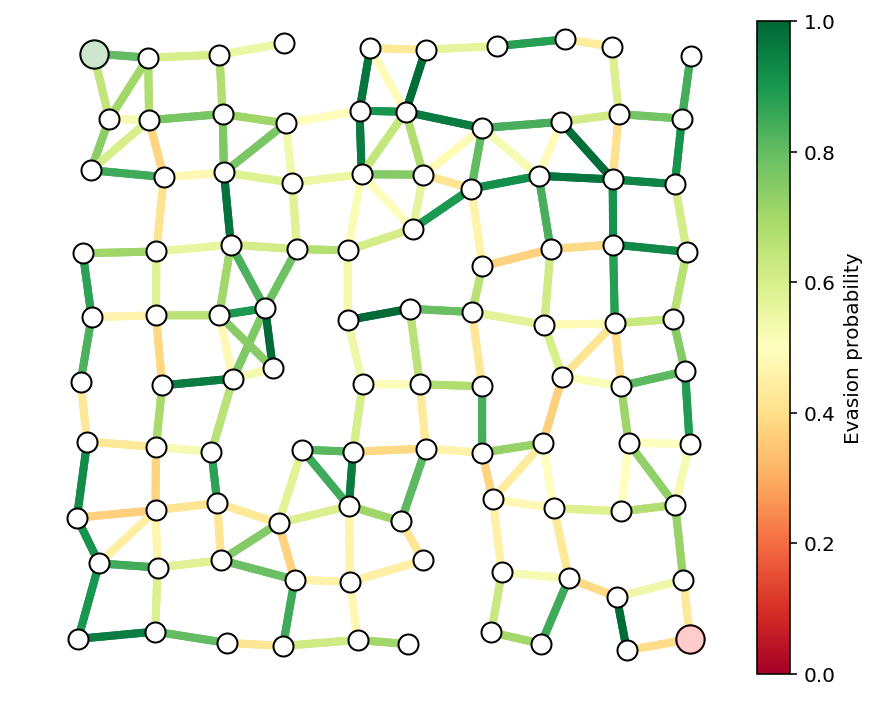

We form the smuggler's relaxed convex problem and solve it to find his
optimal path. We plot the path below.

.. code:: python

    A = nx.incidence_matrix(G,oriented=True).toarray()
    n,m = A.shape
    
    b = np.zeros(n)
    b[0] = -1
    b[n-1] = 1
    
    c = np.log(p)
    
    edge2ind = {e: i for i,e in enumerate(G.edges())}
    
    B = np.zeros((int(m/2),m))
    count = 0
    for i in G:
        for j in G[i]:
            if i < j:
                B[count,edge2ind[(i,j)]] = 1
                B[count,edge2ind[(j,i)]] = -1
                count += 1
    
    
    x = cp.Variable(shape=m)
    constr = [A*x == b,x>=0, x <= 1]
    cp.Problem(cp.Maximize(x.T*c),constr).solve(verbose=True)
    x = np.array(x.value).flatten()

.. parsed-literal::

    -----------------------------------------------------------------
               OSQP v0.4.1  -  Operator Splitting QP Solver
                  (c) Bartolomeo Stellato,  Goran Banjac
            University of Oxford  -  Stanford University 2018
    -----------------------------------------------------------------
    problem:  variables n = 354, constraints m = 808
              nnz(P) + nnz(A) = 1416
    settings: linear system solver = qdldl,
              eps_abs = 1.0e-03, eps_rel = 1.0e-03,
              eps_prim_inf = 1.0e-04, eps_dual_inf = 1.0e-04,
              rho = 1.00e-01 (adaptive),
              sigma = 1.00e-06, alpha = 1.60, max_iter = 4000
              check_termination: on (interval 25),
              scaling: on, scaled_termination: off
              warm start: on, polish: on
    
    iter   objective    pri res    dua res    rho        time
       1  -8.9458e+02   8.00e+00   9.97e+01   1.00e-01   2.10e-03s
      75   5.0606e+00   1.47e-03   5.64e-05   1.00e-01   8.35e-03s
    
    status:               solved
    solution polish:      unsuccessful
    number of iterations: 75
    optimal objective:    5.0606
    run time:             1.15e-02s
    optimal rho estimate: 5.09e-01
    

.. code:: python

    path = list(np.flatnonzero(x > .1))
    showPaths(G,pos,p,path,Gnodes=[0],Rnodes=[n-1])
    print("The evasion probability of the smuggler's "
          "optimal path is %e, or %.3f%%."%(np.exp(x.dot(c)), np.exp(x.dot(c))*100))

.. parsed-literal::

    The evasion probability of the smuggler's optimal path is 6.341943e-03, or 0.634%.

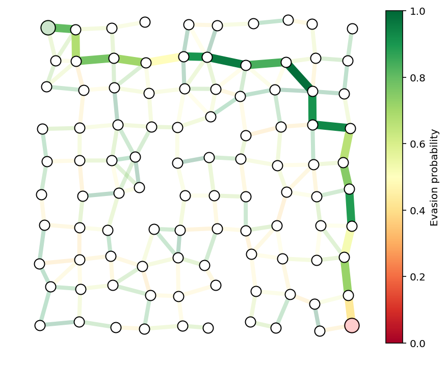

We run a discrete graph-theoretic shortest path algorithm on the same
graph to check that we get the same optimal path. The function
``optPath`` is using the NetworkX Python package and
`Dijkstra's\_algorithm <http://en.wikipedia.org/wiki/Dijkstra%27s_algorithm>`__
to compute the optimal path.

.. code:: python

    y = optPath(G,p)
    path = list(np.flatnonzero(y > .1))
    showPaths(G,pos,p,path,Gnodes=[0],Rnodes=[n-1])
    print("The evasion probability of the smuggler's "
          "optimal path is %e, or %.3f%%."%(np.exp(y.dot(c)), np.exp(y.dot(c))*100))

.. parsed-literal::

    The evasion probability of the smuggler's optimal path is 6.343747e-03, or 0.634%.

Security's objective
====================

The security team's goal is to minimize :math:`P^\mathrm{opt}(c)`,
subject to some constraints (say, limits on budget or personnel), which
we'll denote by :math:`c \in \mathcal{C}`:

\\[ ]

But note that :math:`P^{\mathrm{opt}}(c)` is the optimal value of the
problem

\\[ ]

We'd like to combine these two optimization problems into a single
problem for the security team to solve, but this is problematic as the
variables of one problem, :math:`x`, are multiplied with the variables
of the other, :math:`c`, which is not a convex objective in general. To
get around this, we'll take the dual (Chapter 5 of the `Convex
Optimization book <http://web.stanford.edu/~boyd/cvxbook/>`__) of the
smuggler's problem.

Let :math:`D^\mathrm{opt}(c)` denote the optimal value of the dual of
the smuggler's problem, which is

\\[ ] with dual variable :math:`\lambda`.

Duality theory guarantees that
:math:`D^\mathrm{opt}(c) = P^{\mathrm{opt}}(c)`, which allows us to
write the security team's problem as

\\[ ] which we can rewrite as the single optimization problem

\\[ ] where :math:`c` and :math:`\lambda` are the optimization
variables.

We will denote the optimal value of this problem as :math:`P^\star`. By
solving to find :math:`c^\star`, the security team will have optimally
allocated resources to make detection of the smuggler as likely as
possible.

Security example
================

We'll consider security's problem on the same network as the last
example with the edge evasion probabilities modeled as
:math:`p_j = e^{-a_j r_j}`, where :math:`r_j \in \mathbf{R}_+` denotes
the effort (say, yearly budget) allocated to edge :math:`j`. We'll
assume :math:`a_j \in \mathbf{R}_{++}` are given and represent the cost
involved in securing an edge. As in the last example, :math:`a_j` is a
uniform random variable over the interval :math:`\left[0,1\right]`.

We'll use the same random seed as the last example, so the last example
corresponds to the specific allocation :math:`r_j = 1` for all :math:`j`
in the current model. We'll use this to compare the detection
probability of a naive, uniform effort allocation against the optimal
allocation.

For this example, we'll impose a maximum budget constraint
:math:`\sum_{j=0}^{m-1} r_j = m`, and a uniform spending limit on each
edge, :math:`r_j \leq R`.

We'll also constrain that the evasion probability is equal in both
directions. That is, edge :math:`(i,j)` and edge :math:`(j,i)` have
equal evasion probabilities. We'll enforce that constraint with
:math:`Br = 0`, for some matrix :math:`B`.

The final model is \\[ ]

We solve the model below with :math:`R=5` and report the evasion
probability of the smuggler's optimal path.

.. code:: python

    nu = cp.Variable(shape=n)
    r = cp.Variable(shape=m)
    constr = [A.T*nu >= -cp.multiply(a,r), cp.sum(r) == m, r >= 0, B*r == 0, r <= 5]
    cp.Problem(cp.Minimize(nu.T*b),constr).solve(verbose=True)
    nu = np.array(nu.value).flatten()
    r = np.array(r.value).flatten()

.. parsed-literal::

    -----------------------------------------------------------------
               OSQP v0.4.1  -  Operator Splitting QP Solver
                  (c) Bartolomeo Stellato,  Goran Banjac
            University of Oxford  -  Stanford University 2018
    -----------------------------------------------------------------
    problem:  variables n = 454, constraints m = 1240
              nnz(P) + nnz(A) = 2478
    settings: linear system solver = qdldl,
              eps_abs = 1.0e-03, eps_rel = 1.0e-03,
              eps_prim_inf = 1.0e-04, eps_dual_inf = 1.0e-04,
              rho = 1.00e-01 (adaptive),
              sigma = 1.00e-06, alpha = 1.60, max_iter = 4000
              check_termination: on (interval 25),
              scaling: on, scaled_termination: off
              warm start: on, polish: on
    
    iter   objective    pri res    dua res    rho        time
       1  -3.3084e+01   3.54e+02   3.54e+04   1.00e-01   2.59e-03s
     100  -2.2269e+01   3.28e-01   1.58e-03   5.35e-03   9.06e-03s
    
    status:               solved
    solution polish:      unsuccessful
    number of iterations: 100
    optimal objective:    -22.2692
    run time:             1.05e-02s
    optimal rho estimate: 4.10e-03
    

.. code:: python

    print("The evasion probability of the smuggler's optimal path is %e."%(np.exp(nu.dot(b)),))
    print("The smuggler's chance of evasion is %.2f times smaller than with the uniform resource allocation."%(np.exp(x.dot(c))/np.exp(nu.dot(b))))

.. parsed-literal::

    The evasion probability of the smuggler's optimal path is 2.131035e-10.
    The smuggler's chance of evasion is 29759913.87 times smaller than with the uniform resource allocation.

Here we plot the resulting edge evasion probabilities from the optimal
allocation.

.. code:: python

    p = np.exp(-a*r)
    showPaths(G,pos,p,Gnodes=[0],Rnodes=[n-1])

.. parsed-literal::

    (<Figure size 576x432 with 2 Axes>,
     <matplotlib.axes._subplots.AxesSubplot at 0xd19325278>)

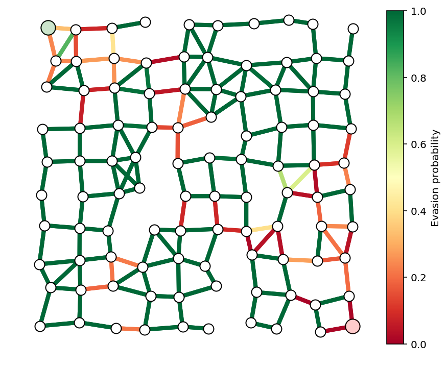

We can now solve the smuggler's problem with these optimal resource
allocations, but we won't recover a Boolean solution for
:math:`x^{\star}` because the optimal path is not unique. Note, however,
that the optimal evasion probability is the same.

.. code:: python

    c = np.log(p)
    x = cp.Variable(shape=m)
    constr = [A*x == b,x>=0, x <= 1]
    cp.Problem(cp.Maximize(x.T*c),constr).solve(verbose=True)
    x = np.array(x.value).flatten()
    
    plt.plot(x)
    print("The evasion probability of the smuggler's optimal path is %e."%(np.exp(x.dot(c)),))

.. parsed-literal::

    -----------------------------------------------------------------
               OSQP v0.4.1  -  Operator Splitting QP Solver
                  (c) Bartolomeo Stellato,  Goran Banjac
            University of Oxford  -  Stanford University 2018
    -----------------------------------------------------------------
    problem:  variables n = 354, constraints m = 808
              nnz(P) + nnz(A) = 1416
    settings: linear system solver = qdldl,
              eps_abs = 1.0e-03, eps_rel = 1.0e-03,
              eps_prim_inf = 1.0e-04, eps_dual_inf = 1.0e-04,
              rho = 1.00e-01 (adaptive),
              sigma = 1.00e-06, alpha = 1.60, max_iter = 4000
              check_termination: on (interval 25),
              scaling: on, scaled_termination: off
              warm start: on, polish: on
    
    iter   objective    pri res    dua res    rho        time
       1  -8.8977e+02   8.00e+00   4.71e+02   1.00e-01   9.14e-04s
     200   2.0447e+01   7.16e-03   6.89e-03   1.00e-01   6.66e-03s
     325   2.0607e+01   9.79e-04   2.46e-03   1.00e-01   9.95e-03s
    
    status:               solved
    solution polish:      unsuccessful
    number of iterations: 325
    optimal objective:    20.6072
    run time:             1.08e-02s
    optimal rho estimate: 1.37e-01
    
    The evasion probability of the smuggler's optimal path is 1.123036e-09.

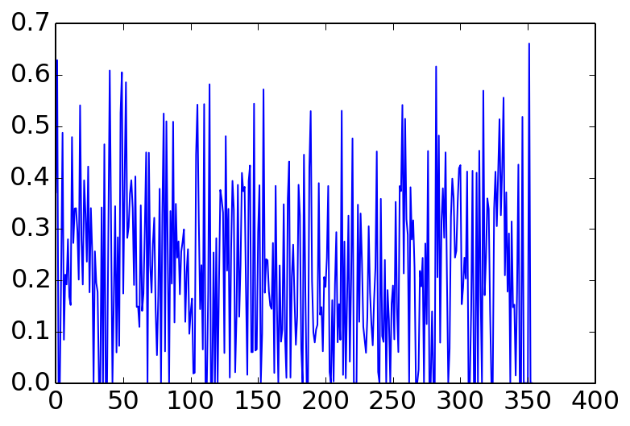

We use
`Dijkstra's\_algorithm <http://en.wikipedia.org/wiki/Dijkstra%27s_algorithm>`__
again to recover an optimal path for the smuggler in the case that the
path is not unique and plot it below. We again check that the detection
probability is what we predicted previously.

.. code:: python

    x = optPath(G,p)
    path = list(np.flatnonzero(x > .1))
    showPaths(G,pos,p,path,Gnodes=[0],Rnodes=[n-1])
    print("The evasion probability of the smuggler's optimal path is %e."%(np.exp(x.dot(c)),))

.. parsed-literal::

    The evasion probability of the smuggler's optimal path is 9.553365e-10.

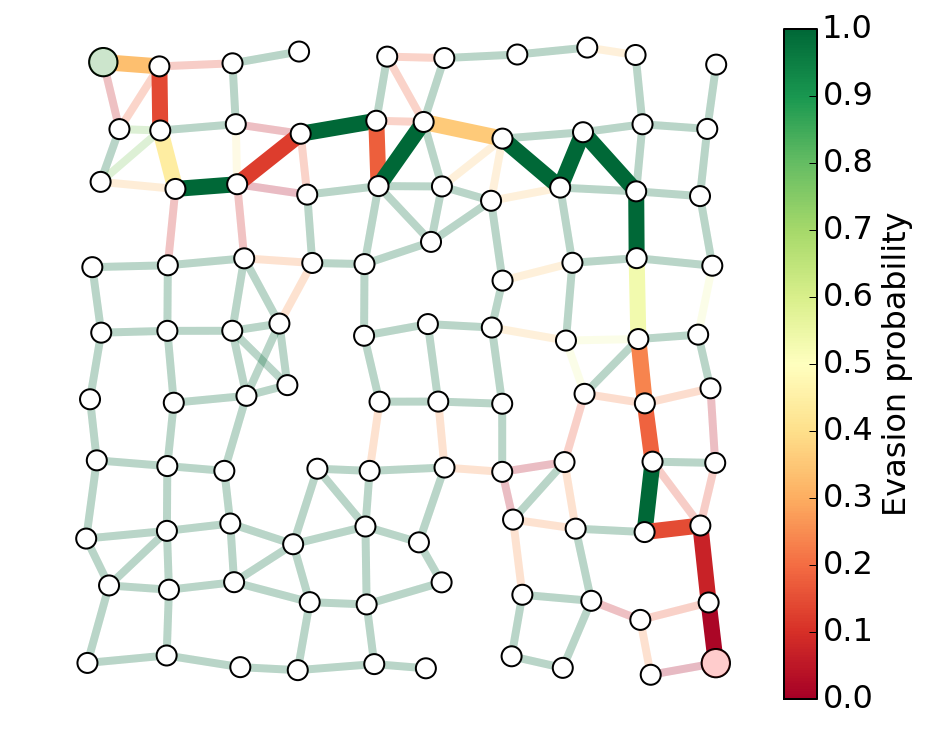

Guard placement example
=======================

We can now go through a more advanced example.

In the previous example, security had direct control over the evasion
probability on each edge. In this section, we'll consider an example
where security can only control the edge probabilities through the
placement of guards, each of whom will effect edges which are close to
them.

In the last example, the security team put a lot of effort on edges near
the source and destination nodes. We'll make the team's job a bit harder
by allowing the smuggler's path to start at any node on the left side of
the graph, and end at any node on the right. This will force the team to
allocate resources more evenly over the graph.

To make things even more interesting, we'll add 'buildings' in the
region covered by the graph. The smuggler and security will have to work
around the buildings. That is, no node is located inside a building, no
edge crosses through a building, and guards can't see through building
walls, restricting their line-of-sight and effect on nearby edges.

Multiple sources and destinations
---------------------------------

To allow for multiple source and destination nodes without changing the
convex formulation, we'll add a dummy source node and a dummy sink node.
The source node will have edges going to each node in the graph on the
left hand side. The sink node will have edges going to each node on the
right. We'll ensure that these dummy edges always have evasion
probability 1. The plot below demonstrates the idea. We won't plot the
dummy nodes or edges, but we will highlight the 'new' source and sink
nodes with light green and red as before.

.. code:: python

    # show dummy source and destination node
    N = 10
    G, pos = formGraph(N,.1,1.2,seed=1,dummyNodes=True)
    n = G.number_of_nodes()
    fig, ax = showPaths(G,pos,Gnodes=[0],Rnodes=[n-1])
    ax.axis([-.6,1.6,-.05,1.05]);

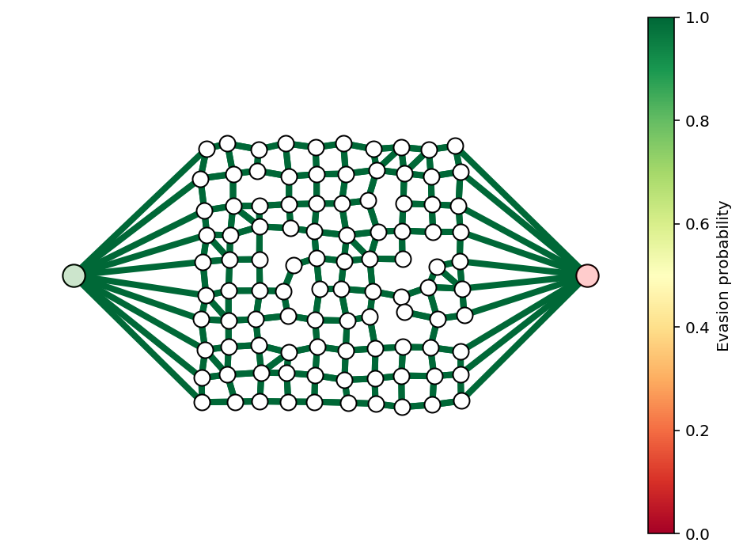

Guards
------

The security team will select a subset of guards to place in the graph.
Each guard will have a profile, which gives his effect on the edge
evasion probabilities. The guard's effect will be a function of his
distance to the center of each edge. In principle, guards could be
placed anywhere in the region occupied by the graph, but we'll only
consider guards placed on node positions to make them easy to visualize.

An example of a few guards and the resulting evasion probabilities is
shown below.

.. code:: python

    N = 10
    k = 5
    G, pos = formGraph(N,.1,1.2,seed=3,dummyNodes=True)
    n = G.number_of_nodes()
    guardIdxs = list(np.random.choice(list(range(N+1,n-N-1)),k,replace=False))
    
    visibleNodes = range(1,n-1)
    Gnodes = range(1,N+1)
    Rnodes = range(n-2,n-N-2,-1)
    
    edgeVals = getGuardEffects(G,pos,guardIdxs,dummyNodes=[0,n-1])
    edgeProbs = edgeVals.sum(axis=1)
    edgeProbs = np.exp(edgeProbs)
    
    fig, ax = showPaths(G,pos,edgeProbs,visibleNodes=visibleNodes,Gnodes=Gnodes,Rnodes=Rnodes,guards=guardIdxs)

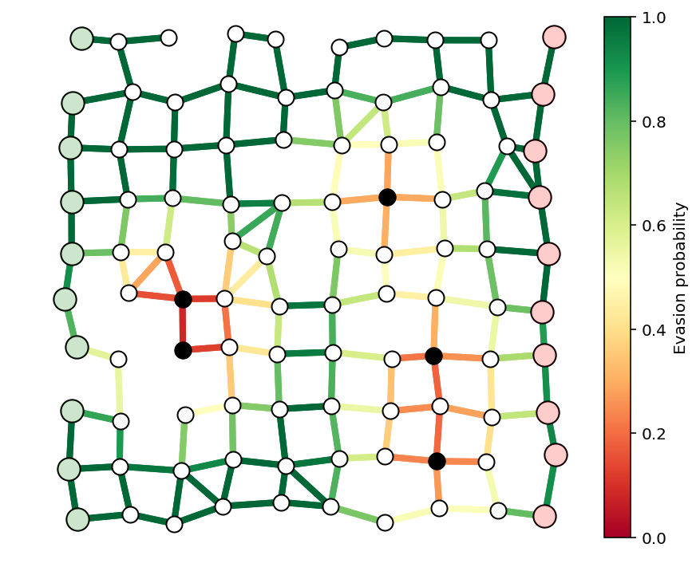

Buildings
---------

We'll also add buildings, which will modify the graph topology and also
restrict the view of the guards.

.. code:: python

    N = 10
    k = 5
    buildings = [(.2,.8,.3,.1),
                 (.35,.1,.3,.1),
                 (.55,.55,.3,.1),
                 (.15,.35,.3,.1),
                 (.65,.25,.3,.1)]
    
    G, pos = formGraph(N,.11,1.25,buildings=buildings,seed=1,dummyNodes=True)
    n = G.number_of_nodes()
    guardIdxs = list(np.random.choice(list(range(N+1,n-N-1)),k,replace=False))
    
    visibleNodes = range(1,n-1)
    Gnodes = range(1,N+1)
    Rnodes = range(n-2,n-N-2,-1)
    
    edgeVals = getGuardEffects(G,pos,guardIdxs,buildings=buildings,dummyNodes=[0,n-1])
    edgeProbs = edgeVals.sum(axis=1)
    edgeProbs = np.exp(edgeProbs)
    
    fig, ax = showPaths(G,pos,edgeProbs,visibleNodes=visibleNodes,Gnodes=Gnodes,Rnodes=Rnodes,guards=guardIdxs)
    
    for x,y,w,h in buildings:
        rect = plt.Rectangle((x,y),w,h,fc='y',alpha=.3)
        ax.add_patch(rect)

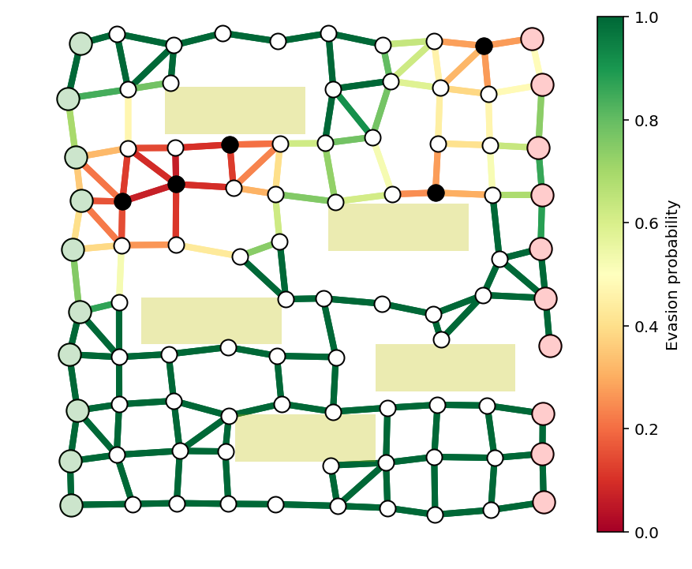

Example to solve
================

We'll solve a larger example with buildings, guards, and multiple source
and destination nodes. We'll consider a guard at every interior node of
the graph, and try to find a limited number, say 10, to secure the graph
as well as possible.

TODO
====

-  optimization formulation
-  this one turns out to be a 'true' integer program, unlike the last
-  use iterative reweighting to get boolean solution
-  use relaxation to give bounds on distance to true optimal

.. code:: python

    N = 17
    buildings = [(.2,.8,.3,.1),
                 (.35,.1,.3,.1),
                 (.55,.55,.3,.1),
                 (.15,.35,.3,.1),
                 (.65,.3,.3,.1)]
    
    G, pos = formGraph(N,.11,1.25,buildings=buildings,seed=0,dummyNodes=True)
    n = G.number_of_nodes()
    guardIdxs = list(range(N+1,n-N-1))
    
    visibleNodes = range(1,n-1)
    Gnodes = range(1,N+1)
    Rnodes = range(n-2,n-N-2,-1)
    
    edgeVals = getGuardEffects(G,pos,guardIdxs,buildings=buildings,dummyNodes=[0,n-1])
    edgeProbs = edgeVals.sum(axis=1)
    edgeProbs = np.exp(edgeProbs)

.. code:: python

    fig, ax = showPaths(G,pos,edgeProbs,visibleNodes=visibleNodes,Gnodes=Gnodes,Rnodes=Rnodes,guards=guardIdxs)
    
    fig.set_size_inches((16,8))
    for x,y,w,h in buildings:
        rect = plt.Rectangle((x,y),w,h,fc='y',alpha=.3)
        ax.add_patch(rect)

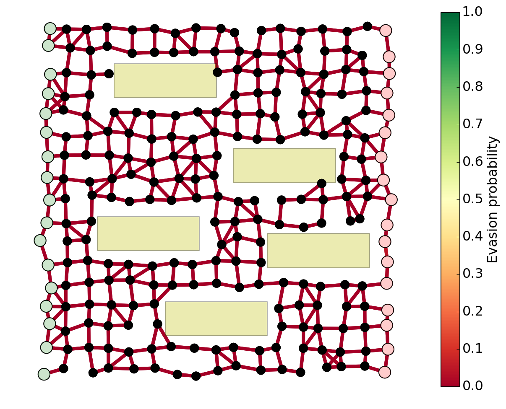

.. code:: python

    A = nx.incidence_matrix(G,oriented=True).toarray()
    n,m = A.shape
    numGuards = len(guardIdxs)
    
    b = np.zeros(n)
    b[0] = -1
    b[n-1] = 1
    
    eps = 1e-1
    w = np.ones(numGuards)
    
    for i in range(2):
        nu = cp.Variable(shape=n)
        r = cp.Variable(shape=numGuards)
        constr = [A.T*nu >= edgeVals*r, cp.sum(r) == 10, r >= 0, r <= 1]
        cp.Problem(cp.Minimize(nu.T*b/100 + r.T*w),constr).solve(verbose=True)
        nu = np.array(nu.value).flatten()
        r = np.array(r.value).flatten()
        w = 1/(eps+np.abs(r))

.. parsed-literal::

    -----------------------------------------------------------------
               OSQP v0.4.1  -  Operator Splitting QP Solver
                  (c) Bartolomeo Stellato,  Goran Banjac
            University of Oxford  -  Stanford University 2018
    -----------------------------------------------------------------
    problem:  variables n = 448, constraints m = 1305
              nnz(P) + nnz(A) = 27688
    settings: linear system solver = qdldl,
              eps_abs = 1.0e-03, eps_rel = 1.0e-03,
              eps_prim_inf = 1.0e-04, eps_dual_inf = 1.0e-04,
              rho = 1.00e-01 (adaptive),
              sigma = 1.00e-06, alpha = 1.60, max_iter = 4000
              check_termination: on (interval 25),
              scaling: on, scaled_termination: off
              warm start: on, polish: on
    
    iter   objective    pri res    dua res    rho        time
       1  -1.5225e-02   1.00e+01   1.24e+03   1.00e-01   1.50e-02s
     200   9.8653e+00   5.33e-03   1.96e-03   1.98e-02   1.10e-01s
    
    status:               solved
    solution polish:      unsuccessful
    number of iterations: 200
    optimal objective:    9.8653
    run time:             1.13e-01s
    optimal rho estimate: 1.08e-02
    
    -----------------------------------------------------------------
               OSQP v0.4.1  -  Operator Splitting QP Solver
                  (c) Bartolomeo Stellato,  Goran Banjac
            University of Oxford  -  Stanford University 2018
    -----------------------------------------------------------------
    problem:  variables n = 448, constraints m = 1305
              nnz(P) + nnz(A) = 27688
    settings: linear system solver = qdldl,
              eps_abs = 1.0e-03, eps_rel = 1.0e-03,
              eps_prim_inf = 1.0e-04, eps_dual_inf = 1.0e-04,
              rho = 1.00e-01 (adaptive),
              sigma = 1.00e-06, alpha = 1.60, max_iter = 4000
              check_termination: on (interval 25),
              scaling: on, scaled_termination: off
              warm start: on, polish: on
    
    iter   objective    pri res    dua res    rho        time
       1  -5.7726e+02   1.00e+01   1.23e+04   1.00e-01   1.10e-02s
     200   1.8639e+01   1.36e-02   4.08e-01   1.00e-01   5.95e-02s
     400   1.9265e+01   2.46e-02   7.13e-02   1.92e-02   1.13e-01s
     600   1.8962e+01   1.23e-02   5.74e-02   1.92e-02   1.61e-01s
     800   1.8931e+01   7.97e-03   4.31e-02   1.92e-02   2.23e-01s
    1000   1.8566e+01   6.39e-03   3.56e-02   1.92e-02   2.74e-01s
    1200   1.8689e+01   8.31e-03   1.31e-02   1.92e-02   3.23e-01s
    1225   1.8471e+01   7.94e-03   3.93e-03   1.92e-02   3.30e-01s
    
    status:               solved
    solution polish:      unsuccessful
    number of iterations: 1225
    optimal objective:    18.4712
    run time:             3.31e-01s
    optimal rho estimate: 2.86e-02
    

.. code:: python

    plt.plot(r,'o')

.. parsed-literal::

    [<matplotlib.lines.Line2D at 0xd1b50d438>]

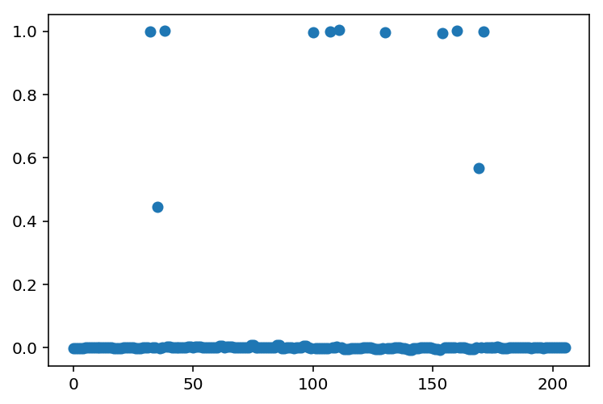

.. code:: python

    c = edgeVals.dot(r)
    edgeProbs = np.exp(c)
    
    guards = [guardIdxs[i] for i in range(len(guardIdxs)) if r[i] > .5]
    
    fig, ax = showPaths(G,pos,edgeProbs,visibleNodes=visibleNodes,Gnodes=Gnodes,Rnodes=Rnodes,guards=guards)
    for x,y,w,h in buildings:
        rect = plt.Rectangle((x,y),w,h,fc='y',alpha=.3)
        ax.add_patch(rect)

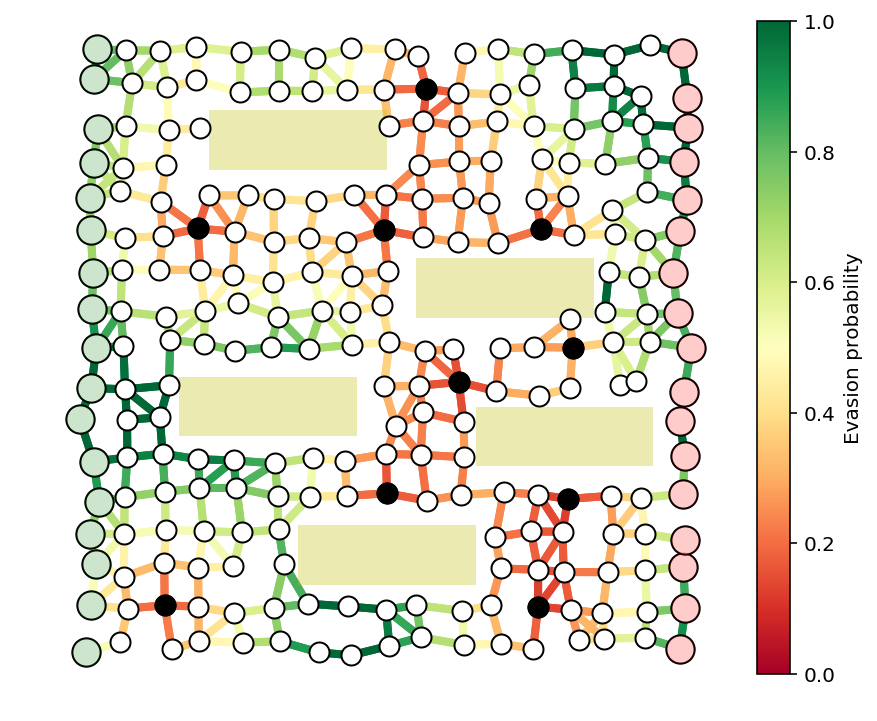

.. code:: python

    x = optPath(G,edgeProbs)
    path_inds = list(np.flatnonzero(x > .1))
    fig, ax = showPaths(G,pos,edgeProbs,path=path_inds,visibleNodes=visibleNodes,Gnodes=Gnodes,Rnodes=Rnodes,guards=guards)
    print("The evasion probability of the smuggler's optimal path is %e."%(np.exp(x.dot(c)),))
    for x,y,w,h in buildings:
        rect = plt.Rectangle((x,y),w,h,fc='y',alpha=.3)
        ax.add_patch(rect)

.. parsed-literal::

    The evasion probability of the smuggler's optimal path is 9.213215e-05.

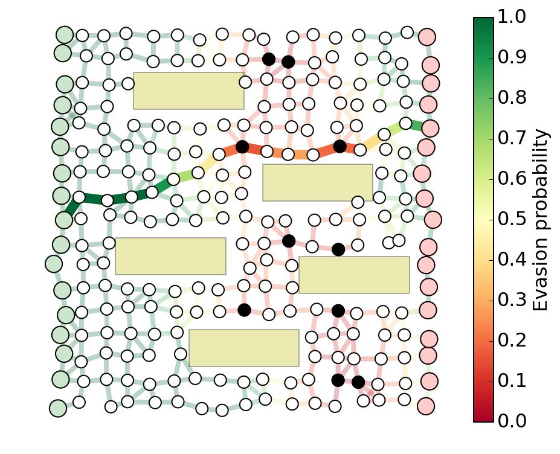

