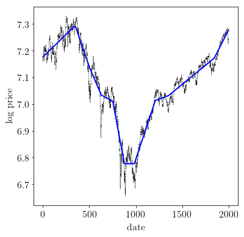

:math:`\ell_1` trend filtering
==============================

A derivative work by Judson Wilson, 5/28/2014. Adapted from the CVX
example of the same name, by Kwangmoo Koh, 12/10/2007

Topic Reference:

-  S.-J. Kim, K. Koh, S. Boyd, and D. Gorinevsky, \`\`l\_1 Trend
   Filtering'' http://stanford.edu/~boyd/papers/l1\_trend\_filter.html

Introduction
------------

The problem of estimating underlying trends in time series data arises
in a variety of disciplines. The :math:`\ell_1` trend filtering method
produces trend estimates :math:`x` that are piecewise linear from the
time series :math:`y`.

The :math:`\ell_1` trend estimation problem can be formulated as

.. raw:: latex

   \begin{array}{ll}
       \mbox{minimize}   &  (1/2)||y-x||_2^2 + \lambda ||Dx||_1,
       \end{array}

with variable :math:`x` , and problem data :math:`y` and
:math:`\lambda`, with :math:`\lambda >0`. :math:`D` is the second
difference matrix, with rows

.. math:: \begin{bmatrix}0 & \cdots & 0 & -1 & 2 & -1 & 0 & \cdots & 0 \end{bmatrix}.

CVXPY is not optimized for the :math:`\ell_1` trend filtering problem.
For large problems, use l1\_tf (http://www.stanford.edu/~boyd/l1\_tf/).

Formulate and solve problem
---------------------------

.. code:: 

    import numpy as np
    import cvxpy as cvx
    import scipy as scipy
    import cvxopt as cvxopt
    
    # Load time series data: S&P 500 price log.
    y = np.loadtxt(open('data/snp500.txt', 'rb'), delimiter=",", skiprows=1)
    n = y.size
    # Form second difference matrix.
    e = np.mat(np.ones((1, n)))
    D = scipy.sparse.spdiags(np.vstack((e, -2*e, e)), range(3), n-2, n)
    # Convert D to cvxopt sparse format, due to bug in scipy which prevents
    # overloading neccessary for CVXPY. Use COOrdinate format as intermediate.
    D_coo = D.tocoo()
    D = cvxopt.spmatrix(D_coo.data, D_coo.row.tolist(), D_coo.col.tolist())
    
    # Set regularization parameter.
    vlambda = 50
    # Solve l1 trend filtering problem.
    x = cvx.Variable(shape=(n,1))
    obj = cvx.Minimize(0.5 * cvx.sum_squares(y - x)
                       + vlambda * cvx.norm(D*x, 1) )
    prob = cvx.Problem(obj)
    # ECOS and SCS solvers fail to converge before
    # the iteration limit. Use CVXOPT instead.
    prob.solve(solver=cvx.CVXOPT,verbose=True)
    
    print 'Solver status: ', prob.status
    # Check for error.
    if prob.status != cvx.OPTIMAL:
        raise Exception("Solver did not converge!")

.. parsed-literal::

         pcost       dcost       gap    pres   dres   k/t
     0: -4.6668e-11 -1.0000e+00  1e+05  3e-01  4e-02  1e+00
     1:  5.3971e-02 -6.9550e-03  1e+04  2e-02  3e-03  1e-01
     2:  1.5513e-01  2.2236e-01  3e+03  7e-03  1e-03  1e-01
     3:  1.4714e-01  2.3287e-01  6e+02  1e-03  2e-04  1e-01
     4:  5.3138e-01  5.4713e-01  1e+02  2e-04  3e-05  2e-02
     5:  5.1410e-01  5.3063e-01  1e+02  2e-04  3e-05  2e-02
     6:  7.2454e-01  7.3795e-01  7e+01  1e-04  2e-05  1e-02
     7:  8.0702e-01  8.1346e-01  3e+01  6e-05  1e-05  7e-03
     8:  9.4942e-01  9.5462e-01  2e+01  5e-05  8e-06  6e-03
     9:  1.0232e+00  1.0254e+00  1e+01  2e-05  3e-06  2e-03
    10:  1.1802e+00  1.1812e+00  4e+00  8e-06  1e-06  1e-03
    11:  1.2596e+00  1.2601e+00  2e+00  4e-06  7e-07  5e-04
    12:  1.3502e+00  1.3504e+00  1e+00  2e-06  3e-07  2e-04
    13:  1.3794e+00  1.3794e+00  3e-01  6e-07  1e-07  8e-05
    14:  1.3956e+00  1.3956e+00  1e-01  3e-07  4e-08  3e-05
    15:  1.3993e+00  1.3993e+00  4e-02  8e-08  1e-08  1e-05
    16:  1.3994e+00  1.3994e+00  4e-02  8e-08  1e-08  1e-05
    17:  1.4009e+00  1.4009e+00  1e-02  2e-08  4e-09  3e-06
    18:  1.4012e+00  1.4012e+00  7e-03  1e-08  2e-09  2e-06
    19:  1.4014e+00  1.4014e+00  2e-03  4e-09  6e-10  5e-07
    20:  1.4014e+00  1.4014e+00  2e-03  3e-09  5e-10  4e-07
    21:  1.4014e+00  1.4014e+00  2e-04  3e-10  5e-11  4e-08
    22:  1.4014e+00  1.4014e+00  3e-05  6e-11  9e-12  7e-09
    23:  1.4014e+00  1.4014e+00  2e-06  3e-12  5e-13  4e-10
    24:  1.4014e+00  1.4014e+00  2e-08  4e-14  6e-15  5e-12
    Optimal solution found.
    Solver status:  optimal

Results plot
------------

.. code:: 

    import matplotlib.pyplot as plt
    
    # Show plots inline in ipython.
    %matplotlib inline
    
    # Plot properties.
    plt.rc('text', usetex=True)
    plt.rc('font', family='serif')
    font = {'family' : 'normal',
            'weight' : 'normal',
            'size'   : 16}
    plt.rc('font', **font)
    
    # Plot estimated trend with original signal.
    plt.figure(figsize=(6, 6))
    plt.plot(np.arange(1,n+1), y, 'k:', linewidth=1.0)
    plt.plot(np.arange(1,n+1), np.array(x.value), 'b-', linewidth=2.0)
    plt.xlabel('date')
    plt.ylabel('log price')

.. parsed-literal::

    <matplotlib.text.Text at 0x10e95aad0>

