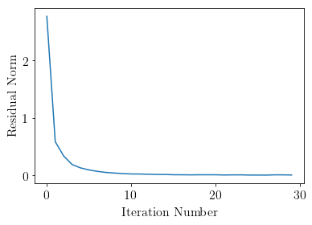

Nonnegative matrix factorization
================================

| A derivative work by Judson Wilson, 6/2/2014.
| Adapted from the CVX example of the same name, by Argyris Zymnis,
Joelle Skaf and Stephen Boyd

Introduction
------------

We are given a matrix :math:`A \in \mathbf{\mbox{R}}^{m \times n}` and
are interested in solving the problem:

.. math::

   \begin{array}{ll}
       \mbox{minimize}   & \| A - YX \|_F \\
       \mbox{subject to} & Y \succeq 0 \\
                         & X \succeq 0,
       \end{array}

where :math:`Y \in \mathbf{\mbox{R}}^{m \times k}` and
:math:`X \in \mathbf{\mbox{R}}^{k \times n}`.

This example generates a random matrix :math:`A` and obtains an
*approximate* solution to the above problem by first generating a random
initial guess for :math:`Y` and then alternatively minimizing over
:math:`X` and :math:`Y` for a fixed number of iterations.

Generate problem data
---------------------

.. code:: python

    import cvxpy as cp
    import numpy as np
    
    # Ensure repeatably random problem data.
    np.random.seed(0)
    
    # Generate random data matrix A.
    m = 10
    n = 10
    k = 5
    A = np.random.rand(m, k).dot(np.random.rand(k, n))
    
    # Initialize Y randomly.
    Y_init = np.random.rand(m, k)

Perform alternating minimization
--------------------------------

.. code:: python

    # Ensure same initial random Y, rather than generate new one
    # when executing this cell.
    Y = Y_init 
    
    # Perform alternating minimization.
    MAX_ITERS = 30
    residual = np.zeros(MAX_ITERS)
    for iter_num in range(1, 1+MAX_ITERS):
        # At the beginning of an iteration, X and Y are NumPy
        # array types, NOT CVXPY variables.
    
        # For odd iterations, treat Y constant, optimize over X.
        if iter_num % 2 == 1:
            X = cp.Variable(shape=(k, n))
            constraint = [X >= 0]
        # For even iterations, treat X constant, optimize over Y.
        else:
            Y = cp.Variable(shape=(m, k))
            constraint = [Y >= 0]
        
        # Solve the problem.
        # increase max iters otherwise, a few iterations are "OPTIMAL_INACCURATE"
        # (eg a few of the entries in X or Y are negative beyond standard tolerances)
        obj = cp.Minimize(cp.norm(A - Y*X, 'fro'))
        prob = cp.Problem(obj, constraint)
        prob.solve(solver=cp.SCS, max_iters=10000)
    
        if prob.status != cp.OPTIMAL:
            raise Exception("Solver did not converge!")
        
        print('Iteration {}, residual norm {}'.format(iter_num, prob.value))
        residual[iter_num-1] = prob.value
    
        # Convert variable to NumPy array constant for next iteration.
        if iter_num % 2 == 1:
            X = X.value
        else:
            Y = Y.value

.. parsed-literal::

    Iteration 1, residual norm 2.766300564135502
    Iteration 2, residual norm 0.5840356930600721
    Iteration 3, residual norm 0.3356679970549085
    Iteration 4, residual norm 0.18670276027770083
    Iteration 5, residual norm 0.12819921698143966
    Iteration 6, residual norm 0.09295501592922492
    Iteration 7, residual norm 0.06766021043574907
    Iteration 8, residual norm 0.04958204907945361
    Iteration 9, residual norm 0.03897402158866238
    Iteration 10, residual norm 0.02979328283505179
    Iteration 11, residual norm 0.022938564327729952
    Iteration 12, residual norm 0.021943924920767337
    Iteration 13, residual norm 0.01810297853945281
    Iteration 14, residual norm 0.014551161988556204
    Iteration 15, residual norm 0.014039687334395924
    Iteration 16, residual norm 0.009354606824469416
    Iteration 17, residual norm 0.008643141637584189
    Iteration 18, residual norm 0.007278100007476402
    Iteration 19, residual norm 0.008486679700021057
    Iteration 20, residual norm 0.008827511916396866
    Iteration 21, residual norm 0.008396764193205366
    Iteration 22, residual norm 0.005265185332845983
    Iteration 23, residual norm 0.006931929503816392
    Iteration 24, residual norm 0.007356156596477946
    Iteration 25, residual norm 0.0039053948996930054
    Iteration 26, residual norm 0.003989885269615319
    Iteration 27, residual norm 0.002920361405226024
    Iteration 28, residual norm 0.007779246694466739
    Iteration 29, residual norm 0.007339011292898449
    Iteration 30, residual norm 0.005008539285258121

Output results
--------------

.. code:: python

    #
    # Plot residuals.
    #
    
    import matplotlib.pyplot as plt
    
    # Show plot inline in ipython.
    %matplotlib inline
    
    # Set plot properties.
    plt.rc('text', usetex=True)
    plt.rc('font', family='serif')
    font = {'weight' : 'normal',
            'size'   : 16}
    plt.rc('font', **font)
    
    # Create the plot.
    plt.plot(residual)
    plt.xlabel('Iteration Number')
    plt.ylabel('Residual Norm')
    plt.show()
    
    #
    # Print results.
    #
    print('Original matrix:')
    print(A)
    print('Left factor Y:')
    print(Y)
    print('Right factor X:')
    print(X)
    print('Residual A - Y * X:')
    print(A - Y.dot(X))
    print('Residual after {} iterations: {}'.format(iter_num, prob.value))

.. parsed-literal::

    Original matrix:
    [[1.323426   1.11061189 1.69137835 1.20020115 1.13216889 0.5980743
      1.64965406 0.340611   1.69871738 0.78278448]
     [1.73721109 1.40464204 1.90898877 1.60774132 1.53717253 0.62647405
      1.76242265 0.41151492 1.8048194  1.20313124]
     [1.4071438  1.10269406 1.75323063 1.18928983 1.23428169 0.60364688
      1.63792853 0.40855006 1.57257432 1.17227344]
     [1.3905141  1.33367163 1.07723947 1.67735654 1.33039096 0.42003169
      1.22641711 0.21470465 1.47350799 0.84931787]
     [1.42153652 1.13598552 2.00816457 1.11463462 1.17914429 0.69942578
      1.90353699 0.45664487 1.81023916 1.09668578]
     [1.60813803 1.23214532 1.73741086 1.3148874  1.27589039 0.40755835
      1.31904948 0.3469129  1.34256526 0.76924618]
     [0.90607895 0.6632877  1.25412229 0.81696721 0.87218892 0.50032884
      1.245879   0.25079329 1.25017792 0.72155621]
     [1.5691922  1.47359672 1.76518996 1.66268312 1.43746574 0.72486628
      1.97409333 0.39239642 2.09234807 1.16325748]
     [1.18723548 1.00282008 1.41532595 1.03836298 0.90382914 0.38460446
      1.213473   0.23641422 1.32784402 0.27179726]
     [0.75789915 0.75119989 0.99502166 0.65444815 0.56073096 0.341146
      1.02555143 0.24273668 1.01035919 0.49427978]]
    Left factor Y:
    [[ 7.56475742e-01  3.42102372e-01  8.40426641e-01  7.02845111e-01
       4.38002833e-03]
     [ 6.36189366e-01  8.27831861e-01  5.28165827e-01  5.60609403e-01
       3.34595403e-02]
     [ 5.54834858e-01  6.37954560e-01  8.01726231e-01  1.96879041e-01
       3.74736667e-02]
     [ 2.72955779e-01  9.53749151e-01  6.14934798e-02  9.81276972e-01
      -4.26647247e-05]
     [ 7.93952558e-01  3.50946872e-01  1.18853643e+00  3.85961318e-01
       2.96701863e-02]
     [ 7.26183347e-01  4.41639937e-01  2.71711699e-03  7.33393633e-01
       4.55176129e-02]
     [ 4.89263105e-01  4.20725095e-01  7.56036398e-01  6.24033457e-02
      -5.38302416e-04]
     [ 6.09810836e-01  7.55780427e-01  1.03636918e+00  9.08549910e-01
       1.91844947e-03]
     [ 8.31578328e-01  8.75528332e-05  2.93543168e-01  1.10037225e+00
      -2.65884776e-04]
     [ 4.26650967e-01  5.53761974e-02  6.52855369e-01  6.43132832e-01
       1.47569255e-02]]
    Right factor X:
    [[ 1.07015116e+00  4.25961964e-01  1.59511553e+00  6.26808607e-01
       8.98124301e-01  3.62801718e-01  9.53757673e-01  1.88661317e-01
       9.64559055e-01  1.43675625e-01]
     [ 8.72908811e-01  7.03553498e-01  6.45229205e-01  1.10121868e+00
       9.93621271e-01  3.12383803e-01  7.45085312e-01  1.25155585e-01
       8.84272390e-01  7.94988511e-01]
     [ 1.41086863e-04  1.70049131e-01  2.73427259e-01  2.50933223e-02
       8.38007474e-03  2.51575697e-01  5.99473425e-01  1.39362252e-01
       5.06840502e-01  4.22844259e-01]
     [ 2.70906925e-01  5.46340550e-01  1.04256418e-02  4.63290841e-01
       1.39889787e-01  7.65220031e-03  2.22742919e-01  3.60875098e-02
       3.41601146e-01  2.72448408e-02]
     [ 5.44108256e+00  4.62667224e+00  6.26354249e+00  7.23656013e-01
       1.81220987e+00 -2.57729003e-07  2.90739234e+00  2.81123997e+00
      -2.15606388e-06  6.43189790e+00]]
    Residual A - Y * X:
    [[ 9.02157264e-04  5.23117764e-04 -5.79950842e-04 -5.74317402e-04
      -4.61768644e-04 -5.28680186e-05  1.62394448e-04  2.76277321e-04
       4.85227596e-04 -5.60481823e-04]
     [-2.33027425e-04  3.21455250e-04  2.17040399e-04  1.56606195e-04
      -2.41256203e-04 -1.01386736e-04  7.36342995e-05 -1.73587325e-05
      -5.22429324e-05 -2.04432888e-04]
     [-8.35846517e-04  2.46121871e-04  5.93720663e-04  5.38806481e-04
      -8.42363429e-05 -1.36215640e-04  2.31633730e-06 -1.52108618e-04
      -3.23620331e-04 -5.42078084e-06]
     [ 2.62860853e-04  1.83780003e-05 -3.20542830e-04 -1.49712163e-04
      -1.31334078e-04  8.78805144e-05  1.46798183e-04 -2.03546983e-05
       4.79256197e-04 -5.81320754e-04]
     [-6.22557723e-04  6.31892711e-04  4.34719938e-04  4.01388769e-04
      -3.52745774e-04 -2.12014739e-04  8.42548761e-05 -4.17321003e-05
      -1.50760383e-04 -3.01455643e-04]
     [-8.46202248e-04  3.61714835e-04  6.15005890e-04  5.85452470e-04
      -2.39872783e-04 -1.59000367e-04  6.24749082e-05 -1.69461803e-04
      -3.16622183e-04 -8.20910778e-05]
     [ 1.15561552e-03 -1.28864368e-03 -1.77288000e-03 -5.10264071e-04
       6.38713553e-04  7.17730381e-04  2.05892579e-04 -2.69449092e-04
       1.71225020e-03 -1.13410340e-03]
     [ 1.57913703e-04  6.21168134e-04 -4.04695033e-05 -1.48187018e-04
      -4.38037868e-04 -1.45409129e-04  1.34145488e-04  1.47289692e-04
       1.98184939e-04 -5.09549810e-04]
     [ 5.51365483e-04 -1.32683206e-03 -1.26345269e-03  6.01647636e-05
       9.72529426e-04  6.10472383e-04 -1.48674297e-05 -3.54468161e-04
       9.92202367e-04 -1.42249517e-04]
     [-1.63514531e-03 -1.59800828e-04  1.08957766e-03  1.01954949e-03
       3.41048252e-04 -1.06257705e-04 -1.57094132e-04 -3.64204427e-04
      -7.26930797e-04  4.63755883e-04]]
    Residual after 30 iterations: 0.005008539285258121

