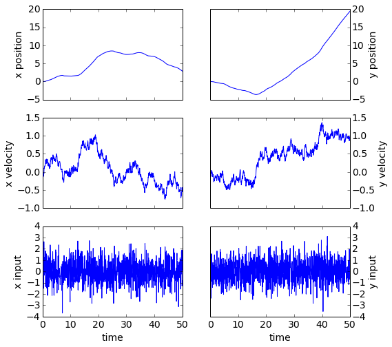
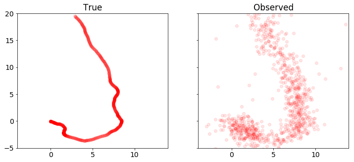
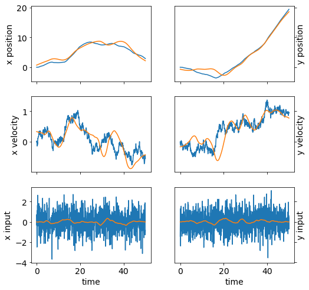
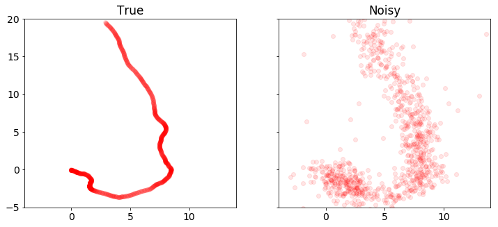
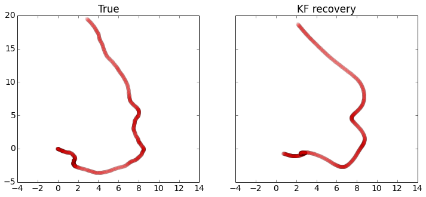
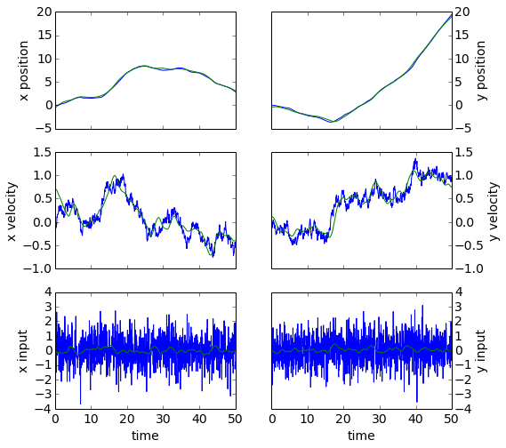
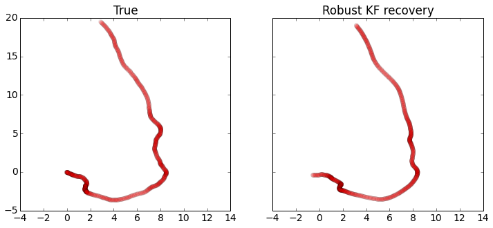

Robust Kalman filtering for vehicle tracking
============================================

We will try to pinpoint the location of a moving vehicle with high
accuracy from noisy sensor data. We'll do this by modeling the vehicle
state as a discrete-time linear dynamical system. Standard **Kalman
filtering** can be used to approach this problem when the sensor noise
is assumed to be Gaussian. We'll use **robust Kalman filtering** to get
a more accurate estimate of the vehicle state for a non-Gaussian case
with outliers.

Problem statement
=================

A discrete-time linear dynamical system consists of a sequence of state
vectors :math:`x_t \in \mathbf{R}^n`, indexed by time
:math:`t \in \lbrace 0, \ldots, N-1 \rbrace` and dynamics equations

.. raw:: latex

   \begin{align}
   x_{t+1} &= Ax_t + Bw_t\\
   y_t &=Cx_t + v_t,
   \end{align}

where :math:`w_t \in \mathbf{R}^m` is an input to the dynamical system
(say, a drive force on the vehicle), :math:`y_t \in \mathbf{R}^r` is a
state measurement, :math:`v_t \in \mathbf{R}^r` is noise, :math:`A` is
the drift matrix, :math:`B` is the input matrix, and :math:`C` is the
observation matrix.

Given :math:`A`, :math:`B`, :math:`C`, and :math:`y_t` for
:math:`t = 0, \ldots, N-1`, the goal is to estimate :math:`x_t` for
:math:`t = 0, \ldots, N-1`.

Kalman filtering
================

A Kalman filter estimates :math:`x_t` by solving the optimization
problem

.. raw:: latex

   \begin{array}{ll}
   \mbox{minimize} & \sum_{t=0}^{N-1} \left( 
   \|w_t\|_2^2 + \tau \|v_t\|_2^2\right)\\
   \mbox{subject to} & x_{t+1} = Ax_t + Bw_t,\quad t=0,\ldots, N-1\\
   & y_t = Cx_t+v_t,\quad t = 0, \ldots, N-1,
   \end{array}

where :math:`\tau` is a tuning parameter. This problem is actually a
least squares problem, and can be solved via linear algebra, without the
need for more general convex optimization. Note that since we have no
observation :math:`y_{N}`, :math:`x_N` is only constrained via
:math:`x_{N} = Ax_{N-1} + Bw_{N-1}`, which is trivially resolved when
:math:`w_{N-1} = 0` and :math:`x_{N} = Ax_{N-1}`. We maintain this
vestigial constraint only because it offers a concise problem statement.

This model performs well when :math:`w_t` and :math:`v_t` are Gaussian.
However, the quadratic objective can be influenced by large outliers,
which degrades the accuracy of the recovery. To improve estimation in
the presence of outliers, we can use **robust Kalman filtering**.

Robust Kalman filtering
=======================

To handle outliers in :math:`v_t`, robust Kalman filtering replaces the
quadratic cost with a Huber cost, which results in the convex
optimization problem

.. raw:: latex

   \begin{array}{ll}
   \mbox{minimize} & \sum_{t=0}^{N-1} \left( \|w_t\|^2_2 + \tau \phi_\rho(v_t) \right)\\
   \mbox{subject to} & x_{t+1} = Ax_t + Bw_t,\quad t=0,\ldots, N-1\\
   & y_t = Cx_t+v_t,\quad t=0,\ldots, N-1,
   \end{array}

where :math:`\phi_\rho` is the Huber function

.. math::

   \phi_\rho(a)= \left\{ \begin{array}{ll} \|a\|_2^2 & \|a\|_2\leq \rho\\
   2\rho \|a\|_2-\rho^2 & \|a\|_2>\rho.
   \end{array}\right.

The Huber penalty function penalizes estimation error linearly outside
of a ball of radius :math:`\rho`, whereas in standard Kalman filtering,
all errors are penalized quadratically. Thus, large errors are penalized
less harshly, making this model more robust to outliers.

Vehicle tracking example
========================

We'll apply standard and robust Kalman filtering to a vehicle tracking
problem with state :math:`x_t \in \mathbf{R}^4`, where
:math:`(x_{t,0}, x_{t,1})` is the position of the vehicle in two
dimensions, and :math:`(x_{t,2}, x_{t,3})` is the vehicle velocity. The
vehicle has unknown drive force :math:`w_t`, and we observe noisy
measurements of the vehicle's position, :math:`y_t \in \mathbf{R}^2`.

The matrices for the dynamics are

.. math::

   A = \begin{bmatrix}
   1 & 0 & \left(1-\frac{\gamma}{2}\Delta t\right) \Delta t & 0 \\
   0 & 1 & 0 & \left(1-\frac{\gamma}{2} \Delta t\right) \Delta t\\
   0 & 0 & 1-\gamma \Delta t & 0 \\
   0 & 0 & 0 & 1-\gamma \Delta t
   \end{bmatrix},

.. math::

   B = \begin{bmatrix}
   \frac{1}{2}\Delta t^2 & 0 \\
   0 & \frac{1}{2}\Delta t^2 \\
   \Delta t & 0 \\
   0 & \Delta t \\
   \end{bmatrix},

.. math::

   C = \begin{bmatrix}
   1 & 0 & 0 & 0 \\
   0 & 1 & 0 & 0
   \end{bmatrix},

where :math:`\gamma` is a velocity damping parameter.

1D Model
========

The recurrence is derived from the following relations in a single
dimension. For this subsection, let :math:`x_t, v_t, w_t` be the vehicle
position, velocity, and input drive force. The resulting acceleration of
the vehicle is :math:`w_t - \gamma v_t`, with :math:`- \gamma v_t` is a
damping term depending on velocity with parameter :math:`\gamma`.

The discretized dynamics are obtained from numerically integrating:

.. math::

   \begin{align}
   x_{t+1} &= x_t + \left(1-\frac{\gamma \Delta t}{2}\right)v_t \Delta t + \frac{1}{2}w_{t} \Delta t^2\\
   v_{t+1} &= \left(1-\gamma\right)v_t + w_t \Delta t.
   \end{align}

Extending these relations to two dimensions gives us the dynamics
matrices :math:`A` and :math:`B`.

Helper Functions
----------------

.. code:: 

    import matplotlib
    import matplotlib.pyplot as plt
    import numpy as np
    
    def plot_state(t,actual, estimated=None):
        '''
        plot position, speed, and acceleration in the x and y coordinates for
        the actual data, and optionally for the estimated data
        '''
        trajectories = [actual]
        if estimated is not None:
            trajectories.append(estimated)
            
        fig, ax = plt.subplots(3, 2, sharex='col', sharey='row', figsize=(8,8))
        for x, w in trajectories:  
            ax[0,0].plot(t,x[0,:-1])
            ax[0,1].plot(t,x[1,:-1])
            ax[1,0].plot(t,x[2,:-1])
            ax[1,1].plot(t,x[3,:-1])
            ax[2,0].plot(t,w[0,:])
            ax[2,1].plot(t,w[1,:])
            
        ax[0,0].set_ylabel('x position')
        ax[1,0].set_ylabel('x velocity')
        ax[2,0].set_ylabel('x input')
        
        ax[0,1].set_ylabel('y position')
        ax[1,1].set_ylabel('y velocity')
        ax[2,1].set_ylabel('y input')
        
        ax[0,1].yaxis.tick_right()
        ax[1,1].yaxis.tick_right()
        ax[2,1].yaxis.tick_right()
        
        ax[0,1].yaxis.set_label_position("right")
        ax[1,1].yaxis.set_label_position("right")
        ax[2,1].yaxis.set_label_position("right")
        
        ax[2,0].set_xlabel('time')
        ax[2,1].set_xlabel('time')
    
    def plot_positions(traj, labels, axis=None,filename=None):
        '''
        show point clouds for true, observed, and recovered positions
        '''
        matplotlib.rcParams.update({'font.size': 14})
        n = len(traj)
    
        fig, ax = plt.subplots(1, n, sharex=True, sharey=True,figsize=(12, 5))
        if n == 1:
            ax = [ax]
        
        for i,x in enumerate(traj):
            ax[i].plot(x[0,:], x[1,:], 'ro', alpha=.1)
            ax[i].set_title(labels[i])
            if axis:
                ax[i].axis(axis)
        
        if filename:
            fig.savefig(filename, bbox_inches='tight')

Problem Data
------------

We generate the data for the vehicle tracking problem. We'll have
:math:`N=1000`, :math:`w_t` a standard Gaussian, and :math:`v_t` a
standard Guassian, except :math:`20\%` of the points will be outliers
with :math:`\sigma = 20`.

Below, we set the problem parameters and define the matrices :math:`A`,
:math:`B`, and :math:`C`.

.. code:: 

    n = 1000 # number of timesteps
    T = 50 # time will vary from 0 to T with step delt
    ts, delt = np.linspace(0,T,n,endpoint=True, retstep=True)
    gamma = .05 # damping, 0 is no damping
    
    A = np.zeros((4,4))
    B = np.zeros((4,2))
    C = np.zeros((2,4))
    
    A[0,0] = 1
    A[1,1] = 1
    A[0,2] = (1-gamma*delt/2)*delt
    A[1,3] = (1-gamma*delt/2)*delt
    A[2,2] = 1 - gamma*delt
    A[3,3] = 1 - gamma*delt
    
    B[0,0] = delt**2/2
    B[1,1] = delt**2/2
    B[2,0] = delt
    B[3,1] = delt
    
    C[0,0] = 1
    C[1,1] = 1

Simulation
==========

We seed :math:`x_0 = 0` (starting at the origin with zero velocity) and
simulate the system forward in time. The results are the true vehicle
positions ``x_true`` (which we will use to judge our recovery) and the
observed positions ``y``.

We plot the position, velocity, and system input :math:`w` in both
dimensions as a function of time. We also plot the sets of true and
observed vehicle positions.

.. code:: 

    sigma = 20
    p = .20
    np.random.seed(6)
    
    x = np.zeros((4,n+1))
    x[:,0] = [0,0,0,0]
    y = np.zeros((2,n))
    
    # generate random input and noise vectors
    w = np.random.randn(2,n)
    v = np.random.randn(2,n)
    
    # add outliers to v
    np.random.seed(0)
    inds = np.random.rand(n) <= p
    v[:,inds] = sigma*np.random.randn(2,n)[:,inds]
    
    # simulate the system forward in time
    for t in range(n):
        y[:,t] = C.dot(x[:,t]) + v[:,t]
        x[:,t+1] = A.dot(x[:,t]) + B.dot(w[:,t])
        
    x_true = x.copy()
    w_true = w.copy()
    
    plot_state(ts,(x_true,w_true))
    plot_positions([x_true,y], ['True', 'Observed'],[-4,14,-5,20],'rkf1.pdf')

Kalman filtering recovery
=========================

The code below solves the standard Kalman filtering problem using CVXPY.
We plot and compare the true and recovered vehicle states. Note that the
recovery is distorted by outliers in the measurements.

.. code:: 

    %%time
    from cvxpy import *
    
    x = Variable(shape=(4, n+1))
    w = Variable(shape=(2, n))
    v = Variable(shape=(2, n))
    
    tau = .08
        
    obj = sum_squares(w) + tau*sum_squares(v)
    obj = Minimize(obj)
    
    constr = []
    for t in range(n):
        constr += [ x[:,t+1] == A*x[:,t] + B*w[:,t] ,
                    y[:,t]   == C*x[:,t] + v[:,t]   ]
    
    Problem(obj, constr).solve(verbose=True)
    
    x = np.array(x.value)
    w = np.array(w.value)
    
    plot_state(ts,(x_true,w_true),(x,w))
    plot_positions([x_true,y], ['True', 'Noisy'], [-4,14,-5,20])
    plot_positions([x_true,x], ['True', 'KF recovery'], [-4,14,-5,20], 'rkf2.pdf')

.. parsed-literal::

    
    ECOS 1.0.4 - (c) A. Domahidi, Automatic Control Laboratory, ETH Zurich, 2012-2014.
    
    It     pcost         dcost      gap     pres    dres     k/t     mu      step     IR
     0   +0.000e+00   -3.414e+00   +3e+03   5e+02   1e+00   1e+00   4e+02    N/A     1 1 -
     1   +3.287e+02   +3.646e+02   +4e+02   2e+02   5e-01   4e+01   7e+01   0.8666   2 2 2
     2   +9.613e+02   +1.284e+03   +2e+02   2e+02   7e-01   3e+02   3e+01   0.8524   3 2 2
     3   +3.398e+02   +5.369e+02   +1e+02   9e+01   3e-01   2e+02   2e+01   0.6979   2 2 2
     4   +6.031e+02   +8.107e+02   +2e+01   3e+01   1e-01   2e+02   3e+00   0.8582   2 2 1
     5   +1.344e+03   +2.462e+03   +8e+00   7e+01   2e-01   1e+03   1e+00   0.8006   3 2 1
     6   +2.830e+03   +3.316e+03   +1e+00   2e+01   5e-02   5e+02   2e-01   0.9639   2 2 2
     7   +2.686e+03   +2.896e+03   +6e-01   7e+00   2e-02   2e+02   9e-02   0.7906   3 2 2
     8   +5.190e+03   +7.816e+03   +3e-01   3e+01   8e-02   3e+03   4e-02   0.9228   2 3 2
     9   +4.379e+03   +5.386e+03   +2e-01   1e+01   4e-02   1e+03   3e-02   0.3498   3 2 2
    10   +6.829e+03   +7.204e+03   +1e-02   1e+00   4e-03   4e+02   2e-03   0.9552   2 2 2
    11   +8.845e+03   +9.140e+03   +4e-03   6e-01   2e-03   3e+02   6e-04   0.9002   3 3 3
    12   +9.958e+03   +1.023e+04   +1e-03   3e-01   9e-04   3e+02   2e-04   0.9424   3 3 3
    13   +1.070e+04   +1.077e+04   +3e-04   8e-02   2e-04   7e+01   6e-05   0.8269   3 3 3
    14   +1.077e+04   +1.084e+04   +3e-04   7e-02   2e-04   7e+01   5e-05   0.4583   3 3 3
    15   +1.104e+04   +1.104e+04   +1e-05   4e-03   1e-05   3e+00   2e-06   0.9622   3 3 3
    16   +1.106e+04   +1.106e+04   +6e-07   1e-04   4e-07   9e-02   1e-07   0.9718   3 3 3
    17   +1.106e+04   +1.106e+04   +8e-09   6e-05   6e-09   1e-03   1e-09   0.9873   2 2 2
    18   +1.108e+04   +1.108e+04   -8e+14   -3e+13   -2e+01   -1e-03   -1e+14   0.0001   0 0 0
    Unreliable search direction detected, recovering best iterate (17) and stopping.
    
    Close to OPTIMAL (within feastol=6.3e-05, reltol=7.5e-13, abstol=8.3e-09).
    Runtime: 0.232002 seconds.
    
    CPU times: user 10.9 s, sys: 79.3 ms, total: 11 s
    Wall time: 11.3 s

Robust Kalman filtering recovery
================================

Here we implement robust Kalman filtering with CVXPY. We get a better
recovery than the standard Kalman filtering, which can be seen in the
plots below.

.. code:: 

    %%time
    from cvxpy import *
    x = Variable(shape=(4, n+1))
    w = Variable(shape=(2, n))
    v = Variable(shape=(2, n))
    
    tau = 2
    rho = 2
        
    obj = sum_squares(w)
    obj += sum(tau*huber(norm(v[:,t]),rho) for t in range(n))
    obj = Minimize(obj)
    
    constr = []
    for t in range(n):
        constr += [ x[:,t+1] == A*x[:,t] + B*w[:,t] ,
                    y[:,t]   == C*x[:,t] + v[:,t]   ]
    
    Problem(obj, constr).solve(verbose=True)
    
    x = np.array(x.value)
    w = np.array(w.value)
    
    plot_state(ts,(x_true,w_true),(x,w))
    plot_positions([x_true,y], ['True', 'Noisy'], [-4,14,-5,20])
    plot_positions([x_true,x], ['True', 'Robust KF recovery'], [-4,14,-5,20],'rkf3.pdf')

.. parsed-literal::

    
    ECOS 1.0.4 - (c) A. Domahidi, Automatic Control Laboratory, ETH Zurich, 2012-2014.
    
    It     pcost         dcost      gap     pres    dres     k/t     mu      step     IR
     0   +0.000e+00   -2.850e+03   +2e+06   1e+02   2e-01   1e+00   3e+02    N/A     1 1 -
     1   +3.189e+03   +1.216e+03   +2e+06   8e+01   2e-01   9e+01   2e+02   0.5782   1 1 1
     2   +4.398e+03   +4.036e+03   +3e+05   2e+01   3e-02   2e+01   5e+01   0.8069   1 1 1
     3   +1.564e+04   +1.539e+04   +2e+05   1e+01   2e-02   2e+01   3e+01   0.5374   1 1 1
     4   +2.547e+04   +2.537e+04   +9e+04   4e+00   9e-03   1e+01   1e+01   0.6977   2 1 1
     5   +3.019e+04   +3.014e+04   +4e+04   2e+00   4e-03   6e+00   6e+00   0.6786   2 1 1
     6   +3.356e+04   +3.353e+04   +2e+04   1e+00   2e-03   3e+00   3e+00   0.6066   2 1 1
     7   +3.528e+04   +3.526e+04   +1e+04   6e-01   1e-03   2e+00   2e+00   0.6694   2 1 1
     8   +3.673e+04   +3.672e+04   +6e+03   3e-01   6e-04   1e+00   9e-01   0.7467   3 1 1
     9   +3.807e+04   +3.807e+04   +2e+03   1e-01   2e-04   4e-01   3e-01   0.8736   2 1 1
    10   +3.887e+04   +3.887e+04   +4e+02   2e-02   4e-05   7e-02   6e-02   0.9156   2 1 1
    11   +3.901e+04   +3.901e+04   +1e+02   7e-03   1e-05   2e-02   2e-02   0.8073   2 1 1
    12   +3.905e+04   +3.905e+04   +5e+01   3e-03   6e-06   1e-02   7e-03   0.7572   2 1 1
    13   +3.907e+04   +3.907e+04   +2e+01   1e-03   2e-06   4e-03   3e-03   0.8667   2 1 1
    14   +3.908e+04   +3.908e+04   +4e+00   2e-04   5e-07   8e-04   6e-04   0.9865   2 1 1
    15   +3.908e+04   +3.908e+04   +5e-01   3e-05   5e-08   8e-05   6e-05   0.8989   2 1 1
    16   +3.908e+04   +3.908e+04   +1e-01   6e-06   1e-08   2e-05   1e-05   0.9899   3 2 2
    17   +3.908e+04   +3.908e+04   +2e-02   1e-06   2e-09   3e-06   3e-06   0.8616   3 2 2
    18   +3.908e+04   +3.908e+04   +7e-03   4e-07   7e-10   1e-06   9e-07   0.9899   2 2 2
    19   +3.908e+04   +3.908e+04   +6e-04   4e-08   6e-11   1e-07   8e-08   0.9423   3 1 2
    
    OPTIMAL (within feastol=3.6e-08, reltol=1.5e-08, abstol=5.7e-04).
    Runtime: 0.363771 seconds.
    
    CPU times: user 28.6 s, sys: 77.1 ms, total: 28.6 s
    Wall time: 29.4 s

