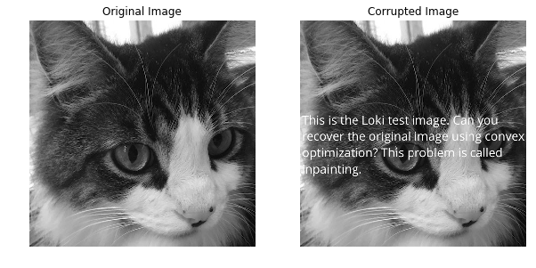
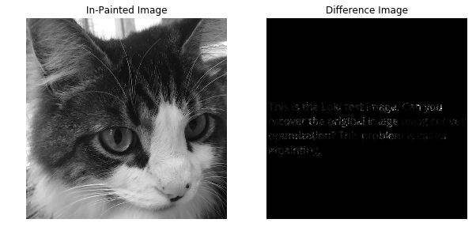
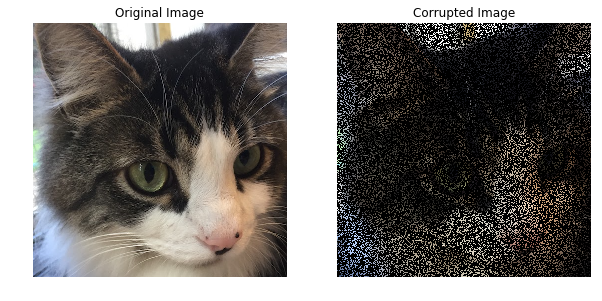
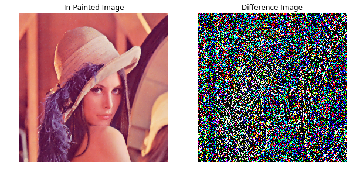

Total variation in-painting
===========================

Grayscale Images
----------------

A grayscale image is represented as an :math:`m \times n` matrix of
intensities :math:`U^\mathrm{orig}` (typically between the values
:math:`0` and :math:`255`). We are given the values
:math:`U^\mathrm{orig}_{ij}`, for :math:`(i,j) \in \mathcal K`, where
:math:`\mathcal K \subset \{1,\ldots, m\} \times \{1, \ldots, n\}` is
the set of indices corresponding to known pixel values. Our job is to
*in-paint* the image by guessing the missing pixel values, *i.e.*, those
with indices not in :math:`\mathcal K`. The reconstructed image will be
represented by :math:`U \in {\bf R}^{m \times n}`, where :math:`U`
matches the known pixels, *i.e.*, :math:`U_{ij} = U^\mathrm{orig}_{ij}`
for :math:`(i,j) \in \mathcal K`.

The reconstruction :math:`U` is found by minimizing the total variation
of :math:`U`, subject to matching the known pixel values. We will use
the :math:`\ell_2` total variation, defined as

.. math::

   \mathop{\bf tv}(U) =
   \sum_{i=1}^{m-1} \sum_{j=1}^{n-1}
   \left\| \left[ \begin{array}{c}
    U_{i+1,j}-U_{ij}\\ U_{i,j+1}-U_{ij} \end{array} \right] \right\|_2.

Note that the norm of the discretized gradient is *not* squared.

We load the original image and the corrupted image and construct the
Known matrix. Both images are displayed below. The corrupted image has
the missing pixels whited out.

.. code:: 

    from PIL import Image
    import matplotlib.pyplot as plt
    import numpy as np
    
    # Load the images.
    orig_img = Image.open("data/lena512.png")
    corr_img = Image.open("data/lena512_corrupted.png")
    
    
    # Convert to arrays.
    Uorig = np.array(orig_img)
    Ucorr = np.array(corr_img)
    rows, cols = Uorig.shape
    
    # Known is 1 if the pixel is known,
    # 0 if the pixel was corrupted.
    Known = np.zeros((rows, cols))
    for i in range(rows):
        for j in range(cols):
             if Uorig[i, j] == Ucorr[i, j]:
                Known[i, j] = 1
    
    %matplotlib inline
    fig, ax = plt.subplots(1, 2,figsize=(10, 5))
    ax[0].imshow(orig_img);
    ax[0].set_title("Original Image")
    ax[0].axis('off')
    ax[1].imshow(corr_img);
    ax[1].set_title("Corrupted Image")
    ax[1].axis('off');

The total variation in-painting problem can be easily expressed in
CVXPY. We use the solver SCS, which finds the optimal value in a few
seconds. The solvers ECOS and CVXOPT take much longer to solve this
large problem.

.. code:: 

    # Recover the original image using total variation in-painting.
    import cvxpy as cvx
    U = cvx.Variable(shape=(rows, cols))
    obj = cvx.Minimize(cvx.tv(U))
    constraints = [cvx.multiply(Known, U) == cvx.multiply(Known, Ucorr)]
    prob = cvx.Problem(obj, constraints)
    # Use SCS to solve the problem.
    prob.solve(verbose=True, solver=cvx.SCS)

.. parsed-literal::

    ----------------------------------------------------------------------------
    	SCS v1.0.5 - Splitting Conic Solver
    	(c) Brendan O'Donoghue, Stanford University, 2012
    ----------------------------------------------------------------------------
    Lin-sys: sparse-direct, nnz in A = 1547594
    EPS = 1.00e-03, ALPHA = 1.80, MAX_ITERS = 2500, NORMALIZE = 1, SCALE = 5.00
    Variables n = 523265, constraints m = 1045507
    Cones:	primal zero / dual free vars: 262144
    	soc vars: 783363, soc blks: 261121
    Setup time: 3.84e+00s
    ----------------------------------------------------------------------------
     Iter | pri res | dua res | rel gap | pri obj | dua obj | kap/tau | time (s)
    ----------------------------------------------------------------------------
         0| 2.97e+00  5.93e+00  1.00e+00 -2.92e+07  6.59e+06  7.18e-09  2.58e-01 
       100| 3.38e-04  2.47e-03  3.84e-05  2.21e+06  2.21e+06  6.98e-10  9.92e+00 
       140| 1.01e-04  7.24e-04  1.24e-05  2.21e+06  2.21e+06  6.98e-10  1.36e+01 
    ----------------------------------------------------------------------------
    Status: Solved
    Timing: Total solve time: 1.37e+01s
    	Lin-sys: nnz in L factor: 12280804, avg solve time: 6.61e-02s
    	Cones: avg projection time: 4.14e-03s
    ----------------------------------------------------------------------------
    Error metrics:
    |Ax + s - b|_2 / (1 + |b|_2) = 1.0084e-04
    |A'y + c|_2 / (1 + |c|_2) = 7.2392e-04
    |c'x + b'y| / (1 + |c'x| + |b'y|) = 1.2426e-05
    dist(s, K) = 0, dist(y, K*) = 0, s'y = 0
    ----------------------------------------------------------------------------
    c'x = 2209202.9055, -b'y = 2209257.8084
    ============================================================================

.. parsed-literal::

    2209202.9055004898

After solving the problem, the in-painted image is stored in
``U.value``. We display the in-painted image and the intensity
difference between the original and in-painted images. The intensity
difference is magnified by a factor of 10 so it is more visible.

.. code:: 

    fig, ax = plt.subplots(1, 2,figsize=(10, 5))
    # Display the in-painted image.
    img_rec = Image.fromarray(U.value)
    ax[0].imshow(img_rec);
    ax[0].set_title("In-Painted Image")
    ax[0].axis('off')
    
    img_diff = Image.fromarray(10*np.abs(Uorig - U.value))
    ax[1].imshow(img_diff);
    ax[1].set_title("Difference Image")
    ax[1].axis('off');

Color Images
============

For color images, the in-painting problem is similar to the grayscale
case. A color image is represented as an :math:`m \times n \times 3`
matrix of RGB values :math:`U^\mathrm{orig}` (typically between the
values :math:`0` and :math:`255`). We are given the pixels
:math:`U^\mathrm{orig}_{ij}`, for :math:`(i,j) \in \mathcal K`, where
:math:`\mathcal K \subset \{1,\ldots, m\} \times \{1, \ldots, n\}` is
the set of indices corresponding to known pixels. Each pixel
:math:`U^\mathrm{orig}_{ij}` is a vector in :math:`{\bf R}^3` of RGB
values. Our job is to *in-paint* the image by guessing the missing
pixels, *i.e.*, those with indices not in :math:`\mathcal K`. The
reconstructed image will be represented by
:math:`U \in {\bf R}^{m \times n \times 3}`, where :math:`U` matches the
known pixels, *i.e.*, :math:`U_{ij} = U^\mathrm{orig}_{ij}` for
:math:`(i,j) \in \mathcal K`.

The reconstruction :math:`U` is found by minimizing the total variation
of :math:`U`, subject to matching the known pixel values. We will use
the :math:`\ell_2` total variation, defined as

.. math::

   \mathop{\bf tv}(U) =
   \sum_{i=1}^{m-1} \sum_{j=1}^{n-1}
   \left\| \left[ \begin{array}{c}
    U_{i+1,j}-U_{ij}\\ 
    U_{i,j+1}-U_{ij} 
    \end{array} \right] \right\|_2.

Note that the norm of the discretized gradient is *not* squared.

We load the original image and construct the Known matrix by randomly
selecting 30% of the pixels to keep and discarding the others. The
original and corrupted images are displayed below. The corrupted image
has the missing pixels blacked out.

.. code:: 

    from PIL import Image
    import matplotlib.pyplot as plt
    import numpy as np
    
    np.random.seed(1)
    # Load the images.
    orig_img = Image.open("data/lena512color.tiff")
    
    # Convert to arrays.
    Uorig = np.array(orig_img)
    rows, cols, colors = Uorig.shape
    
    # Known is 1 if the pixel is known,
    # 0 if the pixel was corrupted.
    # The Known matrix is initialized randomly.
    Known = np.zeros((rows, cols, colors))
    for i in range(rows):
        for j in range(cols):
            if np.random.random() > 0.7:
                for k in range(colors):
                    Known[i, j, k] = 1
                
    Ucorr = Known*Uorig
    corr_img = Image.fromarray(np.uint8(Ucorr))
    
    # Display the images.
    %matplotlib inline
    fig, ax = plt.subplots(1, 2,figsize=(10, 5))
    ax[0].imshow(orig_img);
    ax[0].set_title("Original Image")
    ax[0].axis('off')
    ax[1].imshow(corr_img);
    ax[1].set_title("Corrupted Image")
    ax[1].axis('off');

We express the total variation color in-painting problem in CVXPY using
three matrix variables (one for the red values, one for the blue values,
and one for the green values). We use the solver SCS, which finds the
optimal value in 25 seconds. The solvers ECOS and CVXOPT don't scale to
this large problem.

.. code:: 

    # Recover the original image using total variation in-painting.
    import cvxpy as cvx
    variables = []
    constraints = []
    for i in range(colors):
        U = cvx.Variable(shape=(rows, cols))
        variables.append(U)
        constraints.append(cvx.multiply(Known[:, :, i], U) == cvx.multiply(Known[:, :, i], Ucorr[:, :, i]))
    
    prob = cvx.Problem(cvx.Minimize(cvx.tv(*variables)), constraints)
    prob.solve(verbose=True, solver=cvx.SCS)

.. parsed-literal::

    ----------------------------------------------------------------------------
    	SCS v1.0.5 - Splitting Conic Solver
    	(c) Brendan O'Donoghue, Stanford University, 2012
    ----------------------------------------------------------------------------
    Lin-sys: sparse-direct, nnz in A = 3630814
    EPS = 1.00e-03, ALPHA = 1.80, MAX_ITERS = 2500, NORMALIZE = 1, SCALE = 5.00
    Variables n = 1047553, constraints m = 2614279
    Cones:	primal zero / dual free vars: 786432
    	soc vars: 1827847, soc blks: 261121
    Setup time: 1.16e+01s
    ----------------------------------------------------------------------------
     Iter | pri res | dua res | rel gap | pri obj | dua obj | kap/tau | time (s)
    ----------------------------------------------------------------------------
         0| 4.87e+00  2.03e+01       nan      -inf       inf       inf  6.55e-01 
       100| 7.28e-05  4.92e-04  5.96e-06  2.91e+06  2.91e+06  7.28e-10  3.22e+01 
    ----------------------------------------------------------------------------
    Status: Solved
    Timing: Total solve time: 3.24e+01s
    	Lin-sys: nnz in L factor: 35251632, avg solve time: 2.35e-01s
    	Cones: avg projection time: 7.62e-03s
    ----------------------------------------------------------------------------
    Error metrics:
    |Ax + s - b|_2 / (1 + |b|_2) = 7.2806e-05
    |A'y + c|_2 / (1 + |c|_2) = 4.9207e-04
    |c'x + b'y| / (1 + |c'x| + |b'y|) = 5.9594e-06
    dist(s, K) = 0, dist(y, K*) = 0, s'y = 0
    ----------------------------------------------------------------------------
    c'x = 2906748.2457, -b'y = 2906782.8906
    ============================================================================

.. parsed-literal::

    2906748.2456711144

After solving the problem, the RGB values of the in-painted image are
stored in the value fields of the three variables. We display the
in-painted image and the difference in RGB values at each pixel of the
original and in-painted image. Though the in-painted image looks almost
identical to the original image, you can see that many of the RGB values
differ.

.. code:: 

    import matplotlib.pyplot as plt
    import matplotlib.cm as cm
    %matplotlib inline
    
    # Load variable values into a single array.
    rec_arr = np.zeros((rows, cols, colors), dtype=np.uint8)
    for i in range(colors):
        rec_arr[:, :, i] = variables[i].value
    
    fig, ax = plt.subplots(1, 2,figsize=(10, 5))
    # Display the in-painted image.
    img_rec = Image.fromarray(rec_arr)
    ax[0].imshow(img_rec);
    ax[0].set_title("In-Painted Image")
    ax[0].axis('off')
    
    img_diff = Image.fromarray(np.abs(Uorig - rec_arr))
    ax[1].imshow(img_diff);
    ax[1].set_title("Difference Image")
    ax[1].axis('off');

