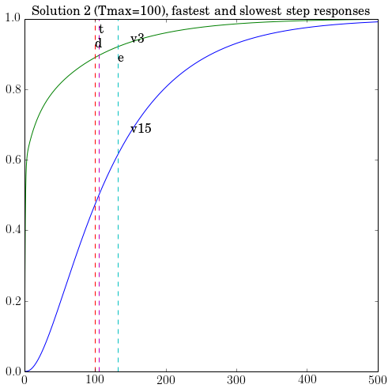
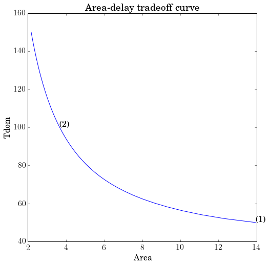

.. _circuit_design:

Circuit Design
==============

Original by Lieven Vanderberghe. Adapted to CVX by Argyris Zymnis,
12/4/2005. Modified by Michael Grant, 3/8/2006. Adapted to CVXPY, with
cosmetic modifications, by Judson Wilson, 5/26/2014.

Topic References:

-  Section 4, L. Vandenberghe, S. Boyd, and A. El Gamal "Optimal Wire
   and Transistor Sizing for Circuits with Non-Tree Topology"

Introduction
------------

We consider the problem of sizing a clock mesh, so as to minimize the
total dissipated power under a constraint on the dominant time constant.
The numbers of nodes in the mesh is :math:`N` per row or column (thus
:math:`n=(N+1)^2` in total). We divide the wire into m segments of width
:math:`x_i`, :math:`i = 1,\dots,m` which is constrained as
:math:`0 \le x_i \le W_{\mbox{max}}`. We use a pi-model of each wire
segment, with capacitance :math:`\beta_i x_i` and conductance
:math:`\alpha_i x_i`. Defining
:math:`C(x) = C_0+x_1 C_1 + x_2 C_ 2 + \cdots + x_m C_m` we have that
the dissipated power is equal to :math:`\mathbf{1}^T C(x) \mathbf{1}`.
Thus to minimize the dissipated power subject to a constraint in the
widths and a constraint in the dominant time constant, we solve the SDP

.. math::

   \begin{array}{ll}
       \mbox{minimize}   & \mathbf{1}^T C(x) \mathbf{1}   \\
       \mbox{subject to} &  T_{\mbox{max}} G(x) - C(x) \succeq 0 \\
                         & 0 \le x_i \le W_{\mbox{max}}.
       \end{array}

Import and setup packages
-------------------------

.. code:: python

    import cvxpy as cvx
    import numpy as np
    import scipy as scipy
    import matplotlib.pyplot as plt

    # Show plots inline in ipython.
    %matplotlib inline

    # Plot properties.
    plt.rc('text', usetex=True)
    plt.rc('font', family='serif')
    font = {'family' : 'normal',
            'weight' : 'normal',
            'size'   : 16}
    plt.rc('font', **font)

Helper functions
----------------

.. code:: python

    # Computes the step response of a linear system.
    def simple_step(A, B, DT, N):
        n  = A.shape[0]
        Ad = scipy.linalg.expm((A * DT))
        Bd = (Ad - np.eye(n)) * B
        Bd = np.linalg.solve(A, Bd)
        X  = np.mat(np.zeros((n, N)))
        for k in range(1, N):
            X[:, k] = Ad * X[:, k-1] + Bd;
        return X
Generate problem data
---------------------

.. code:: python

    #
    # Circuit parameters.
    #

    dim=4            # Grid is dimxdim (assume dim is even).
    n=(dim+1)**2     # Number of nodes.
    m=2*dim*(dim+1)  # Number of wires.
                     #   0 ... dim(dim+1)-1 are horizontal segments
                     #     (numbered rowwise);
                     #   dim(dim+1) ... 2*dim(dim+1)-1 are vertical
                     #     (numbered columnwise)
    beta = 0.5       # Capacitance per segment is twice beta times xi.
    alpha = 1        # Conductance per segment is alpha times xi.
    G0 = 1           # Source conductance.
    C0 = np.array([ (      10,     2,     7,     5,     3),
                    (       8,     3,     9,     5,     5),
                    (       1,     8,     4,     9,     3),
                    (       7,     3,     6,     8,     2),
                    (       5,     2,     1,     9,    10) ])
    wmax = 1        # Upper bound on x.

    #
    # Build capacitance and conductance matrices.
    #

    CC = np.zeros((dim+1, dim+1, dim+1, dim+1, m+1))
    GG = np.zeros((dim+1, dim+1, dim+1, dim+1, m+1))

    # Constant terms.
    # - Reshape order='F' is fortran order to match original
    #   version in MATLAB code.
    CC[:, :, :, :, 0] = np.diag(C0.flatten(1)).reshape(dim+1, dim+1,
                                    dim+1, dim+1, order='F').copy()
    zo13 = np.zeros((2, 1, 2, 1))
    zo13[:,0,:,0] = np.mat([(1, 0), (0, 1)])
    zo24 = np.zeros((1, 2, 1, 2))
    zo24[0,:,0,:] = zo13[:, 0, :, 0]
    pn13 = np.zeros((2, 1, 2, 1))
    pn13[:,0,:,0] = np.mat([(1, -1), (-1, 1)]).reshape(2, 1, 2, 1,
                                                  order='F').copy()
    pn24 = np.zeros((1, 2, 1, 2))
    pn24[0, :, 0, :] = pn13[:, 0, :, 0]

    for i in range(dim+1):
        # Source conductance.
        # First driver in the middle of row 1.
        GG[dim/2, i, dim/2, i, 0] = G0
        for j in range(dim):
            # Horizontal segments.
            node = 1 + j + i * dim
            CC[j:j+2, i, j:j+2, i, node] = beta * zo13[:, 0, :, 0]
            GG[j:j+2, i, j:j+2, i, node] = alpha * pn13[:, 0, :, 0]
            # Vertical segments.
            node = node + dim * ( dim + 1 )
            CC[i, j:j+2, i, j:j+2, node] = beta * zo24[0, :, 0, :]
            GG[i, j:j+2, i, j:j+2, node] = alpha * pn24[0, :, 0, :]

    # Reshape for ease of use.
    CC = CC.reshape((n*n, m+1), order='F').copy()
    GG = GG.reshape((n*n, m+1), order='F').copy()

    #
    # Compute points the tradeoff curve, and the three sample points.
    #

    npts    = 50
    delays  = np.linspace(50, 150, npts)
    xdelays = [50, 100]
    xnpts   = len(xdelays)
    areas   = np.zeros(npts)
    xareas  = dict()
Solve problem and display results
---------------------------------

.. code:: python

    # Iterate over all points, and revisit specific points
    for i in range(npts + xnpts):
        # First pass, only gather minimal data from all cases.
        if i < npts:
            delay = delays[i]
            print( ('Point {} of {} on the tradeoff curve ' \
                  + '(Tmax = {})').format(i+1, npts, delay))
        # Second pass, gather more data for specific cases,
        # and make plots (later).
        else:
            xi = i - npts
            delay = xdelays[xi]
            print( ('Particular solution {} of {} ' \
                  + '(Tmax = {})').format(xi+1, xnpts, delay))

        #
        # Construct and solve the convex model.
        #

        # Variables.
        xt = cvx.Variable(m+1) # Element 1 of xt == 1 below.
        G = cvx.Variable(n,n)  # Symmetric constraint below.
        C = cvx.Variable(n,n)  # Symmetric constraint below.

        # Objective.
        obj = cvx.Minimize(cvx.sum_entries(C))

        # Constraints.
        constraints = [ xt[0] == 1,
                        G == G.T,
                        C == C.T,
                        G == cvx.reshape(GG*xt,n,n),
                        C == cvx.reshape(CC*xt,n,n),
                        delay * G - C == cvx.semidefinite(n),
                        0 <= xt[1:],
                        xt[1:] <= wmax,
                      ]

        #Solve problem
        prob = cvx.Problem(obj, constraints)
        prob.solve()
        if prob.status != cvx.OPTIMAL:
            raise Exception('CVXPY Error')

        # Chop off the first element of x, which is
        # constrainted to be 1
        x = xt.value[1:]

        # First pass, only gather minimal data from all cases.
        if i < npts:
            areas[i] = sum(x)
        # Second pass, gather more data for specific cases,
        # and make plots.
        else:
            xareas[xi] = sum(x)

            #
            # Print display sizes.
            #

            print 'Solution {}:'.format(xi+1)
            print 'Vertical segments:'
            print x[0:dim*(dim+1)].reshape(dim, dim+1, order='F').copy()
            print 'Horizontal segments:'
            print x[dim*(dim+1):].reshape(dim, dim+1, order='F').copy()

            #
            # Determine and plot the step responses.
            #

            A = -np.linalg.inv(C.value)*G.value
            B = -A*np.ones((n, 1))
            T = np.linspace(0, 500, 2000)
            Y = simple_step(A, B, T[1], len(T))
            indmax = -1
            indmin = np.inf
            for j in range(Y.shape[0]):
                inds = np.amin(np.nonzero(Y[j, :] >= 0.5)[1])
                if ( inds > indmax ):
                   indmax = inds
                   jmax = j
                if ( inds < indmin ):
                   indmin = inds
                   jmin = j
            tthres = T[indmax]
            GinvC  = np.linalg.solve(G.value, C.value)
            tdom   = max(np.linalg.eig(GinvC)[0])
            elmore = np.amax(np.sum(GinvC.T, 0))
            plt.figure(figsize=(8, 8))
            plt.plot( T, np.asarray(Y[jmax,:]).flatten(), '-',
                      T, np.asarray(Y[jmin,:]).flatten() )
            plt.plot( tdom   * np.array([1, 1]), [0, 1], '--',
                      elmore * np.array([1, 1]), [0, 1], '--',
                      tthres * np.array([1, 1]), [0, 1], '--' )
            plt.xlim([0, 500])
            plt.ylim([0, 1])
            plt.text(tdom, 0.92, 'd')
            plt.text(elmore, 0.88, 'e')
            plt.text(tthres, 0.96, 't')
            plt.text( T[600], Y[jmax, 600], 'v{}'.format(jmax+1))
            plt.text( T[600], Y[jmin, 600], 'v{}'.format(jmin+1))
            plt.title(('Solution {} (Tmax={}), fastest ' \
                        + 'and slowest step responses').format(xi+1, delay), fontsize=16)
            plt.show()

    #
    # Plot the tradeoff curve.
    #

    plt.figure(figsize=(8, 8))
    ind = np.isfinite(areas)
    plt.plot(areas[ind], delays[ind])
    plt.xlabel('Area')
    plt.ylabel('Tdom')
    plt.title('Area-delay tradeoff curve')
    # Label the specific cases.
    for k in range(xnpts):
        plt.text(xareas[k][0, 0], xdelays[k], '({})'.format(k+1))
    plt.show()

.. parsed-literal::

    Point 1 of 50 on the tradeoff curve (Tmax = 50.0)
    Point 2 of 50 on the tradeoff curve (Tmax = 52.0408163265)
    Point 3 of 50 on the tradeoff curve (Tmax = 54.0816326531)
    Point 4 of 50 on the tradeoff curve (Tmax = 56.1224489796)
    Point 5 of 50 on the tradeoff curve (Tmax = 58.1632653061)
    Point 6 of 50 on the tradeoff curve (Tmax = 60.2040816327)
    Point 7 of 50 on the tradeoff curve (Tmax = 62.2448979592)
    Point 8 of 50 on the tradeoff curve (Tmax = 64.2857142857)
    Point 9 of 50 on the tradeoff curve (Tmax = 66.3265306122)
    Point 10 of 50 on the tradeoff curve (Tmax = 68.3673469388)
    Point 11 of 50 on the tradeoff curve (Tmax = 70.4081632653)
    Point 12 of 50 on the tradeoff curve (Tmax = 72.4489795918)
    Point 13 of 50 on the tradeoff curve (Tmax = 74.4897959184)
    Point 14 of 50 on the tradeoff curve (Tmax = 76.5306122449)
    Point 15 of 50 on the tradeoff curve (Tmax = 78.5714285714)
    Point 16 of 50 on the tradeoff curve (Tmax = 80.612244898)
    Point 17 of 50 on the tradeoff curve (Tmax = 82.6530612245)
    Point 18 of 50 on the tradeoff curve (Tmax = 84.693877551)
    Point 19 of 50 on the tradeoff curve (Tmax = 86.7346938776)
    Point 20 of 50 on the tradeoff curve (Tmax = 88.7755102041)
    Point 21 of 50 on the tradeoff curve (Tmax = 90.8163265306)
    Point 22 of 50 on the tradeoff curve (Tmax = 92.8571428571)
    Point 23 of 50 on the tradeoff curve (Tmax = 94.8979591837)
    Point 24 of 50 on the tradeoff curve (Tmax = 96.9387755102)
    Point 25 of 50 on the tradeoff curve (Tmax = 98.9795918367)
    Point 26 of 50 on the tradeoff curve (Tmax = 101.020408163)
    Point 27 of 50 on the tradeoff curve (Tmax = 103.06122449)
    Point 28 of 50 on the tradeoff curve (Tmax = 105.102040816)
    Point 29 of 50 on the tradeoff curve (Tmax = 107.142857143)
    Point 30 of 50 on the tradeoff curve (Tmax = 109.183673469)
    Point 31 of 50 on the tradeoff curve (Tmax = 111.224489796)
    Point 32 of 50 on the tradeoff curve (Tmax = 113.265306122)
    Point 33 of 50 on the tradeoff curve (Tmax = 115.306122449)
    Point 34 of 50 on the tradeoff curve (Tmax = 117.346938776)
    Point 35 of 50 on the tradeoff curve (Tmax = 119.387755102)
    Point 36 of 50 on the tradeoff curve (Tmax = 121.428571429)
    Point 37 of 50 on the tradeoff curve (Tmax = 123.469387755)
    Point 38 of 50 on the tradeoff curve (Tmax = 125.510204082)
    Point 39 of 50 on the tradeoff curve (Tmax = 127.551020408)
    Point 40 of 50 on the tradeoff curve (Tmax = 129.591836735)
    Point 41 of 50 on the tradeoff curve (Tmax = 131.632653061)
    Point 42 of 50 on the tradeoff curve (Tmax = 133.673469388)
    Point 43 of 50 on the tradeoff curve (Tmax = 135.714285714)
    Point 44 of 50 on the tradeoff curve (Tmax = 137.755102041)
    Point 45 of 50 on the tradeoff curve (Tmax = 139.795918367)
    Point 46 of 50 on the tradeoff curve (Tmax = 141.836734694)
    Point 47 of 50 on the tradeoff curve (Tmax = 143.87755102)
    Point 48 of 50 on the tradeoff curve (Tmax = 145.918367347)
    Point 49 of 50 on the tradeoff curve (Tmax = 147.959183673)
    Point 50 of 50 on the tradeoff curve (Tmax = 150.0)
    Particular solution 1 of 2 (Tmax = 50)
    Solution 1:
    Vertical segments:
    [[ 0.65284942  0.43914725  0.52378641  0.47092764  0.2363529 ]
     [ 0.99999993  0.85353862  0.99999992  0.93601078  0.56994586]
     [ 0.92325575  0.29557654  0.80041338  0.99999998  0.99999997]
     [ 0.41300012  0.13553757  0.26695839  0.67052551  0.88916604]]
    Horizontal segments:
    [[  1.96482534e-01   1.40597477e-01   9.70636721e-08   7.79410966e-08
        5.27448521e-08]
     [  7.07396565e-02   6.38486771e-02   1.02141312e-07   8.59952951e-08
        6.28932386e-08]
     [  6.05774832e-09   1.16285077e-08   3.91575890e-08   9.48421379e-02
        1.58065317e-01]
     [  3.82549764e-07   4.85735816e-07   5.75611351e-07   8.39882993e-02
        5.38621841e-02]]

.. image:: clock_mesh_files/clock_mesh_11_1.png

.. parsed-literal::

    Particular solution 2 of 2 (Tmax = 100)
    Solution 2:
    Vertical segments:
    [[ 0.2687881   0.04368684  0.17122094  0.133796    0.07360396]
     [ 0.41346231  0.08016135  0.30642705  0.2224136   0.1484946 ]
     [ 0.25755998  0.08016077  0.11200259  0.38352317  0.28159768]
     [ 0.13439419  0.04368697  0.02445701  0.24083502  0.24534599]]
    Horizontal segments:
    [[  1.53940099e-09  -5.24201582e-10  -9.81239894e-10  -5.24795793e-10
        1.57225223e-09]
     [  9.22364268e-10  -9.62820741e-10  -1.35650863e-09  -1.00291410e-09
        1.03002692e-09]
     [  9.27808967e-10  -9.18371287e-10  -2.29520965e-10  -7.98112036e-10
        1.50541203e-09]
     [  1.31806182e-09  -8.56476546e-10  -1.40000198e-09  -8.38943705e-10
        1.27508885e-09]]

