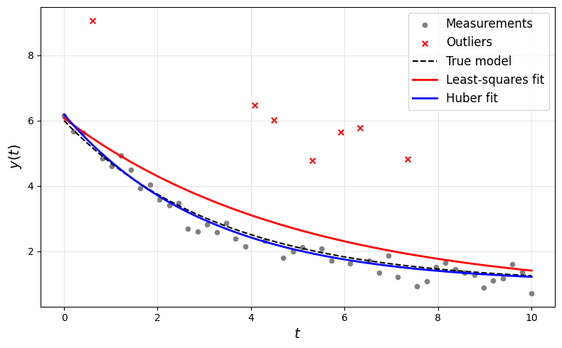

Fitting an exponential decay model
==================================

*This example is adapted from Cederberg, Zhang, Nobel, and Boyd,* "`Disciplined Nonlinear Programming <https://stanford.edu/~boyd/papers/pdf/dnlp.pdf>`__\ ".

In this example, we use CVXPY DNLP to fit an exponential decay model
on synthetic data of varying quality. An exponential decay model describes a quantity
:math:`y(t)` that decreases over time :math:`t` at a rate proportional
to its current value. The model takes the form

.. math::

   y(t) = ae^{-\lambda t} + c,

where the model parameters are the amplitude :math:`a \in \mathbf{R}`,
the decay rate :math:`\lambda > 0`, and the asymptotic offset
:math:`c \in \mathbf{R}`. Given noisy measurements
:math:`(t_i, y_i)` for :math:`i = 1, \ldots, m`, we estimate the
parameters by solving the nonlinear least-squares problem

.. math::

   \begin{array}{ll}
   \mbox{minimize} & \sum_{i=1}^{m} (y_i - ae^{-\lambda t_i} - c)^2 \\
   \mbox{subject to} & \lambda \geq 0,
   \end{array}

with variables :math:`a, \lambda, c \in \mathbf{R}`. This problem is not
convex, but close to convex. When :math:`\lambda` is fixed, it is convex
in :math:`a` and :math:`c`. When :math:`c` is known and :math:`a` is
positive, one could also fit :math:`a` and :math:`\lambda` by taking
logarithms and solving the linear least-squares problem of minimizing
:math:`\sum_{i=1}^{m}(\log(y_i - c) - \tilde{a} + \lambda t_i)^2`
subject to :math:`\lambda \geq 0`, where
:math:`\tilde{a} = \log a` is the log-transformed amplitude.

Alternatively, to gain robustness to outliers, we can replace the
least-squares objective with a Huber loss, resulting in a problem of the
form

.. math::

   \begin{array}{ll}
   \mbox{minimize} & \sum_{i=1}^{m} \phi(y_i - ae^{-\lambda t_i} - c; M) \\
   \mbox{subject to} & \lambda \geq 0,
   \end{array}

where :math:`\phi(\cdot; M)` is the Huber function with fixed threshold
:math:`M > 0` (see table 1). Here the variables are
:math:`a, \lambda, c \in \mathbf{R}`.

Finally, we note that since there are only three variables, it is quite
tractable to solve the problem globally by *gridding*, i.e., evaluating
the objective on a large but finite set of values of the parameters,
possibly with refinement. We do this in our example below to certify the
parameters found by Ipopt as globally optimal.

.. code:: python

   import numpy as np
   import cvxpy as cp
   import matplotlib.pyplot as plt

   # ---------------------------------------------------------------------------
   # Generate toy data with outliers
   # ---------------------------------------------------------------------------
   np.random.seed(42)
   m = 50
   a_true, lambda_true, c_true = 5.0, 0.3, 1.0
   sigma = 0.3
   t = np.linspace(0, 10, m)
   y = a_true * np.exp(-lambda_true * t) + c_true + sigma * np.random.randn(m)

   # Corrupt ~7 points with large outliers
   outlier_idx = np.random.choice(m, size=7, replace=False)
   y[outlier_idx] += np.random.uniform(3, 4, size=7)

   # ---------------------------------------------------------------------------
   # Least-squares fit
   # ---------------------------------------------------------------------------
   a_ls, lmbda_ls, c_ls = cp.Variable(), cp.Variable(nonneg=True), cp.Variable()
   residuals_ls = y - (a_ls * cp.exp(-lmbda_ls * t) + c_ls)
   prob_ls = cp.Problem(cp.Minimize(cp.sum_squares(residuals_ls)))

   a_ls.value, lmbda_ls.value, c_ls.value = 4.0, 0.5, 0.5
   prob_ls.solve(nlp=True, solver=cp.IPOPT)

   print("Least-squares fit")
   print(f"  a={a_ls.value:.3f}, lambda={lmbda_ls.value:.3f}, c={c_ls.value:.3f}")

.. parsed-literal::

   Least-squares fit
      a=5.402, lambda=0.200, c=0.671

.. code:: python

   # ---------------------------------------------------------------------------
   # Huber fit  
   # ---------------------------------------------------------------------------
   M = sigma
   a_hub, lmbda_hub, c_hub = cp.Variable(), cp.Variable(nonneg=True), cp.Variable()
   residuals_hub = y - (a_hub * cp.exp(-lmbda_hub * t) + c_hub)
   prob_hub = cp.Problem(cp.Minimize(cp.sum(cp.huber(residuals_hub, M=M))))

   a_hub.value, lmbda_hub.value, c_hub.value = 4.0, 0.5, 0.5
   prob_hub.solve(nlp=True, solver=cp.IPOPT)

   print("\nHuber fit")
   print(f"  a={a_hub.value:.3f}, lambda={lmbda_hub.value:.3f}, c={c_hub.value:.3f}")

.. parsed-literal::

   Huber fit
      a=5.172, lambda=0.326, c=1.017

.. code:: python

   print(f"\nTrue parameters: a={a_true}, lambda={lambda_true}, c={c_true}")

.. parsed-literal::

   True parameters: a=5.0, lambda=0.3, c=1.0

.. code:: python

   # ---------------------------------------------------------------------------
   # Plot
   # ---------------------------------------------------------------------------
   t_fine = np.linspace(0, 10, 200)
   y_true = a_true * np.exp(-lambda_true * t_fine) + c_true
   y_ls = a_ls.value * np.exp(-lmbda_ls.value * t_fine) + c_ls.value
   y_hub = a_hub.value * np.exp(-lmbda_hub.value * t_fine) + c_hub.value

   fig, ax = plt.subplots(figsize=(8, 5))
   inlier_mask = np.ones(m, dtype=bool)
   inlier_mask[outlier_idx] = False
   ax.scatter(t[inlier_mask], y[inlier_mask], color='gray', s=20, label='Measurements')
   ax.scatter(t[outlier_idx], y[outlier_idx], color='red', s=30, marker='x', label='Outliers')
   ax.plot(t_fine, y_true, 'k--', linewidth=1.5, label='True model')
   ax.plot(t_fine, y_ls, 'r-', linewidth=2, label='Least-squares fit')
   ax.plot(t_fine, y_hub, 'b-', linewidth=2, label='Huber fit')
   ax.set_xlabel('$t$', fontsize=14)
   ax.set_ylabel('$y(t)$', fontsize=14)
   ax.legend(fontsize=12)
   ax.grid(True, alpha=0.3)
   plt.tight_layout()

