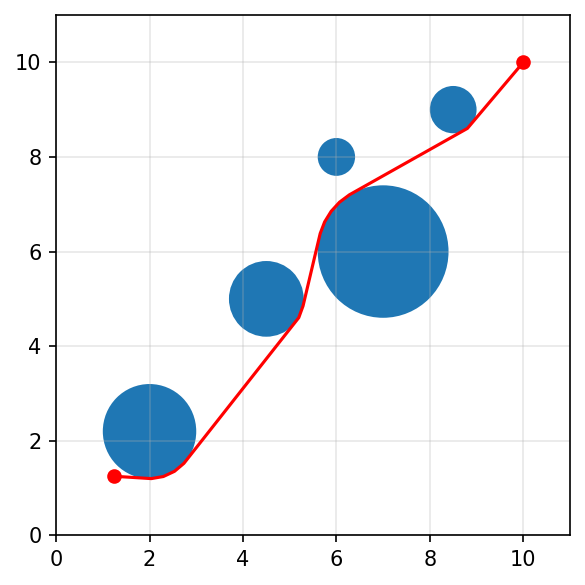

Path planning with obstacles
============================

*This example is adapted from Cederberg, Zhang, Nobel, and Boyd,* "`Disciplined Nonlinear Programming <https://stanford.edu/~boyd/papers/pdf/dnlp.pdf>`__\ ".

**Problem.** We seek the shortest path connecting points :math:`a` and
:math:`b` in :math:`\mathbf{R}^d` that avoids :math:`m` circles,
centered at :math:`p_j` with radius :math:`r_j`,
:math:`j = 1, \ldots, m`. After discretizing the
arc-length-parametrized path into a sequence of points
:math:`x_0, \ldots, x_n`, the problem can be written as

.. math::

   \begin{array}{ll}
   \mbox{minimize} & L \\
   \mbox{subject to} & x_0 = a, \quad x_n = b \\
   & \|x_{i+1} - x_i\|_2^2 \leq (L/n)^2, \quad i = 0, \ldots, n - 1 \\
   & \|x_i - p_j\|_2^2 \geq r_j^2, \quad i = 1, \ldots, n - 1, \quad j = 1, \ldots, m \\
   & L \geq 0,
   \end{array}

with variables :math:`L \in \mathbf{R}` and
:math:`x_i \in \mathbf{R}^d`, :math:`i = 0, \ldots, n`. The problem
data are :math:`a \in \mathbf{R}^d`, :math:`b \in \mathbf{R}^d`, and
:math:`p_j \in \mathbf{R}^d` and :math:`r_j > 0` for
:math:`j = 1, \ldots, m`.

.. code:: python
    import cvxpy as cp

    # problem data
    n = 50
    ell = 10
    m = 5
    a = np.array([[1.25, 1.25]])
    b = np.array([[ell, ell]])
    d = 2
    p = np.array([[2, 4.5, 6, 7, 8.5], [2.2, 5, 8, 6, 9]]).T
    r = np.array([1, 0.8, 0.4, 1.4, 0.5])

    x = cp.Variable((d, n + 1), name="x")
    L = cp.Variable(name="L", nonneg=True)
    constr = [x[:, 0] == a, x[:, n] == b]
    constr += [cp.sum(cp.square(x[:, 1:] - x[:, :-1]), axis=0) <= (L / n) ** 2]
    for i in range(n + 1):
        constr += [cp.sum(cp.square(x[:, i] - p), axis=1) >= r ** 2]

    # initialize to straight line path
    x.value = (b.T - a.T) / n * np.arange(n + 1) + a.T
    prob = cp.Problem(cp.Minimize(L), constr)
    prob.solve(nlp=True, solver=cp.IPOPT, verbose=False)

.. code:: python
    fig, ax = plt.subplots(figsize=(4, 4))
    for i in range(m):
        center = tuple(p[i, :])
        circle = mpatches.Circle(center, r[i], ec="none")
        ax.add_patch(circle)

    plt.plot(a[0, 0], a[0, 1], "ro", markersize=6)
    plt.plot(b[0, 0], b[0, 1], "ro", markersize=6)
    ax1 = x.value[0, :]
    ax2 = x.value[1, :]
    plt.plot(ax1, ax2, "r-")
    plt.ylim(0, 11)
    plt.xlim(0, 11)
    ax.grid(alpha=0.3)
    fig.set_dpi(150)
    fig.tight_layout()

