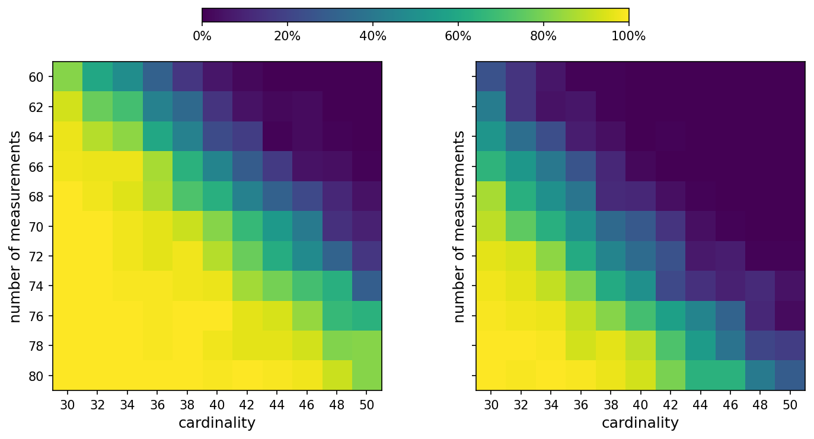

Sparse signal recovery
======================

*This example is adapted from Cederberg, Zhang, Nobel, and Boyd,* "`Disciplined Nonlinear Programming <https://stanford.edu/~boyd/papers/pdf/dnlp.pdf>`__\ ".

In this example, the goal is to recover a sparse signal
:math:`x_0 \in \mathbf{R}^n` from a given measurement vector
:math:`y = Ax_0`, where :math:`A \in \mathbf{R}^{m \times n}` (with
:math:`m < n`) is a known sensing matrix [26]. A common heuristic based
on convex optimization is to minimize the :math:`\ell_1` norm of
:math:`x` subject to :math:`Ax = y`. An alternative approach based on
nonconvex optimization is to minimize the sum of the square roots of the
absolute values of the entries of :math:`x`, which tends to promote
sparsity more aggressively. This leads to the problem

.. math::

   \begin{array}{ll}
   \mbox{minimize} & \sum_{i=1}^{n} \sqrt{|x_i|} \\
   \mbox{subject to} & Ax = y,
   \end{array}

with variable :math:`x`. This problem is DNLP-compliant since the
objective is L-convex.

**DNLP specification**. The code specifying this problem is given below. For this
example, we use Knitro's interior-point method as the solver, because Ipopt failed
to solve this problem reliably. The issue likely arises from the fact that the objective
function gradient becomes infinite as any entry of x approaches zero, so no KKT
point exists for the canonicalized problem.

We consider a simulation with signal dimension n = 100, where we vary the number of measurements m 
from 60 to 80, and the cardinality of the true signal :math:`x_0` from 30 to 50. The positions of the 
nonzero entries of :math:`x_0` are sampled from a uniform distribution, with the nonzero values chosen 
as :math:`\mathcal{N}(0, 25)` random variables. The entries of A are sampled from a standard normal distribution.
We say that the recovery is successful if the relative error
:math:`\|\hat{x} - x_0\|_2 / \|x_0\|_2` is less than
:math:`10^{-2}`, where :math:`\hat{x}` is the recovered signal. To
estimate the probability of successful recovery for each pair of number
of measurements and signal cardinality, we repeat the simulation 100
times and compute the fraction of successful recoveries.

.. code:: python
   import matplotlib.pyplot as plt
   import numpy as np
   import numpy.linalg as LA
   import cvxpy as cp
   from matplotlib.ticker import PercentFormatter

   rng = np.random.default_rng(0)
   n, T = 100, 100
   m = list(range(60, 81, 2))
   k = list(range(30, 51, 2))

   RECOVERY_TOL = 1e-2
   probabilities_noncvx = np.zeros((len(m), len(k)))
   probabilities_cvx = np.zeros((len(m), len(k)))

   for time in range(T):
      print(f"Trial {time+1} of {T}")
      for kk in k:
         x0 = np.zeros((n,))
         ind = rng.permutation(n)
         ind = ind[0:kk]
         x0[ind] = rng.standard_normal((kk,)) * 5
         
         for mm in m:
               A = rng.standard_normal((mm, n))
               y = A @ x0
               
               # nonconvex recovery
               x = cp.Variable((n, ))
               prob = cp.Problem(cp.Minimize(cp.sum(cp.sqrt(cp.abs(x)))), [A @ x == y])
               prob.solve(nlp=True, solver=cp.KNITRO, verbose=False, algorithm=1)
               x_noncvx_recovery = x.value      
      
               # convex recovery
               x = cp.Variable((n, ))
               prob = cp.Problem(cp.Minimize(cp.norm1(x)), [A @ x == y])
               prob.solve(solver=cp.CLARABEL)
               x_cvx_recovery = x.value

               # were the recoveries successful?
               noncvx_success = LA.norm(x_noncvx_recovery - x0, 2) / LA.norm(x0, 2) <= RECOVERY_TOL
               cvx_success = LA.norm(x_cvx_recovery - x0, 2) / LA.norm(x0, 2) <= RECOVERY_TOL
               probabilities_noncvx[m.index(mm), k.index(kk)] += int(noncvx_success)
               probabilities_cvx[m.index(mm), k.index(kk)] += int(cvx_success)

We see below that the nonconvex approach is more has a higher probability of 
recovery than the convex approach. Left: Approach based on nonconvex
optimization. Right: Approach based on convex optimization.

