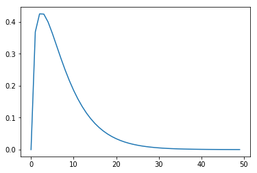

Fractional optimization
=======================

This notebook shows how to solve a simple *concave fractional problem*,
in which the objective is to maximize the ratio of a nonnegative concave
function and a positive convex function. Concave fractional problems are
quasiconvex programs (QCPs). They can be specified using disciplined
quasiconvex programming
(`DQCP <https://www.cvxpy.org/tutorial/dqcp/index.html>`__), and hence
can be solved using CVXPY.

.. code:: 

    !pip install --upgrade cvxpy

.. code:: 

    import cvxpy as cp
    import numpy as np
    import matplotlib.pyplot as plt

Our goal is to maximize the function

.. math:: \frac{\sqrt{x}}{\exp(x)}.

This function is not concave, but it is quasiconcave, as can be seen by
inspecting its graph.

.. code:: 

    plt.plot([np.sqrt(y) / np.exp(y) for y in np.linspace(0, 10)])
    plt.show()

The below code specifies and solves the QCP, using DQCP. The concave
fraction function is DQCP-compliant, because the ratio atom is
quasiconcave (actually, quasilinear), increasing in the numerator when
the denominator is positive, and decreasing in the denominator when the
numerator is nonnegative.

.. code:: 

    x = cp.Variable()
    concave_fractional_fn = cp.sqrt(x) / cp.exp(x)
    problem = cp.Problem(cp.Maximize(concave_fractional_fn))
    assert problem.is_dqcp()
    problem.solve(qcp=True)

.. parsed-literal::

    0.4288821220397949

.. code:: 

    x.value

.. parsed-literal::

    array(0.50000165)

