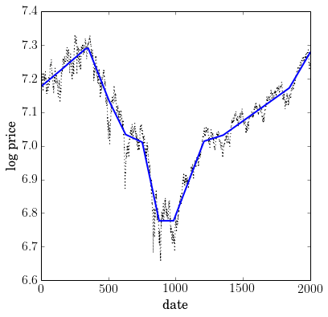

.. _l1_trend_filter:

:math:`\ell_1` Trend Filtering
==============================

A derivative work by Judson Wilson, 5/28/2014. Adapted from the CVX
example of the same name, by Kwangmoo Koh, 12/10/2007

Topic Reference:

-  S.-J. Kim, K. Koh, S. Boyd, and D. Gorinevsky, \`\`l\_1 Trend
   Filtering'' http://stanford.edu/~boyd/papers/l1\_trend\_filter.html

Introduction
------------

The problem of estimating underlying trends in time series data arises
in a variety of disciplines. The :math:`\ell_1` trend filtering method
produces trend estimates x that are piecewise linear from the time
series :math:`y`.

The :math:`\ell_1` trend estimation problem can be formulated as

.. math::

   \begin{array}{ll}
       \mbox{minimize}   &  (1/2)||y-x||_2^2 + \lambda ||Dx||_1,
       \end{array}

with variable :math:`x` , and problem data :math:`y` and
:math:`\lambda`, with :math:`\lambda >0`. :math:`D` is the second
difference matrix, with rows

.. math:: \begin{bmatrix}0 & \cdots & 0 & -1 & 2 & -1 & 0 & \cdots & 0 \end{bmatrix}.

CVXPY is not optimized for the :math:`\ell_1` trend filtering problem.
For large problems, use l1\_tf (http://www.stanford.edu/~boyd/l1\_tf/).

Formulate and solve problem
---------------------------

Data file available at: `snp500.txt <./snp500.txt>`__. Alternative link:
http://web.cvxr.com/cvx/examples/time\_series\_analysis/l1\_trend\_filter\_snp500.m

.. code:: python

    import numpy as np
    import cvxpy as cvx
    import scipy as scipy
    import cvxopt as cvxopt

    # Load time series data: S&P 500 price log.
    y = np.loadtxt(open('snp500.txt', 'rb'), delimiter=",", skiprows=1)
    n = y.size

    # Form second difference matrix.
    e = np.mat(np.ones((1, n)))
    D = scipy.sparse.spdiags(np.vstack((e, -2*e, e)), range(3), n-2, n)
    # Convert D to cvxopt sparse format, due to bug in scipy which prevents
    # overloading neccessary for CVXPY. Use COOrdinate format as intermediate.
    D_coo = D.tocoo()
    D = cvxopt.spmatrix(D_coo.data, D_coo.row.tolist(), D_coo.col.tolist())

    # Set regularization parameter.
    vlambda = 50

    # Solve l1 trend filtering problem.
    x = cvx.Variable(n)
    obj = cvx.Minimize(0.5 * cvx.sum_squares(y - x)
                       + vlambda * cvx.norm(D*x, 1) )
    prob = cvx.Problem(obj)
    # ECOS and SCS solvers fail to converge before
    # the iteration limit. Use CVXOPT instead.
    prob.solve(solver=cvx.CVXOPT)

    print 'Solver status: ', prob.status
    # Check for error.
    if prob.status != cvx.OPTIMAL:
        raise Exception("Solver did not converge!")

.. parsed-literal::

    Solver status:  optimal

Results plot
------------

.. code:: python

    import matplotlib.pyplot as plt

    # Show plots inline in ipython.
    %matplotlib inline

    # Plot properties.
    plt.rc('text', usetex=True)
    plt.rc('font', family='serif')
    font = {'family' : 'normal',
            'weight' : 'normal',
            'size'   : 16}
    plt.rc('font', **font)

    # Plot estimated trend with original signal.
    plt.figure(figsize=(6, 6))
    plt.plot(np.arange(1,n+1), y, 'k:', linewidth=1.0)
    plt.plot(np.arange(1,n+1), np.array(x.value), 'b-', linewidth=2.0)
    plt.xlabel('date')
    plt.ylabel('log price')

.. parsed-literal::

    <matplotlib.text.Text at 0xdd2b2d0>

