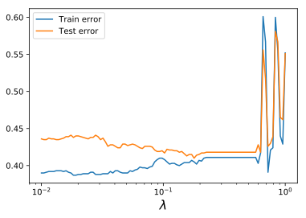
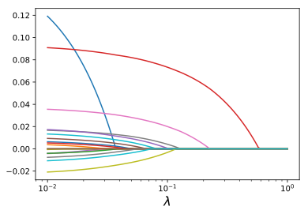

Logistic regression with :math:`\ell_1` regularization
======================================================

In this example, we use CVXPY to train a logistic regression classifier
with :math:`\ell_1` regularization. We are given data :math:`(x_i,y_i)`,
:math:`i=1,\ldots, m`. The :math:`x_i \in {\bf R}^n` are feature
vectors, while the :math:`y_i \in \{0, 1\}` are associated boolean
classes; we assume the first component of each :math:`x_i` is :math:`1`.

Our goal is to construct a linear classifier
:math:`\hat y = \mathbb{1}[\beta^T x > 0]`, which is :math:`1` when
:math:`\beta^T x` is positive and :math:`0` otherwise. We model the
posterior probabilities of the classes given the data linearly, with

.. math::

   \log \frac{\mathrm{Pr} (Y=1 \mid X = x)}{\mathrm{Pr} (Y=0 \mid X = x)} = \beta^T x.

This implies that

.. math::

   \mathrm{Pr} (Y=1 \mid X = x) = \frac{\exp(\beta^T x)}{1 + \exp(\beta^T x)}, \quad
   \mathrm{Pr} (Y=0 \mid X = x) = \frac{1}{1 + \exp(\beta^T x)}.

We fit :math:`\beta` by maximizing the log-likelihood of the data, plus
a regularization term :math:`\lambda \|{\beta_{1:}}\|_1` with
:math:`\lambda > 0`:

.. math::

   \ell(\beta) = \sum_{i=1}^{m} y_i \beta^T x_i - \log(1 + \exp (\beta^T x_i)) - \lambda \|{\beta_{1:}}\|_1.

Because :math:`\ell` is a concave function of :math:`\beta`, this is a
convex optimization problem.

.. code:: python

    from __future__ import division
    import cvxpy as cp
    import numpy as np
    import matplotlib.pyplot as plt

In the following code we generate data with :math:`n=20` features by
randomly choosing :math:`x_i` and a sparse
:math:`\beta_{\mathrm{true}} \in {\bf R}^n`. We then set
:math:`y_i = \mathbb{1}[\beta_{\mathrm{true}}^T x_i  - z_i > 0]`, where
the :math:`z_i` are i.i.d. normal random variables. We divide the data
into training and test sets with :math:`m=1000` examples each.

.. code:: python

    np.random.seed(1)
    n = 20
    m = 1000
    density = 0.2
    beta_true = np.random.randn(n,1)
    idxs = np.random.choice(range(n), int((1-density)*n), replace=False)
    for idx in idxs:
        beta_true[idx] = 0
    
    sigma = 45
    X = np.random.normal(0, 5, size=(m,n))
    X[:, 0] = 1.0
    Y = X @ beta_true + np.random.normal(0, sigma, size=(m,1))
    Y[Y > 0] = 1
    Y[Y <= 0] = 0
    
    X_test = np.random.normal(0, 5, size=(m, n))
    X_test[:, 0] = 1.0
    Y_test = X_test @ beta_true + np.random.normal(0, sigma, size=(m,1))
    Y_test[Y_test > 0] = 1
    Y_test[Y_test <= 0] = 0

We next formulate the optimization problem using CVXPY.

.. code:: python

    beta = cp.Variable((n,1))
    lambd = cp.Parameter(nonneg=True)
    log_likelihood = cp.sum(
        cp.reshape(cp.multiply(Y, X @ beta), (m,)) -
        cp.log_sum_exp(cp.hstack([np.zeros((m,1)), X @ beta]), axis=1) - 
        lambd * cp.norm(beta[1:], 1)
    )
    problem = cp.Problem(cp.Maximize(log_likelihood))

We solve the optimization problem for a range of :math:`\lambda` to
compute a trade-off curve. We then plot the train and test error over
the trade-off curve. A reasonable choice of :math:`\lambda` is the value
that minimizes the test error.

.. code:: python

    def error(scores, labels):
      scores[scores > 0] = 1
      scores[scores <= 0] = 0
      return np.sum(np.abs(scores - labels)) / float(np.size(labels))

.. code:: python

    trials = 100
    train_error = np.zeros(trials)
    test_error = np.zeros(trials)
    lambda_vals = np.logspace(-2, 0, trials)
    beta_vals = []
    for i in range(trials):
        lambd.value = lambda_vals[i]
        problem.solve()
        train_error[i] = error(X @ beta.value, Y)
        test_error[i] = error(X_test @ beta.value, Y_test)
        beta_vals.append(beta.value)

.. code:: python

    %matplotlib inline
    %config InlineBackend.figure_format = 'svg'
    
    plt.plot(lambda_vals, train_error, label="Train error")
    plt.plot(lambda_vals, test_error, label="Test error")
    plt.xscale('log')
    plt.legend(loc='upper left')
    plt.xlabel(r"$\lambda$", fontsize=16)
    plt.show()

We also plot the regularization path, or the :math:`\beta_i` versus
:math:`\lambda`. Notice that a few features remain non-zero longer for
larger :math:`\lambda` than the rest, which suggests that these features
are the most important.

.. code:: python

    for i in range(n):
        plt.plot(lambda_vals, [wi[i,0] for wi in beta_vals])
    plt.xlabel(r"$\lambda$", fontsize=16)
    plt.xscale("log")

