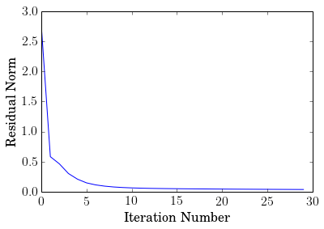

.. _nonneg_matrix_fact:

Nonnegative Matrix Factorization
================================

| A derivative work by Judson Wilson, 6/2/2014.
| Adapted from the CVX example of the same name, by Argyris Zymnis, Joelle Skaf and Stephen Boyd

Introduction
------------

We are given a matrix :math:`A \in \mathbf{\mbox{R}}^{m \times n}` and
are interested in solving the problem:

.. math::

    \begin{array}{ll}
    \mbox{minimize}   & \| A - YX \|_F \\
    \mbox{subject to} & Y \succeq 0 \\
                      & X \succeq 0,
    \end{array}

where :math:`Y \in \mathbf{\mbox{R}}^{m \times k}` and
:math:`X \in \mathbf{\mbox{R}}^{k \times n}`.

This example generates a random matrix :math:`A` and obtains an
*approximate* solution to the above problem by first generating a random
initial guess for :math:`Y` and then alternatively minimizing over
:math:`X` and :math:`Y` for a fixed number of iterations.

Generate problem data
---------------------

.. code:: python

    import cvxpy as cvx
    import numpy as np

    # Ensure repeatably random problem data.
    np.random.seed(0)

    # Generate random data matrix A.
    m = 10
    n = 10
    k = 5
    A = np.random.rand(m, k).dot(np.random.rand(k, n))

    # Initialize Y randomly.
    Y_init = np.random.rand(m, k)

Perform alternating minimization
--------------------------------

.. code:: python

    # Ensure same initial random Y, rather than generate new one
    # when executing this cell.
    Y = Y_init

    # Perform alternating minimization.
    MAX_ITERS = 30
    residual = np.zeros(MAX_ITERS)
    for iter_num in range(1, 1+MAX_ITERS):
        # At the beginning of an iteration, X and Y are NumPy
        # array types, NOT CVXPY variables.

        # For odd iterations, treat Y constant, optimize over X.
        if iter_num % 2 == 1:
            X = cvx.Variable(k, n)
            constraint = [X >= 0]
        # For even iterations, treat X constant, optimize over Y.
        else:
            Y = cvx.Variable(m, k)
            constraint = [Y >= 0]

        # Solve the problem.
        obj = cvx.Minimize(cvx.norm(A - Y*X, 'fro'))
        prob = cvx.Problem(obj, constraint)
        prob.solve(solver=cvx.ECOS)

        if prob.status != cvx.OPTIMAL:
            raise Exception("Solver did not converge!")

        print 'Iteration {}, residual norm {}'.format(iter_num, prob.value)
        residual[iter_num-1] = prob.value

        # Convert variable to NumPy array constant for next iteration.
        if iter_num % 2 == 1:
            X = X.value
        else:
            Y = Y.value

.. parsed-literal::

    Iteration 1, residual norm 2.76554556878
    Iteration 2, residual norm 0.58424028355
    Iteration 3, residual norm 0.464977652325
    Iteration 4, residual norm 0.304509099482
    Iteration 5, residual norm 0.210812104807
    Iteration 6, residual norm 0.149285412154
    Iteration 7, residual norm 0.115822729277
    Iteration 8, residual norm 0.0949166009533
    Iteration 9, residual norm 0.0810869474847
    Iteration 10, residual norm 0.0720197979793
    Iteration 11, residual norm 0.0655917199152
    Iteration 12, residual norm 0.0611422237619
    Iteration 13, residual norm 0.0579289476463
    Iteration 14, residual norm 0.0555556187154
    Iteration 15, residual norm 0.0536388094494
    Iteration 16, residual norm 0.0520291219472
    Iteration 17, residual norm 0.0506149313538
    Iteration 18, residual norm 0.0493320538706
    Iteration 19, residual norm 0.0481635960832
    Iteration 20, residual norm 0.0470769774749
    Iteration 21, residual norm 0.046070381691
    Iteration 22, residual norm 0.045121033974
    Iteration 23, residual norm 0.0442324247274
    Iteration 24, residual norm 0.0433871149405
    Iteration 25, residual norm 0.0425901131373
    Iteration 26, residual norm 0.0418270869927
    Iteration 27, residual norm 0.0411031114511
    Iteration 28, residual norm 0.0404061844157
    Iteration 29, residual norm 0.0397417255013
    Iteration 30, residual norm 0.0390991641525

Output results
--------------

.. code:: python

    #
    # Plot residuals.
    #

    import matplotlib.pyplot as plt

    # Show plot inline in ipython.
    %matplotlib inline

    # Set plot properties.
    plt.rc('text', usetex=True)
    plt.rc('font', family='serif')
    font = {'family' : 'normal',
            'weight' : 'normal',
            'size'   : 16}
    plt.rc('font', **font)

    # Create the plot.
    plt.plot(residual)
    plt.xlabel('Iteration Number')
    plt.ylabel('Residual Norm')
    plt.show()

    #
    # Print results.
    #
    print 'Original matrix:'
    print A
    print 'Left factor Y:'
    print Y
    print 'Right factor X:'
    print X
    print 'Residual A - Y * X:'
    print A - Y * X
    print 'Residual after {} iterations: {}'.format(iter_num, prob.value)

.. parsed-literal::

    Original matrix:
    [[ 1.323426    1.11061189  1.69137835  1.20020115  1.13216889  0.5980743
       1.64965406  0.340611    1.69871738  0.78278448]
     [ 1.73721109  1.40464204  1.90898877  1.60774132  1.53717253  0.62647405
       1.76242265  0.41151492  1.8048194   1.20313124]
     [ 1.4071438   1.10269406  1.75323063  1.18928983  1.23428169  0.60364688
       1.63792853  0.40855006  1.57257432  1.17227344]
     [ 1.3905141   1.33367163  1.07723947  1.67735654  1.33039096  0.42003169
       1.22641711  0.21470465  1.47350799  0.84931787]
     [ 1.42153652  1.13598552  2.00816457  1.11463462  1.17914429  0.69942578
       1.90353699  0.45664487  1.81023916  1.09668578]
     [ 1.60813803  1.23214532  1.73741086  1.3148874   1.27589039  0.40755835
       1.31904948  0.3469129   1.34256526  0.76924618]
     [ 0.90607895  0.6632877   1.25412229  0.81696721  0.87218892  0.50032884
       1.245879    0.25079329  1.25017792  0.72155621]
     [ 1.5691922   1.47359672  1.76518996  1.66268312  1.43746574  0.72486628
       1.97409333  0.39239642  2.09234807  1.16325748]
     [ 1.18723548  1.00282008  1.41532595  1.03836298  0.90382914  0.38460446
       1.213473    0.23641422  1.32784402  0.27179726]
     [ 0.75789915  0.75119989  0.99502166  0.65444815  0.56073096  0.341146
       1.02555143  0.24273668  1.01035919  0.49427978]]
    Left factor Y:
    [[  7.40733791e-01   2.82233422e-01   6.79031335e-01   6.90788473e-01
        6.75922769e+00]
     [  6.63938209e-01   8.62626233e-01   5.47360330e-01   3.97034630e-01
        2.15367899e+00]
     [  5.93113705e-01   6.85883833e-01   8.82088454e-01   4.29318773e-02
        2.60309960e-08]
     [  2.54641969e-01   8.69899856e-01   2.80001362e-09   1.14277709e+00
        4.99370987e+00]
     [  8.16905919e-01   3.74565931e-01   1.17731599e+00   2.98169167e-01
        2.08990508e+00]
     [  7.77008630e-01   6.05794731e-01   5.95407999e-03   3.73777774e-01
        5.91222851e-08]
     [  4.70427608e-01   3.15875940e-01   6.51147995e-01   1.50315628e-09
        6.23841260e+00]
     [  5.88405727e-01   6.38349797e-01   9.39515175e-01   1.13949731e+00
        6.29504103e+00]
     [  8.10830925e-01   9.66630136e-09   3.26942930e-02   1.00835999e+00
        7.56338665e+00]
     [  4.39043996e-01   9.07748929e-02   6.43662848e-01   7.68161355e-01
        6.93806900e-08]]
    Right factor X:
    [[  1.21318909e+00   7.66304609e-01   1.67900928e+00   6.27036474e-01
        7.81794255e-01   2.93868166e-01   1.03280451e+00   2.96380174e-01
        9.31327778e-01   3.01285567e-01]
     [  9.90923478e-01   8.15863125e-01   7.13498497e-01   1.15250666e+00
        1.03765458e+00   2.82573358e-01   7.42024707e-01   1.68303084e-01
        8.47610378e-01   8.79493895e-01]
     [  2.52399058e-04   7.84159966e-02   3.04108670e-01   1.45583101e-02
        6.37805784e-02   2.67586672e-01   5.78159582e-01   1.23374969e-01
        4.86409262e-01   4.40290553e-01]
     [  1.76152340e-01   3.75751854e-01   1.95255070e-10   3.45920513e-01
        1.05679946e-01   1.82795888e-02   1.73785095e-01   9.86147078e-11
        2.76825816e-01   2.13723288e-10]
     [  3.34278680e-03  -5.60075922e-11   5.70762776e-03   2.39669339e-02
        2.14184853e-02   1.57636915e-02   2.39272901e-02  -7.98415544e-11
        3.67047223e-02   1.65959648e-03]]
    Residual A - Y * X:
    [[  6.54072258e-04  -9.16370539e-05   1.22785192e-03  -3.83271555e-04
       -8.77249610e-04  -2.32872119e-04   8.29474141e-04  -1.02040346e-02
        1.66613334e-05   1.20083180e-03]
     [ -3.44106539e-04  -3.01023957e-05  -1.58080239e-06   3.17230084e-04
        3.29416521e-06  -6.53393920e-05  -3.77726982e-04   2.02357909e-03
        1.03602187e-04  -1.50086736e-04]
     [  1.41139771e-04   3.29938408e-03  -2.40611958e-04  -7.92517162e-04
       -1.91884192e-03  -1.28274715e-03  -1.03354628e-03   8.49891703e-03
       -2.11185094e-03   1.97098372e-03]
     [  1.58528504e-03  -5.81514660e-04   5.18763250e-04   1.27409239e-04
        9.31437816e-04  -2.18804392e-04  -1.49019758e-04  -7.17301287e-03
       -6.26232782e-04  -7.61234510e-04]
     [ -4.97457446e-04   3.41902614e-05  -6.40674260e-04   3.43903800e-04
        4.58888536e-04   9.16876678e-05  -6.03948971e-04   6.23823125e-03
        3.83072639e-05  -6.94146427e-04]
     [ -6.59920982e-04   1.55985846e-03  -1.23815546e-03   1.08109635e-04
       -5.67399759e-05  -3.86937931e-04  -1.36260803e-03   1.39312365e-02
       -9.29825432e-04  -2.69599742e-04]
     [  1.33439446e-03  -5.97509134e-03   5.26667605e-03  -1.05241454e-03
        1.49325637e-03   2.48076969e-04  -1.04269217e-04  -2.21303866e-02
       -1.38772475e-03   4.96464173e-03]
     [  7.83762076e-04   5.13986513e-05   1.45201728e-04  -6.97205387e-04
       -1.08145672e-04   1.07553016e-04   8.73298523e-04  -5.34427099e-03
       -2.11326803e-04   4.47697756e-04]
     [  6.28222696e-04   1.97070927e-05   8.21688465e-04  -6.17161709e-04
       -7.18803143e-04  -8.07925220e-05   9.31357004e-04  -7.93365173e-03
        3.97535896e-05   5.58433952e-04]
     [ -1.71090716e-04   1.58704798e-03  -2.64848863e-03  -5.60532911e-04
        1.06345705e-03   1.97100534e-04  -8.87239514e-04   1.79231707e-02
       -1.20688982e-03  -1.23248035e-03]]
    Residual after 30 iterations: 0.0390991641525

