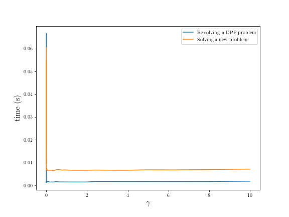

.. _advanced:

Advanced Features
=================

This section of the tutorial covers features of CVXPY intended for users with advanced knowledge of convex optimization. We recommend `Convex Optimization <https://www.stanford.edu/~boyd/cvxbook/>`_ by Boyd and Vandenberghe as a reference for any terms you are unfamiliar with.

Dual variables
--------------

You can use CVXPY to find the optimal dual variables for a problem. When you call ``prob.solve()`` each dual variable in the solution is stored in the ``dual_value`` field of the constraint it corresponds to.

.. code:: python

    import cvxpy as cp

    # Create two scalar optimization variables.
    x = cp.Variable()
    y = cp.Variable()

    # Create two constraints.
    constraints = [x + y == 1,
                   x - y >= 1]

    # Form objective.
    obj = cp.Minimize((x - y)**2)

    # Form and solve problem.
    prob = cp.Problem(obj, constraints)
    prob.solve()

    # The optimal dual variable (Lagrange multiplier) for
    # a constraint is stored in constraint.dual_value.
    print("optimal (x + y == 1) dual variable", constraints[0].dual_value)
    print("optimal (x - y >= 1) dual variable", constraints[1].dual_value)
    print("x - y value:", (x - y).value)

::

    optimal (x + y == 1) dual variable 6.47610300459e-18
    optimal (x - y >= 1) dual variable 2.00025244976
    x - y value: 0.999999986374

The dual variable for ``x - y >= 1`` is 2. By complementarity this implies that ``x - y`` is 1, which we can see is true. The fact that the dual variable is non-zero also tells us that if we tighten ``x - y >= 1``, (i.e., increase the right-hand side), the optimal value of the problem will increase.

.. _attributes:

Attributes
----------

Variables and parameters can be created with attributes specifying additional properties.
For example, ``Variable(nonneg=True)`` is a scalar variable constrained to be nonnegative.
Similarly, ``Parameter(nonpos=True)`` is a scalar parameter constrained to be nonpositive.
The full constructor for :py:class:`Leaf <cvxpy.expressions.leaf.Leaf>` (the parent class
of :py:class:`Variable <cvxpy.expressions.variable.Variable>` and
:py:class:`Parameter <cvxpy.expressions.constants.parameter.Parameter>`) is given below.

.. function:: Leaf(shape=None, value=None, nonneg=False, nonpos=False, complex=False, imag=False, symmetric=False, diag=False, PSD=False, NSD=False, hermitian=False, boolean=False, integer=False, sparsity=None, pos=False, neg=False)

    Creates a Leaf object (e.g., Variable or Parameter).
    Only one attribute can be active (set to True).

    :param shape: The variable dimensions (0D by default). Cannot be more than 2D.
    :type shape: tuple or int
    :param value: A value to assign to the variable.
    :type value: numeric type
    :param nonneg: Is the variable constrained to be nonnegative?
    :type nonneg: bool
    :param nonpos: Is the variable constrained to be nonpositive?
    :type nonpos: bool
    :param complex: Is the variable constrained to be complex-valued?
    :type complex: bool
    :param imag: Is the variable constrained to be imaginary?
    :type imag: bool
    :param symmetric: Is the variable constrained to be symmetric?
    :type symmetric: bool
    :param diag: Is the variable constrained to be diagonal?
    :type diag: bool
    :param PSD: Is the variable constrained to be symmetric positive semidefinite?
    :type PSD: bool
    :param NSD: Is the variable constrained to be symmetric negative semidefinite?
    :type NSD: bool
    :param hermitian: Is the variable constrained to be Hermitian?
    :type hermitian: bool
    :param boolean:
        Is the variable boolean (i.e., 0 or 1)? True, which constrains
        the entire variable to be boolean, False, or a list of
        indices which should be constrained as boolean, where each
        index is a tuple of length exactly equal to the
        length of shape.
    :type boolean: bool or list of tuple
    :param integer: Is the variable integer? The semantics are the same as the boolean argument.
    :type integer: bool or list of tuple
    :param sparsity: Fixed sparsity pattern for the variable.
    :type sparsity: list of tuplewith
    :param pos: Is the variable constrained to be positive?
    :type pos: bool
    :param neg: Is the variable constrained to be negative?
    :type neg: bool

The ``value`` field of Variables and Parameters can be assigned a value after construction,
but the assigned value must satisfy the object attributes.
A Euclidean projection onto the set defined by the attributes is given by the
:py:meth:`project <cvxpy.expressions.leaf.Leaf.project>` method.

.. code:: python

    p = Parameter(nonneg=True)
    try:
        p.value = -1
    except Exception as e:
        print(e)

    print("Projection:", p.project(-1))

::

    Parameter value must be nonnegative.
    Projection: 0.0

A sensible idiom for assigning values to leaves is
:py:meth:`leaf.value = leaf.project(val) <cvxpy.expressions.leaf.Leaf.project>`,
ensuring that the assigned value satisfies the leaf's properties.
A slightly more efficient variant is
:py:meth:`leaf.project_and_assign(val) <cvxpy.expressions.leaf.Leaf.project_and_assign>`,
which projects and assigns the value directly, without additionally checking
that the value satisfies the leaf's properties.  In most cases ``project`` and
checking that a value satisfies a leaf's properties are cheap operations (i.e.,
:math:`O(n)`), but for symmetric positive semidefinite or negative semidefinite
leaves, the operations compute an eigenvalue decomposition.

Many attributes, such as nonnegativity and symmetry, can be easily specified with constraints.
What is the advantage then of specifying attributes in a variable?
The main benefit is that specifying attributes enables more fine-grained DCP analysis.
For example, creating a variable ``x`` via ``x = Variable(nonpos=True)`` informs the DCP analyzer that ``x`` is nonpositive.
Creating the variable ``x`` via ``x = Variable()`` and adding the constraint ``x >= 0`` separately does not provide any information
about the sign of ``x`` to the DCP analyzer.

One downside of using attributes over explicit constraints is that dual variables will not be recorded. Dual variable values
are only recorded for explicit constraints.

.. _semidefinite:

Semidefinite matrices
----------------------

Many convex optimization problems involve constraining matrices to be positive or negative semidefinite (e.g., SDPs).
You can do this in CVXPY in two ways.
The first way is to use
``Variable((n, n), PSD=True)`` to create an ``n`` by ``n`` variable constrained to be symmetric and positive semidefinite. For example,

.. code:: python

    # Creates a 100 by 100 positive semidefinite variable.
    X = cp.Variable((100, 100), PSD=True)

    # You can use X anywhere you would use
    # a normal CVXPY variable.
    obj = cp.Minimize(cp.norm(X) + cp.sum(X))

The second way is to create a positive semidefinite cone constraint using the ``>>`` or ``<<`` operator.
If ``X`` and ``Y`` are ``n`` by ``n`` variables,
the constraint ``X >> Y`` means that :math:`z^T(X - Y)z \geq 0`, for all :math:`z \in \mathcal{R}^n`.
In other words, :math:`(X - Y) + (X - Y)^T` is positive semidefinite.
The constraint does not require that ``X`` and ``Y`` be symmetric.
Both sides of a postive semidefinite cone constraint must be square matrices and affine.

The following code shows how to constrain matrix expressions to be positive or negative
semidefinite (but not necessarily symmetric).

.. code:: python

    # expr1 must be positive semidefinite.
    constr1 = (expr1 >> 0)

    # expr2 must be negative semidefinite.
    constr2 = (expr2 << 0)

To constrain a matrix expression to be symmetric, simply write

.. code:: python

    # expr must be symmetric.
    constr = (expr == expr.T)

You can also use ``Variable((n, n), symmetric=True)`` to create an ``n`` by ``n`` variable constrained to be symmetric.
The difference between specifying that a variable is symmetric via attributes and adding the constraint ``X == X.T`` is that
attributes are parsed for DCP information and a symmetric variable is defined over the (lower dimensional) vector space of symmetric matrices.

.. _mip:

Mixed-integer programs
----------------------

In mixed-integer programs, certain variables are constrained to be boolean (i.e., 0 or 1) or integer valued.
You can construct mixed-integer programs by creating variables with the attribute that they have only boolean or integer valued entries:

.. code:: python

    # Creates a 10-vector constrained to have boolean valued entries.
    x = cp.Variable(10, boolean=True)

    # expr1 must be boolean valued.
    constr1 = (expr1 == x)

    # Creates a 5 by 7 matrix constrained to have integer valued entries.
    Z = cp.Variable((5, 7), integer=True)

    # expr2 must be integer valued.
    constr2 = (expr2 == Z)

CVXPY provides interfaces to many mixed-integer solvers, including open source and commercial solvers.
For licensing reasons, CVXPY does not install any of the preferred solvers by default.

The preferred open source mixed-integer solvers in CVXPY are GLPK_MI_, CBC_ and SCIP_. The CVXOPT_
python package provides CVXPY with access to GLPK_MI; CVXOPT can be installed by running
``pip install cvxopt`` in your command line or terminal. SCIP supports nonlinear models, but
GLPK_MI and CBC do not.

CVXPY comes with ECOS_BB -- an open source mixed-integer nonlinear solver -- by default. However
ECOS_BB will not be called automatically; you must explicitly call ``prob.solve(solver='ECOS_BB')``
if you want to use it (:ref:`changed in CVXPY 1.1.6 <changes116>`). This policy stems from the fact
that there are recurring correctness issues with ECOS_BB. If you rely on this solver for some
application then you need to be aware of the increased risks that come with using it.
If you need to use an open-source mixed-integer nonlinear solver from CVXPY, then we recommend you install SCIP.

If you need to solve a large mixed-integer problem quickly, or if you have a nonlinear mixed-integer
model that is challenging for SCIP, then you will need to use a commercial solver such as CPLEX_,
GUROBI_, XPRESS_, MOSEK_, or COPT_. Commercial solvers require licenses to run. CPLEX, GUROBI, and MOSEK
provide free licenses to those
in academia (both students and faculty), as well as trial versions to those outside academia.
CPLEX Free Edition is available at no cost regardless of academic status, however it still requires
online registration, and it's limited to problems with at most 1000 variables and 1000 constraints.
XPRESS has a free community edition which does not require registration, however it is limited
to problems where the sum of variables count and constraint count does not exceed 5000.
COPT also has a free community edition that is limited to problems with at most 2000 variables 
and 2000 constraints.

.. note::
   If you develop an open-source mixed-integer solver with a permissive license such
   as Apache 2.0, and you're interested in incorporating your solver into CVXPY's default installation,
   please reach out to us at our `GitHub issues <https://github.com/cvxpy/cvxpy/issues>`_. We are
   particularly interested in incorporating a simple mixed-integer SOCP solver.

Complex valued expressions
--------------------------

By default variables and parameters are real valued.
Complex valued variables and parameters can be created by setting the attribute ``complex=True``.
Similarly, purely imaginary variables and parameters can be created by setting the attributes ``imag=True``.
Expressions containing complex variables, parameters, or constants may be complex valued.
The functions ``is_real``, ``is_complex``, and ``is_imag`` return whether an expression is purely real, complex, or purely imaginary, respectively.

.. code:: python

   # A complex valued variable.
   x = cp.Variable(complex=True)
   # A purely imaginary parameter.
   p = cp.Parameter(imag=True)

   print("p.is_imag() = ", p.is_imag())
   print("(x + 2).is_real() = ", (x + 2).is_real())

::

   p.is_imag() = True
   (x + 2).is_real() = False

The top-level expressions in the problem objective must be real valued,
but subexpressions may be complex.
Arithmetic and all linear atoms are defined for complex expressions.
The nonlinear atoms ``abs`` and all norms except ``norm(X, p)`` for ``p < 1`` are also defined for complex expressions.
All atoms whose domain is symmetric matrices are defined for Hermitian matrices.
Similarly, the atoms ``quad_form(x, P)`` and ``matrix_frac(x, P)`` are defined for complex ``x`` and Hermitian ``P``.
All constraints are defined for complex expressions.

The following additional atoms are provided for working with complex expressions:

* ``real(expr)`` gives the real part of ``expr``.
* ``imag(expr)`` gives the imaginary part of ``expr`` (i.e., ``expr = real(expr) + 1j*imag(expr)``).
* ``conj(expr)`` gives the complex conjugate of ``expr``.
* ``expr.H`` gives the Hermitian (conjugate) transpose of ``expr``.

Transforms
----------

Transforms provide additional ways of manipulating CVXPY objects
beyond the atomic functions.  For example, the :py:class:`indicator
<cvxpy.transforms.indicator>` transform converts a list of constraints into an
expression representing the convex function that takes value 0 when the
constraints hold and :math:`\infty` when they are violated.

.. code:: python

   x = cp.Variable()
   constraints = [0 <= x, x <= 1]
   expr = cp.transforms.indicator(constraints)
   x.value = .5
   print("expr.value = ", expr.value)
   x.value = 2
   print("expr.value = ", expr.value)

::

   expr.value = 0.0
   expr.value = inf

The full set of transforms available is discussed in :ref:`transforms-api`.

Problem arithmetic
------------------

For convenience, arithmetic operations have been overloaded for
problems and objectives.
Problem arithmetic is useful because it allows you to write a problem as a
sum of smaller problems.
The rules for adding, subtracting, and multiplying objectives are given below.

.. code:: python

    # Addition and subtraction.

    Minimize(expr1) + Minimize(expr2) == Minimize(expr1 + expr2)

    Maximize(expr1) + Maximize(expr2) == Maximize(expr1 + expr2)

    Minimize(expr1) + Maximize(expr2) # Not allowed.

    Minimize(expr1) - Maximize(expr2) == Minimize(expr1 - expr2)

    # Multiplication (alpha is a positive scalar).

    alpha*Minimize(expr) == Minimize(alpha*expr)

    alpha*Maximize(expr) == Maximize(alpha*expr)

    -alpha*Minimize(expr) == Maximize(-alpha*expr)

    -alpha*Maximize(expr) == Minimize(-alpha*expr)

The rules for adding and multiplying problems are equally straightforward:

.. code:: python

    # Addition and subtraction.

    prob1 + prob2 == Problem(prob1.objective + prob2.objective,
                             prob1.constraints + prob2.constraints)

    prob1 - prob2 == Problem(prob1.objective - prob2.objective,
                             prob1.constraints + prob2.constraints)

    # Multiplication (alpha is any scalar).

    alpha*prob == Problem(alpha*prob.objective, prob.constraints)

Note that the ``+`` operator concatenates lists of constraints,
since this is the default behavior for Python lists.
The in-place operators ``+=``, ``-=``, and ``*=`` are also supported for
objectives and problems and follow the same rules as above.

.. Given the optimization problems :math:`p_1,\ldots,p_n` where each
.. :math:`p_i` is of the form

.. :math:`\begin{array}{ll}
.. \mbox{minimize}  &f_i(x) \\
.. \mbox{subject to} &x \in \mathcal C_i
.. \end{array}`

.. the weighted sum `\sum_{i=1}^n \alpha_i p_i` is the problem

.. :math:`\begin{array}{ll}
.. \mbox{minimize}  &\sum_{i=1}^n \alpha_i f_i(x) \\
.. \mbox{subject to} &x \in \cap_{i=1}^n \mathcal C_i
.. \end{array}`

Solve method options
--------------------

The ``solve`` method takes optional arguments that let you change how CVXPY
parses and solves the problem.

.. function:: solve(solver=None, verbose=False, gp=False, qcp=False, requries_grad=False, enforce_dpp=False, **kwargs)

   Solves the problem using the specified method.

   Populates the :code:`status` and :code:`value` attributes on the
   problem object as a side-effect.

   :param solver: The solver to use.
   :type solver: str, optional
   :param verbose:  Overrides the default of hiding solver output.
   :type verbose: bool, optional
   :param gp:  If ``True``, parses the problem as a disciplined geometric program instead of a disciplined convex program.
   :type gp: bool, optional
   :param qcp:  If ``True``, parses the problem as a disciplined quasiconvex program instead of a disciplined convex program.
   :type qcp: bool, optional
   :param requires_grad: Makes it possible to compute gradients of a solution
        with respect to Parameters by calling ``problem.backward()`` after
        solving, or to compute perturbations to the variables given perturbations to
        Parameters by calling ``problem.derivative()``.

        Gradients are only supported for DCP and DGP problems, not
        quasiconvex problems. When computing gradients (i.e., when
        this argument is True), the problem must satisfy the DPP rules.
   :type requires_grad: bool, optional
   :param enforce_dpp: When True, a ``DPPError`` will be thrown when trying to solve
        a non-DPP problem (instead of just a warning). Only relevant for
        problems involving Parameters. Defaults to ``False``.
   :type enforce_dpp: bool, optional
   :param ignore_dpp: When True, DPP problems will be treated as non-DPP,
        which may speed up compilation. Defaults to False.
   :type ignore_dpp: bool, optional
   :param kwargs: Additional keyword arguments specifying solver specific options.
   :return: The optimal value for the problem, or a string indicating why the problem could not be solved.

We will discuss the optional arguments in detail below.

.. _solvers:

Choosing a solver
^^^^^^^^^^^^^^^^^

CVXPY is distributed with the open source solvers `CLARABEL`_, `OSQP`_, and `SCS`_.
Many other solvers can be called by CVXPY if installed separately.
The table below shows the types of problems the supported solvers can handle.

+----------------+----+----+------+-----+-----+-----+-----+
|                | LP | QP | SOCP | SDP | EXP | POW | MIP |
+================+====+====+======+=====+=====+=====+=====+
| `CBC`_         | X  |    |      |     |     |     | X   |
+----------------+----+----+------+-----+-----+-----+-----+
| `CLARABEL`_    | X  | X  | X    |  X  |  X  |  X  |     |
+----------------+----+----+------+-----+-----+-----+-----+
| `COPT`_        | X  | X  | X    |  X  |     |     | X*  |
+----------------+----+----+------+-----+-----+-----+-----+
| `GLOP`_        | X  |    |      |     |     |     |     |
+----------------+----+----+------+-----+-----+-----+-----+
| `GLPK`_        | X  |    |      |     |     |     |     |
+----------------+----+----+------+-----+-----+-----+-----+
| `GLPK_MI`_     | X  |    |      |     |     |     | X   |
+----------------+----+----+------+-----+-----+-----+-----+
| `OSQP`_        | X  | X  |      |     |     |     |     |
+----------------+----+----+------+-----+-----+-----+-----+
| `PIQP`_        | X  | X  |      |     |     |     |     |
+----------------+----+----+------+-----+-----+-----+-----+
| `PROXQP`_      | X  | X  |      |     |     |     |     |
+----------------+----+----+------+-----+-----+-----+-----+
| `PDLP`_        | X  |    |      |     |     |     |     |
+----------------+----+----+------+-----+-----+-----+-----+
| `CPLEX`_       | X  | X  | X    |     |     |     | X   |
+----------------+----+----+------+-----+-----+-----+-----+
| `NAG`_         | X  | X  | X    |     |     |     |     |
+----------------+----+----+------+-----+-----+-----+-----+
| `ECOS`_        | X  | X  | X    |     | X   |     |     |
+----------------+----+----+------+-----+-----+-----+-----+
| `GUROBI`_      | X  | X  | X    |     |     |     | X   |
+----------------+----+----+------+-----+-----+-----+-----+
| `MOSEK`_       | X  | X  | X    | X   | X   | X   | X** |
+----------------+----+----+------+-----+-----+-----+-----+
| `CVXOPT`_      | X  | X  | X    | X   |     |     |     |
+----------------+----+----+------+-----+-----+-----+-----+
| `SDPA`_ ***    | X  | X  | X    | X   |     |     |     |
+----------------+----+----+------+-----+-----+-----+-----+
| `SCS`_         | X  | X  | X    | X   | X   | X   |     |
+----------------+----+----+------+-----+-----+-----+-----+
| `SCIP`_        | X  | X  | X    |     |     |     | X   |
+----------------+----+----+------+-----+-----+-----+-----+
| `XPRESS`_      | X  | X  | X    |     |     |     | X   |
+----------------+----+----+------+-----+-----+-----+-----+
| `SCIPY`_       | X  |    |      |     |     |     | X*  |
+----------------+----+----+------+-----+-----+-----+-----+

(*) Mixed-integer LP only.

(**) Except mixed-integer SDP.

(***) Multiprecision support is available on SDPA if the appropriate SDPA package is installed. With multiprecision support, SDPA can solve your problem with much smaller `epsilonDash` and/or `epsilonStar` parameters. These parameters must be manually adjusted to achieve the desired degree of precision. Please see the solver website for details. SDPA can also solve some ill-posed problems with multiprecision support.

LP - Linear Programming refers to problems with a linear objective function and linear constraints.

QP - Quadratic Programming refers to problems with a quadratic objective function and linear constraints.

SOCP - Second-Order Cone Programming refers to problems with second-order cone constraints. The second-order cone is defined as

    :math:`\mathcal{C}_{n+1} = \left\{\begin{bmatrix} x \\ t \end{bmatrix} \mid x \in \mathbb{R}^n , t \in \mathbb{R} , \| x \|_2 \leq t\right\}`

SDP - Semidefinite Programming refers to problems with :ref:`semidefinite matrix constraints <Semidefinite matrices>`.

EXP - refers to problems with exponential cone constraints. The exponential cone is defined as

    :math:`\{(x,y,z) \mid y > 0, y\exp(x/y) \leq z \} \cup \{ (x,y,z) \mid x \leq 0, y = 0, z \geq 0\}`.

POW - refers to problems with 3-dimensional power cone constraints. The 3D power cone is defined as

    :math:`\{(x,y,z) \mid x^{\alpha}y^{\alpha} \geq |z|, x \geq 0, y \geq 0 \}`.

Support for power cone constraints is a recent addition (v1.1.8), and CVXPY currently does
not have any atoms that take advantage of this constraint. If you want you want to use this
type of constraint in your model, you will need to instantiate ``PowCone3D`` and/or ``PowConeND``
objects manually.

MIP - :ref:`Mixed-Integer Programming <Mixed-integer programs>` refers to problems where some decision variables are constrained to be integer values.

By default CVXPY calls the solver most specialized to the problem type. For example, `ECOS`_ is called for SOCPs.
`SCS`_ can handle all problems (except mixed-integer programs). If the problem is a QP, CVXPY will use `OSQP`_.

You can change the solver called by CVXPY using the ``solver`` keyword argument. If the solver you choose cannot solve the problem, CVXPY will raise an exception. Here's example code solving the same problem with different solvers.

.. code:: python

    # Solving a problem with different solvers.
    x = cp.Variable(2)
    obj = cp.Minimize(x[0] + cp.norm(x, 1))
    constraints = [x >= 2]
    prob = cp.Problem(obj, constraints)

    # Solve with OSQP.
    prob.solve(solver=cp.OSQP)
    print("optimal value with OSQP:", prob.value)

    # Solve with ECOS.
    prob.solve(solver=cp.ECOS)
    print("optimal value with ECOS:", prob.value)

    # Solve with COPT.
    prob.solve(solver=cp.COPT)
    print("optimal value with COPT:", prob.value)

    # Solve with CVXOPT.
    prob.solve(solver=cp.CVXOPT)
    print("optimal value with CVXOPT:", prob.value)

    # Solve with SDPA.
    prob.solve(solver=cp.SDPA)
    print("optimal value with SDPA:", prob.value)

    # Solve with SCS.
    prob.solve(solver=cp.SCS)
    print("optimal value with SCS:", prob.value)

    # Solve with SciPy/HiGHS.
    prob.solve(solver=cp.SCIPY, scipy_options={"method": "highs"})
    print("optimal value with SciPy/HiGHS:", prob.value)

    # Solve with GLOP.
    prob.solve(solver=cp.GLOP)
    print("optimal value with GLOP:", prob.value)

    # Solve with GLPK.
    prob.solve(solver=cp.GLPK)
    print("optimal value with GLPK:", prob.value)

    # Solve with GLPK_MI.
    prob.solve(solver=cp.GLPK_MI)
    print("optimal value with GLPK_MI:", prob.value)

    # Solve with CLARABEL.
    prob.solve(solver=cp.CLARABEL)
    print("optimal value with CLARABEL:", prob.value)

    # Solve with GUROBI.
    prob.solve(solver=cp.GUROBI)
    print("optimal value with GUROBI:", prob.value)

    # Solve with MOSEK.
    prob.solve(solver=cp.MOSEK)
    print("optimal value with MOSEK:", prob.value)

    # Solve with PIQP.
    prob.solve(solver=cp.PIQP)
    print("optimal value with PIQP:", prob.value)

    # Solve with PROXQP.
    prob.solve(solver=cp.PROXQP)
    print("optimal value with PROXQP:", prob.value)

    # Solve with CBC.
    prob.solve(solver=cp.CBC)
    print("optimal value with CBC:", prob.value)

    # Solve with CPLEX.
    prob.solve(solver=cp.CPLEX)
    print("optimal value with CPLEX:", prob.value)

    # Solve with NAG.
    prob.solve(solver=cp.NAG)
    print("optimal value with NAG:", prob.value)

    # Solve with PDLP.
    prob.solve(solver=cp.PDLP)
    print("optimal value with PDLP:", prob.value)

    # Solve with SCIP.
    prob.solve(solver=cp.SCIP)
    print("optimal value with SCIP:", prob.value)

    # Solve with XPRESS.
    prob.solve(solver=cp.XPRESS)
    print("optimal value with XPRESS:", prob.value)

::

    optimal value with OSQP: 6.0
    ...
    optimal value with XPRESS: 6.0

Use the ``installed_solvers`` utility function to get a list of the solvers your installation of CVXPY supports.

.. code:: python

    print(installed_solvers())

::

    ['CBC', 'CVXOPT', 'MOSEK', 'GLPK', 'GLPK_MI', 'ECOS', 'SCS', 'SDPA'
     'SCIPY', 'GUROBI', 'OSQP', 'CPLEX', 'NAG', 'SCIP', 'XPRESS', 'PROXQP']

Viewing solver output
^^^^^^^^^^^^^^^^^^^^^

All the solvers can print out information about their progress while solving the problem. This information can be useful in debugging a solver error. To see the output from the solvers, set ``verbose=True`` in the solve method.

.. code:: python

    # Solve with ECOS and display output.
    prob.solve(solver=cp.ECOS, verbose=True)
    print(f"optimal value with ECOS: {prob.value}")

::

    ECOS 1.0.3 - (c) A. Domahidi, Automatic Control Laboratory, ETH Zurich, 2012-2014.

    It     pcost         dcost      gap     pres    dres     k/t     mu      step     IR
     0   +0.000e+00   +4.000e+00   +2e+01   2e+00   1e+00   1e+00   3e+00    N/A     1 1 -
     1   +6.451e+00   +8.125e+00   +5e+00   7e-01   5e-01   7e-01   7e-01   0.7857   1 1 1
     2   +6.788e+00   +6.839e+00   +9e-02   1e-02   8e-03   3e-02   2e-02   0.9829   1 1 1
     3   +6.828e+00   +6.829e+00   +1e-03   1e-04   8e-05   3e-04   2e-04   0.9899   1 1 1
     4   +6.828e+00   +6.828e+00   +1e-05   1e-06   8e-07   3e-06   2e-06   0.9899   2 1 1
     5   +6.828e+00   +6.828e+00   +1e-07   1e-08   8e-09   4e-08   2e-08   0.9899   2 1 1

    OPTIMAL (within feastol=1.3e-08, reltol=1.5e-08, abstol=1.0e-07).
    Runtime: 0.000121 seconds.

    optimal value with ECOS: 6.82842708233

Solving disciplined geometric programs
^^^^^^^^^^^^^^^^^^^^^^^^^^^^^^^^^^^^^^

When the ``solve`` method is called with `gp=True`, the problem is parsed
as a disciplined geometric program instead of a disciplined convex program.
For more information, see the :doc:`DGP tutorial </tutorial/dgp/index>`.

Solver stats
------------

When the ``solve`` method is called on a problem object and a solver is invoked,
the problem object records the optimal value, the values of the primal and dual variables,
and several solver statistics.
We have already discussed how to view the optimal value and variable values.
The solver statistics are accessed via the ``problem.solver_stats`` attribute,
which returns a :class:`~cvxpy.problems.problem.SolverStats` object.
For example, ``problem.solver_stats.solve_time`` gives the time it took the solver to solve the problem.

.. note::

    Information stored in ``problem.solver_stats`` differs in the solver used.
    For example, if we use ``MOSEK``, ``problem.solver_stats.num_iters`` includes the following: ``iinfitem.intpnt_iter``, ``liinfitem.simplex_iter``
    or ``iinfitem.mio_num_relax``. In addition, ``problem.solver_stats.extra_stats`` includes ``liinfitem.mio_intpnt_iter`` and ``liinfitem.mio_simplex_iter``.
    For more information, please visit https://docs.mosek.com/latest/pythonapi/constants.html

Warm start
----------

When solving the same problem for multiple values of a parameter, many solvers can exploit work from previous solves (i.e., warm start).
For example, the solver might use the previous solution as an initial point or reuse cached matrix factorizations.
Warm start is enabled by default and controlled with the ``warm_start`` solver option.
The code below shows how warm start can accelerate solving a sequence of related least-squares problems.

.. code:: python

    import cvxpy as cp
    import numpy

    # Problem data.
    m = 2000
    n = 1000
    numpy.random.seed(1)
    A = numpy.random.randn(m, n)
    b = cp.Parameter(m)

    # Construct the problem.
    x = cp.Variable(n)
    prob = cp.Problem(cp.Minimize(cp.sum_squares(A @ x - b)),
                       [x >= 0])

    b.value = numpy.random.randn(m)
    prob.solve()
    print("First solve time:", prob.solver_stats.solve_time)

    b.value = numpy.random.randn(m)
    prob.solve(warm_start=True)
    print("Second solve time:", prob.solver_stats.solve_time)

::

   First solve time: 11.14
   Second solve time: 2.95

The speed up in this case comes from caching the KKT matrix factorization.
If ``A`` were a parameter, factorization caching would not be possible and the benefit of
warm start would only be a good initial point.

Warm start can also be used to provide an initial guess the first time a problem is solved.
The initial guess is constructed from the ``value`` field of the problem variables.
If the same problem is solved a second time, the initial guess is constructed from the
cached previous solution as described above (rather than from the ``value`` field).

.. _solveropts:

Setting solver options
----------------------

The `OSQP`_, `ECOS`_, `GLOP`_, `MOSEK`_, `CBC`_, `CVXOPT`_, `NAG`_, `PDLP`_, `GUROBI`_, `SCS`_ , `CLARABEL`_, `PIQP`_ and `PROXQP`_ Python interfaces allow you to set solver options such as the maximum number of iterations. You can pass these options along through CVXPY as keyword arguments.

For example, here we tell SCS to use an indirect method for solving linear equations rather than a direct method.

.. code:: python

    # Solve with SCS, use sparse-indirect method.
    prob.solve(solver=cp.SCS, verbose=True, use_indirect=True)
    print(f"optimal value with SCS: {prob.value}")

::

    ----------------------------------------------------------------------------
        SCS v1.0.5 - Splitting Conic Solver
        (c) Brendan O'Donoghue, Stanford University, 2012
    ----------------------------------------------------------------------------
    Lin-sys: sparse-indirect, nnz in A = 13, CG tol ~ 1/iter^(2.00)
    EPS = 1.00e-03, ALPHA = 1.80, MAX_ITERS = 2500, NORMALIZE = 1, SCALE = 5.00
    Variables n = 5, constraints m = 9
    Cones:  linear vars: 6
        soc vars: 3, soc blks: 1
    Setup time: 2.78e-04s
    ----------------------------------------------------------------------------
     Iter | pri res | dua res | rel gap | pri obj | dua obj | kap/tau | time (s)
    ----------------------------------------------------------------------------
         0| 4.60e+00  5.78e-01       nan      -inf       inf       inf  3.86e-05
        60| 3.92e-05  1.12e-04  6.64e-06  6.83e+00  6.83e+00  1.41e-17  9.51e-05
    ----------------------------------------------------------------------------
    Status: Solved
    Timing: Total solve time: 9.76e-05s
        Lin-sys: avg # CG iterations: 1.00, avg solve time: 2.24e-07s
        Cones: avg projection time: 4.90e-08s
    ----------------------------------------------------------------------------
    Error metrics:
    |Ax + s - b|_2 / (1 + |b|_2) = 3.9223e-05
    |A'y + c|_2 / (1 + |c|_2) = 1.1168e-04
    |c'x + b'y| / (1 + |c'x| + |b'y|) = 6.6446e-06
    dist(s, K) = 0, dist(y, K*) = 0, s'y = 0
    ----------------------------------------------------------------------------
    c'x = 6.8284, -b'y = 6.8285
    ============================================================================
    optimal value with SCS: 6.82837896975

Here is the complete list of solver options.

`OSQP`_ options:

``'max_iter'``
    maximum number of iterations (default: 10,000).

``'eps_abs'``
    absolute accuracy (default: 1e-5).

``'eps_rel'``
    relative accuracy (default: 1e-5).

For others see `OSQP documentation <https://osqp.org/docs/interfaces/solver_settings.html>`_.

`PROXQP`_ options:

``'backend'``
    solver backend [dense, sparse] (default: dense).

``'max_iter'``
    maximum number of iterations (default: 10,000).

``'eps_abs'``
    absolute accuracy (default: 1e-8).

``'eps_rel'``
    relative accuracy (default: 0.0).

``'rho'``
    primal proximal parameter (default: 1e-6).

``'mu_eq'``
    dual equality constraint proximal parameter (default: 1e-3).

``'mu_in'``
    dual inequality constraint proximal parameter (default: 1e-1).

`ECOS`_ options:

``'max_iters'``
    maximum number of iterations (default: 100).

``'abstol'``
    absolute accuracy (default: 1e-8).

``'reltol'``
    relative accuracy (default: 1e-8).

``'feastol'``
    tolerance for feasibility conditions (default: 1e-8).

``'abstol_inacc'``
    absolute accuracy for inaccurate solution (default: 5e-5).

``'reltol_inacc'``
    relative accuracy for inaccurate solution (default: 5e-5).

``'feastol_inacc'``
    tolerance for feasibility condition for inaccurate solution (default: 1e-4).

`GLOP`_ options:

``'time_limit_sec'``
    Time limit for the solve, in seconds.

``'parameters_proto'``
    A `ortools.glop.parameters_pb2.GlopParameters` protocol buffer message.
    For the definition of GlopParameters, see
    `here <https://github.com/google/or-tools/blob/2cb85b4eead4c38e1c54b48044f92087cf165bce/ortools/glop/parameters.proto#L26>`_.

.. dropdown:: `MOSEK`_ options

    ``'mosek_params'``
        A dictionary of MOSEK parameters in the form ``name: value``. Parameter names
        should be strings, as in the MOSEK C API or command line, for example
        ``'MSK_DPAR_BASIS_TOL_X'``, ``'MSK_IPAR_NUM_THREADS'`` etc. Values are strings,
        integers or floats, depending on the parameter.
        See `example <https://docs.mosek.com/latest/faq/faq.html#cvxpy>`_.

    ``'save_file'``
        The name of a file where MOSEK will save the problem just before optimization.
        Refer to MOSEK documentation for a list of supported file formats. File format
        is chosen based on the extension.

    ``'bfs'``
        For a linear problem, if ``bfs=True``, then the basic solution will be retrieved
        instead of the interior-point solution. This assumes no specific MOSEK
        parameters were used which prevent computing the basic solution.

    ``'accept_unknown'``
        If ``accept_unknown=True``, an inaccurate solution will be returned, even if
        it is arbitrarily bad, when the solver does not generate an optimal
        point under the given conditions.

    ``'eps'``
        Applies tolerance ``eps`` to termination parameters for (conic) interior-point,
        simplex, and MIO solvers. The full list of termination parameters is returned
        by ``MOSEK.tolerance_params()`` in
        ``cvxpy.reductions.solvers.conic_solvers.mosek_conif``.
        Explicitly defined parameters take precedence over ``eps``.

    .. note::

        In CVXPY 1.1.6 we did a complete rewrite of the MOSEK interface. The main
        takeaway is that we now dualize all continuous problems. The dualization is
        automatic because this eliminates the previous need for a large number of
        slack variables, and never results in larger problems compared to our old
        MOSEK interface. If you notice MOSEK solve times are slower for some of your
        problems under CVXPY 1.1.6 or higher, be sure to use the MOSEK solver options
        to tell MOSEK that it should solve the dual; this can be accomplished by
        adding the ``(key, value)`` pair ``('MSK_IPAR_INTPNT_SOLVE_FORM', 'MSK_SOLVE_DUAL')``
        to the ``mosek_params`` argument.

.. dropdown:: `CVXOPT`_ options

    ``'max_iters'``
        maximum number of iterations (default: 100).

    ``'abstol'``
        absolute accuracy (default: 1e-7).

    ``'reltol'``
        relative accuracy (default: 1e-6).

    ``'feastol'``
        tolerance for feasibility conditions (default: 1e-7).

    ``'refinement'``
        number of iterative refinement steps after solving KKT system (default: 1).

    ``'kktsolver'``
        Controls the method used to solve systems of linear equations at each step of CVXOPT's
        interior-point algorithm. This parameter can be a string (with one of several values),
        or a function handle.

        KKT solvers built-in to CVXOPT can be specified by strings  'ldl', 'ldl2', 'qr', 'chol',
        and 'chol2'. If 'chol' is chosen, then CVXPY will perform an additional presolve
        procedure to eliminate redundant constraints. You can also set ``kktsolver='robust'``.
        The 'robust' solver is implemented in python, and is part of CVXPY source code; the
        'robust' solver doesn't require a presolve phase to eliminate redundant constraints,
        however it can be slower than 'chol'.

        Finally, there is an option to pass a function handle for the ``kktsolver`` argument.
        Passing a KKT solver based on a function handle allows you to take complete control of
        solving the linear systems encountered in CVXOPT's interior-point algorithm. The API for
        KKT solvers of this form is a small wrapper around CVXOPT's API for function-handle KKT
        solvers. The precise API that CVXPY users are held to is described in the CVXPY source
        code: `cvxpy/reductions/solvers/kktsolver.py <https://github.com/cvxpy/cvxpy/blob/master/cvxpy/reductions/solvers/kktsolver.py>`_.

.. dropdown:: `SDPA`_ options

    ``'maxIteration'``
        The maximum number of iterations. (default: 100).

    ``'epsilonStar'``
        The accuracy of an approximate optimal solution for primal and dual SDP. (default: 1.0E-7).

    ``'lambdaStar'``
        An initial point. (default: 1.0E2).

    ``'omegaStar'``
        The search region for an optimal solution. (default: 2.0).

    ``'lowerBound'``
        Lower bound of the minimum objective value of the primal SDP. (default: -1.0E5).

    ``'upperBound'``
        Upper bound of the maximum objective value of the dual SDP. (default: 1.0E5).

    ``'betaStar'``
        The parameter for controlling the search direction if the current point is feasible. (default: 0.1).

    ``'betaBar'``
        The parameter for controlling the search direction if the current point is infeasible. (default: 0.2).

    ``'gammaStar'``
        A reduction factor for the primal and dual step lengths. (default: 0.9).

    ``'epsilonDash'``
        The relative accuracy of an approximate optimal solution between primal and dual SDP. (default: 1.0E-7).

    ``'isSymmetric'``
        Specify whether to check the symmetricity of input matrices. (default: False).

    ``'isDimacs'``
        Specify whether to compute DIMACS ERROR. (default: False).

    ``'numThreads'``
        numThreads (default: ``'multiprocessing.cpu_count()'``).

    ``'domainMethod'``
        Algorithm option for exploiting sparsity in the domain space. Can be ``'none'`` (exploiting no sparsity in the domain space) or ``'basis'`` (using basis representation) (default: ``'none'``).

    ``'rangeMethod'``
        Algorithm option for exploiting sparsity in the range space. Can be ``'none'`` (exploiting no sparsity in the range space) or ``'decomp'`` (using matrix decomposition) (default: ``'none'``).

    ``'frvMethod'``
        The method to eliminate free variables. Can be ``'split'`` or ``'elimination'`` (default: ``'split'``).

    ``'rho'``
        The parameter of range in split method or pivoting in elimination method. (default: 0.0).

    ``'zeroPoint'``
        The zero point of matrix operation, determine unboundness, or LU decomposition. (default: 1.0E-12).

.. dropdown:: `SCS`_ options

    ``'max_iters'``
        maximum number of iterations (default: 2500).

    ``'eps'``
        convergence tolerance (default: 1e-4).

    ``'alpha'``
        relaxation parameter (default: 1.8).

    ``'acceleration_lookback'``
        Anderson Acceleration parameter for SCS 2.0 and higher. This can be any positive or negative integer;
        its default value is 10. See `this page of the SCS documentation <https://www.cvxgrp.org/scs/algorithm/acceleration.html#in-scs>`_
        for more information.

        .. warning::
            The value of this parameter often effects whether or not SCS 2.X will converge to an accurate solution.
            If you don't *explicitly* set ``acceleration_lookback`` and SCS 2.X fails to converge, then CVXPY
            will raise a warning and try to re-solve the problem with ``acceleration_lookback=0``.
            No attempt will be made to re-solve with problem if you have SCS version 3.0 or higher.

    ``'scale'``
        balance between minimizing primal and dual residual (default: 5.0).

    ``'normalize'``
        whether to precondition data matrices (default: True).

    ``'use_indirect'``
        whether to use indirect solver for KKT sytem (instead of direct) (default: True).

    ``'use_quad_obj'``
        whether to use a quadratic objective or reduce it to SOC constraints (default: True).

.. dropdown:: `CBC`_ options

    Cut-generation through `CGL`_

    General remarks:
        - some of these cut-generators seem to be buggy (observed problems with AllDifferentCuts, RedSplitCuts, LandPCuts, PreProcessCuts)
        - a few of these cut-generators will generate noisy output even if ``'verbose=False'``

    The following cut-generators are available:
        ``GomoryCuts``, ``MIRCuts``, ``MIRCuts2``, ``TwoMIRCuts``, ``ResidualCapacityCuts``, ``KnapsackCuts`` ``FlowCoverCuts``, ``CliqueCuts``, ``LiftProjectCuts``, ``AllDifferentCuts``, ``OddHoleCuts``, ``RedSplitCuts``, ``LandPCuts``, ``PreProcessCuts``, ``ProbingCuts``, ``SimpleRoundingCuts``.

    ``'CutGenName'``
        if cut-generator is activated (e.g. ``'GomoryCuts=True'``)

    ``'integerTolerance'``
        an integer variable is deemed to be at an integral value if it is no further than this value (tolerance) away

    ``'maximumSeconds'``
        stop after given amount of seconds

    ``'maximumNodes'``
        stop after given maximum number of nodes

    ``'maximumSolutions'``
        stop after evalutation x number of solutions

    ``'numberThreads'``
        sets the number of threads

    ``'allowableGap'``
        returns a solution if the gap between the best known solution and the best possible solution is less than this value.

    ``'allowableFractionGap'``
        returns a solution if the gap between the best known solution and the best possible solution is less than this fraction.

    ``'allowablePercentageGap'``
        returns if the gap between the best known solution and the best possible solution is less than this percentage.

`COPT`_ options:

COPT solver options are specified in CVXPY as keyword arguments. The full list of COPT parameters with defaults is listed `here <https://guide.coap.online/copt/en-doc/index.html#parameters>`_.

`CPLEX`_ options:

``'cplex_params'``
    a dictionary where the key-value pairs are composed of parameter names (as used in the CPLEX Python API) and parameter values. For example, to set the advance start switch parameter (i.e., CPX_PARAM_ADVIND), use "advance" for the parameter name. For the data consistency checking and modeling assistance parameter (i.e., CPX_PARAM_DATACHECK), use "read.datacheck" for the parameter name, and so on.

``'cplex_filename'``
    a string specifying the filename to which the problem will be written. For example, use "model.lp", "model.sav", or "model.mps" to export to the LP, SAV, and MPS formats, respectively.

``reoptimize``
    A boolean. This is only relevant for problems where CPLEX initially produces an "infeasible or unbounded" status.
    Its default value is False. If set to True, then if CPLEX produces an "infeasible or unbounded" status, its algorithm
    parameters are automatically changed and the problem is re-solved in order to determine its precise status.

`NAG`_ options:

``'nag_params'``
    a dictionary of NAG option parameters. Refer to NAG's Python or Fortran API for details. For example, to set the maximum number of iterations for a linear programming problem to 20, use "LPIPM Iteration Limit" for the key name and 20 for its value . 

SCIP_ options:
``'scip_params'`` a dictionary of SCIP optional parameters, a full list of parameters with defaults is listed `here <https://www.scipopt.org/doc-5.0.1/html/PARAMETERS.php>`_.

`SCIPY`_ options:
``'scipy_options'`` a dictionary of SciPy optional parameters, a full list of parameters with defaults is listed `here <https://docs.scipy.org/doc/scipy/reference/generated/scipy.optimize.linprog.html#scipy.optimize.linprog>`_.

* **Please note**: All options should be listed as key-value pairs within the ``'scipy_options'`` dictionary, and there should not be a nested dictionary called options. Some of the methods have different parameters, so please check the parameters for the method you wish to use, e.g., for method = 'highs-ipm'. Also, note that the 'integrality' and 'bounds' options should never be specified within ``'scipy_options'`` and should instead be specified using CVXPY.

* The main advantage of this solver is its ability to use the `HiGHS`_ LP and MIP solvers, which are coded in C++. However, these require versions of SciPy larger than 1.6.1 and 1.9.0, respectively. To use the `HiGHS`_ LP solvers, simply set the method parameter to 'highs-ds' (for dual-simplex), 'highs-ipm' (for interior-point method) or 'highs' (which will choose either 'highs-ds' or 'highs-ipm' for you). To use the `HiGHS`_ MIP solver, leave the method parameter unspecified or set it explicitly to 'highs'.

`PDLP`_ options:

``'time_limit_sec'``
    Time limit for the solve, in seconds.

``'parameters_proto'``
    A `ortools.pdlp.solvers_pb2.PrimalDualHybridGradientParams` protocol buffer message.
    For the definition of PrimalDualHybridGradientParams, see
    `here <https://github.com/google/or-tools/blob/a3ef28e824ee84a948796dffbb8254e67714cb56/ortools/pdlp/solvers.proto#L150>`_.

`GUROBI`_ options:

Gurobi solver options are specified in CVXPY as keyword arguments. The full list of Gurobi parameters with defaults is listed `here <https://www.gurobi.com/documentation/9.1/refman/parameters.html>`_.

In addition to Gurobi's parameters, the following options are available:

``'env'``
    Allows for the passage of a Gurobi Environment, which specifies parameters and license information.  Keyword arguments will override any settings in this environment.

``reoptimize``
    A boolean. This is only relevant for problems where GUROBI initially produces an "infeasible or unbounded" status.
    Its default value is False. If set to True, then if GUROBI produces an "infeasible or unbounded" status, its algorithm
    parameters are automatically changed and the problem is re-solved in order to determine its precise status.

`CLARABEL`_ options:

``'max_iter'``
    maximum number of iterations (default: 50).

``'time_limit'``
    time limit in seconds (default: 0.0, giving no limit).

For others see `CLARABEL documentation <https://oxfordcontrol.github.io/ClarabelDocs/stable/api_settings/>`_.

`XPRESS`_ options:

``'save_iis'``
    Whether (and how many) Irreduceable Infeasible Subsystems
    (IISs) should be saved in the event a problem is found to be
    infeasible. If 0 (default), no IIS is saved; if negative, all
    IISs are stored; if a positive ``'k>0'``, at most ``'k'`` IISs
    are saved.

``'write_mps'``
    Filename (with extension ``'.mps'``) in which Xpress will save
    the quadratic or conic problem.

``'maxtime'``
    Time limit in seconds (must be integer).

All controls of the Xpress Optimizer can be specified within the ``'solve'``
command. For all controls see `FICO Xpress Optimizer manual <https://www.fico.com/fico-xpress-optimization/docs/dms2019-03/solver/optimizer/HTML/chapter7.html>`_.

`PIQP`_ options:

``'backend'``
    solver backend [dense, sparse] (default: sparse).

``'max_iter'``
    maximum number of iterations (default: 250).

``'eps_abs'``
    absolute accuracy (default: 1e-8).

``'eps_rel'``
    relative accuracy (default: 1e-9).

For others see `PIQP documentation <https://predict-epfl.github.io/piqp/interfaces/settings>`_.

Getting the standard form
-------------------------

If you are interested in getting the standard form that CVXPY produces for a
problem, you can use the ``get_problem_data`` method. When a problem is solved, 
a :class:`~cvxpy.reductions.solvers.solving_chain.SolvingChain` passes a
low-level representation that is compatible with the targeted solver to a
solver, which solves the problem. This method returns that low-level
representation, along with a ``SolvingChain`` and metadata for unpacking
a solution into the problem. This low-level representation closely resembles,
but is not identical to, the arguments supplied to the solver.

A solution to the equivalent low-level problem can be obtained via the
data by invoking the ``solve_via_data`` method of the returned solving
chain, a thin wrapper around the code external to CVXPY that further
processes and solves the problem. Invoke the ``unpack_results`` method
to recover a solution to the original problem.

For example:

.. code:: python

  problem = cp.Problem(objective, constraints)
  data, chain, inverse_data = problem.get_problem_data(cp.SCS)
  # calls SCS using `data`
  soln = chain.solve_via_data(problem, data)
  # unpacks the solution returned by SCS into `problem`
  problem.unpack_results(soln, chain, inverse_data)

Alternatively, the ``data`` dictionary returned by this method
contains enough information to bypass CVXPY and call the solver
directly.

For example:

.. code:: python

  problem = cp.Problem(objective, constraints)
  probdata, _, _ = problem.get_problem_data(cp.SCS)

  import scs
  data = {
    'A': probdata['A'],
    'b': probdata['b'],
    'c': probdata['c'],
  }
  cone_dims = probdata['dims']
  cones = {
      "f": cone_dims.zero,
      "l": cone_dims.nonpos,
      "q": cone_dims.soc,
      "ep": cone_dims.exp,
      "s": cone_dims.psd,
  }
  soln = scs.solve(data, cones)

The structure of the data dict that CVXPY returns depends on the solver. For
details, print the dictionary, or consult the solver interfaces in
``cvxpy/reductions/solvers``.

Reductions
----------

CVXPY uses a system of **reductions** to rewrite problems from
the form provided by the user into the standard form that a solver will accept.
A reduction is a transformation from one problem to an equivalent problem.
Two problems are equivalent if a solution of one can be converted efficiently
to a solution of the other.
Reductions take a CVXPY Problem as input and output a CVXPY Problem.
The full set of reductions available is discussed in :ref:`reductions-api`.

.. _dpp:

Disciplined Parametrized Programming
------------------------------------
*Note: DPP requires CVXPY version 1.1.0 or greater.*

:py:class:`Parameters <cvxpy.expressions.constants.parameter.Parameter>` are
symbolic representations of constants. Using parameters lets you modify the
values of constants without reconstructing the entire problem. When your
parametrized problem is constructed according to *Disciplined Parametrized
Programming (DPP)*, solving it repeatedly for different values of the
parameters can be much faster than repeatedly solving a new problem.

You should read this tutorial if you intend to solve a :ref:`DCP <dcp>` or
:ref:`DGP <dgp>` problem many times, for different values of the numerical
data, or if you want to differentiate through the solution map of a DCP or DGP
problem.

What is DPP?
^^^^^^^^^^^^
DPP is a ruleset for producing parametrized DCP or DGP compliant problems that
CVXPY can re-canonicalize very quickly. The first time a DPP-compliant problem
is solved, CVXPY compiles it and caches the mapping from parameters to problem
data. As a result, subsequent rewritings of DPP problems can be substantially
faster. CVXPY allows you to solve parametrized problems that are not DPP, but
you won't see a speed-up when doing so.

The DPP ruleset
^^^^^^^^^^^^^^^

DPP places mild restrictions on how parameters can enter expressions in
DCP and DGP problems. First, we describe the DPP ruleset for DCP problems.
Then, we describe the DPP ruleset for DGP problems.

**DCP problems.**
In DPP, an expression is said to be parameter-affine if it does
not involve variables and is affine in its parameters, and it is parameter-free
if it does not have parameters. DPP introduces two restrictions to DCP:

1. Under DPP, all parameters are classified as affine, just like variables.
2. Under DPP, the product of two expressions is affine when
   at least one of the expressions is constant, or when one of the
   expressions is parameter-affine and the other is parameter-free.

An expression is DPP-compliant if it DCP-compliant subject to these two
restrictions. You can check whether an expression or problem is DPP-compliant
by calling the ``is_dcp`` method with the keyword argument ``dpp=True`` (by
default, this keyword argument is ``False``). For example,

.. code:: python3

    import cvxpy as cp

    m, n = 3, 2
    x = cp.Variable((n, 1))
    F = cp.Parameter((m, n))
    G = cp.Parameter((m, n))
    g = cp.Parameter((m, 1))
    gamma = cp.Parameter(nonneg=True)

    objective = cp.norm((F + G) @ x - g) + gamma * cp.norm(x)
    print(objective.is_dcp(dpp=True))

prints ``True``. We can walk through the DPP analysis to understand why
``objective`` is DPP-compliant. The product ``(F + G) @ x`` is affine under DPP,
because ``F + G`` is parameter-affine and ``x`` is parameter-free. The difference
``(F + G) @ x - g`` is affine because the addition atom is affine and both
``(F + G) @ x`` and  ``- g`` are affine. Likewise ``gamma * cp.norm(x)`` is affine
under DPP because ``gamma`` is parameter-affine and ``cp.norm(x)`` is
parameter-free. The final objective is then affine under DPP because addition is
affine.

Some expressions are DCP-compliant but not DPP-compliant. For example,
DPP forbids taking the product of two parametrized expressions:

.. code:: python3

    import cvxpy as cp

    x = cp.Variable()
    gamma = cp.Parameter(nonneg=True)
    problem = cp.Problem(cp.Minimize(gamma * gamma * x), [x >= 1])
    print("Is DPP? ", problem.is_dcp(dpp=True))
    print("Is DCP? ", problem.is_dcp(dpp=False))

This code snippet prints

::

    Is DPP? False
    Is DCP? True

Just as it is possible to rewrite non-DCP problems in DCP-compliant ways, it is
also possible to re-express non-DPP problems in DPP-compliant ways. For
example, the above problem can be equivalently written as

.. code:: python3

    import cvxpy as cp

    x = cp.Variable()
    y = cp.Variable()
    gamma = cp.Parameter(nonneg=True)
    problem = cp.Problem(cp.Minimize(gamma * y), [y == gamma * x])
    print("Is DPP? ", problem.is_dcp(dpp=True))
    print("Is DCP? ", problem.is_dcp(dpp=False))

This snippet prints 

::

    Is DPP? True
    Is DCP? True

In other cases, you can represent non-DPP transformations of parameters
by doing them outside of the DSL, e.g., in NumPy. For example, 
if ``P`` is a parameter and ``x`` is a variable, ``cp.quad_form(x, P)`` is not
DPP. You can represent a parametric quadratic form like so:

.. code:: python3

  import cvxpy as cp
  import numpy as np
  import scipy.linalg

  n = 4
  L = np.random.randn(n, n)
  P = L.T @ L
  P_sqrt = cp.Parameter((n, n))
  x = cp.Variable((n, 1))
  quad_form = cp.sum_squares(P_sqrt @ x)
  P_sqrt.value = scipy.linalg.sqrtm(P)
  assert quad_form.is_dcp(dpp=True)

As another example, the quotient ``expr / p`` is not DPP-compliant when ``p`` is
a parameter, but this can be rewritten as ``expr * p_tilde``, where ``p_tilde`` is
a parameter that represents ``1/p``.

**DGP problems.**
Just as DGP is the log-log analogue of DCP, DPP for DGP is the log-log analog
of DPP for DCP. DPP introduces two restrictions to DGP:

1. Under DPP, all positive parameters are classified as log-log-affine, just like positive variables.
2. Under DPP, the power atom ``x**p`` (with base ``x`` and exponent ``p``)
   is log-log affine as long as ``x`` and ``p`` are not both parametrized.

Note that for powers, the exponent ``p`` must be either a numerical constant
or a parameter; attempting to construct a power atom in which the exponent
is a compound expression, e.g., ``x**(p + p)``, where ``p`` is a Parameter,
will result in a ``ValueError``.

If a parameter appears in a DGP problem as an exponent, it can have any
sign. If a parameter appears elsewhere in a DGP problem, *it must be
positive*, i.e., it must be constructed with ``cp.Parameter(pos=True)``.

You can check whether an expression or problem is DPP-compliant
by calling the ``is_dgp`` method with the keyword argument ``dpp=True`` (by
default, this keyword argument is ``False``). For example,

.. code:: python3

    import cvxpy as cp

    x = cp.Variable(pos=True)
    y = cp.Variable(pos=True)
    a = cp.Parameter()
    b = cp.Parameter()
    c = cp.Parameter(pos=True)
    
    monomial = c * x**a * y**b
    print(monomial.is_dgp(dpp=True))

prints ``True``. The expressions ``x**a`` and ``y**b`` are log-log affine, since
``x`` and ``y`` do not contain parameters. The parameter ``c`` is log-log affine
because it is positive, and the monomial expression is log-log affine because
the product of log-log affine expression is also log-log affine.

Some expressions are DGP-compliant but not DPP-compliant. For example,
DPP forbids taking raising a parametrized expression to a power:

.. code:: python3

    import cvxpy as cp

    x = cp.Variable(pos=True)
    a = cp.Parameter()
    
    monomial = (x**a)**a
    print("Is DPP? ", monomial.is_dgp(dpp=True))
    print("Is DGP? ", monomial.is_dgp(dpp=False))

This code snippet prints

::

    Is DPP? False
    Is DGP? True

You can represent non-DPP transformations of parameters
by doing them outside of CVXPY, e.g., in NumPy. For example, 
you could rewrite the above program as the following DPP-complaint program

.. code:: python3

    import cvxpy as cp

    a = 2.0
    x = cp.Variable(pos=True)
    b = cp.Parameter(value=a**2)
    
    monomial = x**b

Repeatedly solving a DPP problem
^^^^^^^^^^^^^^^^^^^^^^^^^^^^^^^^
The following example demonstrates how parameters can speed-up repeated
solves of a DPP-compliant DCP problem.

.. code:: python3

    import cvxpy as cp
    import numpy
    import matplotlib.pyplot as plt
    import time

    n = 15
    m = 10
    numpy.random.seed(1)
    A = numpy.random.randn(n, m)
    b = numpy.random.randn(n)
    # gamma must be nonnegative due to DCP rules.
    gamma = cp.Parameter(nonneg=True)

    x = cp.Variable(m)
    error = cp.sum_squares(A @ x - b)
    obj = cp.Minimize(error + gamma*cp.norm(x, 1))
    problem = cp.Problem(obj)
    assert problem.is_dcp(dpp=True)

    gamma_vals = numpy.logspace(-4, 1)
    times = []
    new_problem_times = []
    for val in gamma_vals:
        gamma.value = val
        start = time.time()
        problem.solve()
        end = time.time()
        times.append(end - start)
        new_problem = cp.Problem(obj)
        start = time.time()
        new_problem.solve()
        end = time.time()
        new_problem_times.append(end - start)

    plt.rc('text', usetex=True)
    plt.rc('font', family='serif')
    plt.figure(figsize=(6, 6))
    plt.plot(gamma_vals, times, label='Re-solving a DPP problem')
    plt.plot(gamma_vals, new_problem_times, label='Solving a new problem')
    plt.xlabel(r'$\gamma$', fontsize=16)
    plt.ylabel(r'time (s)', fontsize=16)
    plt.legend()

Similar speed-ups can be obtained for DGP problems.

.. _derivatives:

Sensitivity analysis and gradients
------------------------------------
*Note: This feature requires CVXPY version 1.1.0 or greater.*

An optimization problem can be viewed as a function mapping parameters
to solutions. This solution map is sometimes differentiable. CVXPY
has built-in support for computing the derivative of the optimal variable
values of a problem with respect to small perturbations of the parameters
(i.e., the ``Parameter`` instances appearing in a problem).

The problem class exposes two methods related to computing the derivative.
The :py:func:`derivative <cvxpy.problems.problem.Problem.derivative>` evaluates
the derivative given perturbations to the parameters. This
lets you calculate how the solution to a problem would change
given small changes to the parameters, without re-solving the problem. 
The :py:func:`backward <cvxpy.problems.problem.Problem.backward>` method
evaluates the adjoint of the derivative, computing the gradient of the solution
with respect to the parameters. This can be useful when combined with
automatic differentiation software.

The derivative and backward methods are only meaningful when the problem
contains parameters. In order for a problem to be differentiable, it must
be :ref:`DPP-compliant <dpp>`. CVXPY can compute the derivative of any
DPP-compliant DCP or DGP problem. At non-differentiable points, CVXPY
computes a heuristic quantity.

**Example.**

As a first example, we solve a trivial problem with an analytical solution,
to illustrate the usage of the ``backward`` and ``derivative``
functions. In the following block of code, we construct a problem with
a scalar variable ``x`` and a scalar parameter ``p``. The problem
is to minimize the quadratic ``(x - 2*p)**2``.

.. code:: python3

    import cvxpy as cp

    x = cp.Variable()
    p = cp.Parameter()
    quadratic = cp.square(x - 2 * p)
    problem = cp.Problem(cp.Minimize(quadratic))

Next, we solve the problem for the particular value of ``p == 3``. Notice that
when solving the problem, we supply the keyword argument ``requires_grad=True``
to the ``solve`` method.

.. code:: python3

    p.value = 3.
    problem.solve(requires_grad=True)

Having solved the problem with ``requires_grad=True``, we can now use the
``backward`` and ``derivative`` to differentiate through the problem.
First, we compute the gradient of the solution with respect to its parameter
by calling the ``backward()`` method. As a side-effect, the ``backward()``
method populates the ``gradient`` attribute on all parameters with the gradient
of the solution with respect to that parameter.

.. code:: python3

    problem.backward()
    print("The gradient is {0:0.1f}.".format(p.gradient))

In this case, the problem has the trivial analytical solution ``2*p``, and
the gradient is therefore just 2. So, as expected, the above code prints

.. code::

    The gradient is 2.0.

Next, we use the ``derivative`` method to see how a small change in ``p``
would affect the solution ``x``. We will perturb ``p`` by ``1e-5``, by
setting ``p.delta = 1e-5``, and calling the ``derivative`` method will populate
the ``delta`` attribute of ``x`` with the the change in ``x`` predicted by
a first-order approximation (which is ``dx/dp * p.delta``).

.. code:: python3

    p.delta = 1e-5
    problem.derivative()
    print("x.delta is {0:2.1g}.".format(x.delta))

In this case the solution is trivial and its derivative is just ``2*p``, so we
know that the delta in ``x`` should be ``2e-5``. As expected, the output is

.. code::

    x.delta is 2e-05.

We emphasize that this example is trivial, because it has a trivial analytical
solution, with a trivial derivative. The ``backward()`` and ``forward()``
methods are useful because the vast majority of convex optimization problems
do not have analytical solutions: in these cases, CVXPY can compute solutions
and their derivatives, even though it would be impossible to derive them by
hand.

**Note.** In this simple example, the variable ``x`` was a scalar, so the
``backward`` method computed the gradient of ``x`` with respect to ``p``.
When there is more than one scalar variable, by default, ``backward``
computes the gradient of the *sum* of the optimal variable values with respect
to the parameters.

More generally, the ``backward`` method can be used to compute the gradient of
a scalar-valued function ``f`` of the optimal variables, with
respect to the parameters. If ``x(p)`` denotes the optimal value of
the variable (which might be a vector or a matrix) for a particular value of
the parameter ``p`` and ``f(x(p))`` is a scalar, then ``backward`` can be used
to compute the gradient of ``f`` with respect to ``p``. Let ``x* = x(p)``,
and say the derivative of ``f`` with respect to ``x*`` is ``dx``. To compute
the derivative of ``f`` with respect to ``p``, before calling
``problem.backward()``, just set ``x.gradient = dx``.

The ``backward`` method can be powerful when combined with software for
automatic differentiation. We recommend the software package
`CVXPY Layers <https://www.github.com/cvxgrp/cvxpylayers>`_, which provides
differentiable PyTorch and TensorFlow wrappers for CVXPY problems.

**backward or derivative?** The ``backward`` method should be used when
you need the gradient of (a scalar-valued function) of the solution, with
respect to the parameters. If you only want to do a sensitivity analysis,
that is, if all you're interested in is how the solution would change if
one or more parameters were changed, you should use the ``derivative``
method. When there are multiple variables, it is much more efficient to
compute sensitivities using the derivative method than it would be to compute
the entire Jacobian (which can be done by calling backward multiple times,
once for each standard basis vector).

**Next steps.** See the `introductory notebook <https://www.cvxpy.org/examples/derivatives/fundamentals.html>`_
on derivatives.

.. _CVXOPT: http://cvxopt.org/
.. _COPT: https://github.com/COPT-Public/COPT-Release
.. _ECOS: https://www.embotech.com/ECOS
.. _SCS: http://github.com/cvxgrp/scs
.. _SDPA: https://sdpa-python.github.io
.. _GLOP: https://developers.google.com/optimization
.. _GLPK: https://www.gnu.org/software/glpk/
.. _GLPK_MI: https://www.gnu.org/software/glpk/
.. _GUROBI: https://www.gurobi.com/
.. _MOSEK: https://www.mosek.com/
.. _CBC: https://projects.coin-or.org/Cbc
.. _CGL: https://projects.coin-or.org/Cgl
.. _CPLEX: https://www.ibm.com/docs/en/icos
.. _NAG: https://www.nag.co.uk/nag-library-python/
.. _OSQP: https://osqp.org/
.. _PDLP: https://developers.google.com/optimization
.. _SCIP: https://scip.zib.de/
.. _XPRESS: https://www.fico.com/en/products/fico-xpress-optimization
.. _SCIPY: https://docs.scipy.org/doc/scipy/reference/generated/scipy.optimize.linprog.html#scipy.optimize.linprog
.. _HiGHS: https://www.maths.ed.ac.uk/hall/HiGHS/#guide
.. _CLARABEL: https://oxfordcontrol.github.io/ClarabelDocs/
.. _PIQP: https://predict-epfl.github.io/piqp/
.. _PROXQP: https://github.com/simple-robotics/proxsuite

Custom Solvers
------------------------------------
Although ``cvxpy`` supports many different solvers out of the box, it is also possible to define and use custom solvers. This can be helpful in prototyping or developing custom solvers tailored to a specific application.

To do so, you have to implement a solver class that is a child of ``cvxpy.reductions.solvers.qp_solvers.qp_solver.QpSolver`` or ``cvxpy.reductions.solvers.conic_solvers.conic_solver.ConicSolver``. Then you pass an instance of this solver class to ``solver.solve(.)`` as following:

.. code:: python3

    import cvxpy as cp
    from cvxpy.reductions.solvers.qp_solvers.osqp_qpif import OSQP

    class CUSTOM_OSQP(OSQP):
        MIP_CAPABLE=False

        def name(self):
            return "CUSTOM_OSQP"

        def solve_via_data(self, *args, **kwargs):
            print("Solving with a custom QP solver!")
            super().solve_via_data(*args, **kwargs)

    x = cp.Variable()
    quadratic = cp.square(x)
    problem = cp.Problem(cp.Minimize(quadratic))
    problem.solve(solver=CUSTOM_OSQP())

You might also want to override the methods ``invert`` and ``import_solver`` of the ``Solver`` class.

Note that the string returned by the ``name`` property should be different to all of the officially supported solvers 
(a list of which can be found in ``cvxpy.settings.SOLVERS``). Also, if your solver is mixed integer capable, 
you should set the class variable ``MIP_CAPABLE`` to ``True``. If your solver is both mixed integer capable 
and a conic solver (as opposed to a QP solver), you should set the class variable ``MI_SUPPORTED_CONSTRAINTS`` 
to the list of cones supported when solving mixed integer problems. Usually ``MI_SUPPORTED_CONSTRAINTS`` 
will be the same as the class variable ``SUPPORTED_CONSTRAINTS``.

.. _canonicalization-backends:

Canonicalization backends
------------------------------------
Users can select from multiple canonicalization backends by adding the ``canon_backend``
keyword argument to the ``.solve()`` call, e.g. ``problem.solve(canon_backend=cp.SCIPY_CANON_BACKEND)``
(Introduced in CVXPY 1.3).
This can speed up the canonicalization time significantly for some problems.
Currently, the following canonicalization backends are supported:

*  CPP (default): The original C++ implementation, also referred to as CVXCORE.
*  | SCIPY: A pure Python implementation based on the SciPy sparse module.
   | Generally fast for problems that are already vectorized.
*  NUMPY: Reference implementation in pure NumPy. Fast for some small or dense problems.

